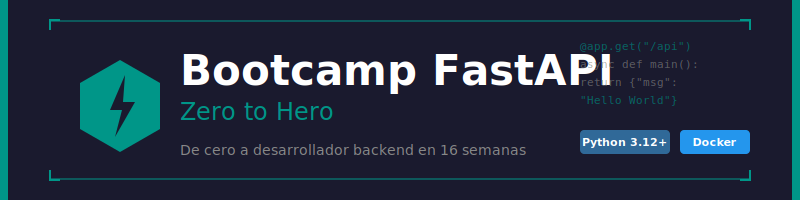

<p align="center">
  
</p>

<p align="center">
  <a href="LICENSE"></a>
  <a href="#"></a>
  <a href="#"></a>
  <a href="#"></a>
  <a href="CONTRIBUTING.md"></a>
</p>

<p align="center">
  <a href="README_EN.md"></a>
</p>

---

## 📋 Descripción

Bootcamp intensivo de **16 semanas (~4 meses)** enfocado en el dominio de **FastAPI** y desarrollo backend moderno con Python. Diseñado para llevar a estudiantes de cero a **Desarrollador Backend Junior**, con énfasis en código limpio, mejores prácticas y proyectos del mundo real.

### 🎯 Objetivos

Al finalizar el bootcamp, los estudiantes serán capaces de:

- ✅ Dominar los fundamentos de Python necesarios para desarrollo backend
- ✅ Construir APIs RESTful completas con FastAPI
- ✅ Implementar validación de datos robusta con Pydantic v2
- ✅ Trabajar con bases de datos usando SQLAlchemy (sync y async)
- ✅ Implementar autenticación y autorización (JWT, OAuth2)
- ✅ Escribir tests automatizados con pytest
- ✅ Documentar APIs automáticamente (OpenAPI/Swagger)
- ✅ Desplegar aplicaciones con Docker y servicios cloud
- ✅ Aplicar clean code, patrones de diseño y mejores prácticas
- ✅ Construir proyectos completos listos para producción

### 🚀 ¿Por qué FastAPI?

> **FastAPI moderno desde el día 1** - Sin código legacy, solo las mejores prácticas actuales.

FastAPI es el framework web de Python más rápido y moderno. Este bootcamp se enfoca exclusivamente en FastAPI con Python 3.12+ y características modernas. Los estudiantes aprenden directamente las herramientas y técnicas que usarán en el mundo profesional.

---

## 🗓️ Estructura del Bootcamp

|         Etapa          | Semanas | Horas | Temas Principales                                      |
| :--------------------: | :-----: | :---: | ------------------------------------------------------ |
| **Fundamentos**        |   1-4   |  24h  | Python moderno, async/await, intro FastAPI, Pydantic v2 |
| **Intermedio**         |  5-10   |  36h  | SQLAlchemy, CRUD, relaciones, middleware, dependencias |
| **Avanzado**           |  11-14  |  24h  | JWT/OAuth2, testing, WebSockets, seguridad             |
| **Producción**         |  15-16  |  12h  | Docker, CI/CD, deployment, proyecto final              |

**Total: 16 semanas** | **96 horas** de formación intensiva

---

## 📚 Contenido por Semana

Cada semana incluye:

```
bootcamp/week-XX/
├── README.md                 # Descripción y objetivos
├── rubrica-evaluacion.md     # Criterios de evaluación
├── 0-assets/                 # Imágenes y diagramas
├── 1-teoria/                 # Material teórico
├── 2-practicas/              # Ejercicios guiados
├── 3-proyecto/               # Proyecto semanal
├── 4-recursos/               # Recursos adicionales
│   ├── ebooks-free/
│   ├── videografia/
│   └── webgrafia/
└── 5-glosario/               # Términos clave
```

### 🔑 Componentes Clave

- 📖 **Teoría**: Conceptos fundamentales con ejemplos del mundo real
- 💻 **Práctica**: Ejercicios progresivos y proyectos hands-on
- 📝 **Evaluación**: Evidencias de conocimiento, desempeño y producto
- 🎓 **Recursos**: Glosarios, referencias y material complementario

---

## 🛠️ Stack Tecnológico

| Tecnología | Versión | Uso |
|------------|---------|-----|
| Python | **3.14+** | Lenguaje principal |
| FastAPI | **0.128+** | Framework web |
| Pydantic | **2.12+** | Validación de datos |
| SQLAlchemy | **2.0.46+** | ORM (sync y async) |
| Alembic | **1.15+** | Migraciones de BD |
| SQLite | **3.48+** | Desarrollo y testing |
| PostgreSQL | **17+** | Producción |
| pytest | **8.4+** | Testing |
| Docker | **27.5+** | Containerización |
| Docker Compose | **2.32+** | Orquestación |
| uv | **0.6+** | Gestión de paquetes |

**Entorno de desarrollo**: Docker + docker compose (❌ NO instalar Python localmente)

**Documentación de API**: OpenAPI/Swagger (integrado en FastAPI)

---

## 🚀 Inicio Rápido

### Prerrequisitos

- **Docker** y **Docker Compose** instalados ([Bootcamp Docker](https://github.com/ergrato-dev/bc-docker))
- **Git** para control de versiones
- **VS Code** (recomendado) con extensiones incluidas
- Navegador moderno (Chrome, Firefox, Edge)

### 1. Clonar el Repositorio

```bash
git clone https://github.com/epti-dev/bc-fastapi.git
cd bc-fastapi
```

### 2. Instalar Extensiones de VS Code

```bash
# Abrir en VS Code
code .

# Las extensiones recomendadas aparecerán automáticamente
# O ejecutar: Ctrl+Shift+P → "Extensions: Show Recommended Extensions"
```

### 3. Navegar a la Semana Actual

```bash
cd bootcamp/week-01
```

### 4. Seguir las Instrucciones

Cada semana contiene un `README.md` con instrucciones detalladas.

---

## 📊 Metodología de Aprendizaje

### Estrategias Didácticas

- 🎯 **Aprendizaje Basado en Proyectos (ABP)**
- 🧩 **Práctica Deliberada**
- 🔄 **API Challenges**
- 👥 **Code Review entre pares**
- 🎮 **Live Coding**

### Distribución del Tiempo (6h/semana)

- **Teoría**: 1.5-2 horas
- **Prácticas**: 2.5-3 horas
- **Proyecto**: 1.5-2 horas

### Evaluación

Cada semana incluye tres tipos de evidencias:

1. **Conocimiento 🧠** (30%): Cuestionarios y evaluaciones teóricas
2. **Desempeño 💪** (40%): Ejercicios prácticos en clase
3. **Producto 📦** (30%): Entregables evaluables (proyectos funcionales)

**Criterio de aprobación**: Mínimo 70% en cada tipo de evidencia

---

## 🤝 Contribuir

¡Las contribuciones son bienvenidas! Este es un proyecto educativo de código abierto.

### Cómo Contribuir

1. Lee la [Guía de Contribución](CONTRIBUTING.md)
2. Revisa el [Código de Conducta](CODE_OF_CONDUCT.md)
3. Fork del repositorio
4. Crea tu rama (`git checkout -b feature/nueva-funcionalidad`)
5. Commit con [Conventional Commits](https://www.conventionalcommits.org/) (`git commit -m 'feat: add new exercise'`)
6. Push a la rama (`git push origin feature/nueva-funcionalidad`)
7. Abre un Pull Request

### 📋 Áreas de Contribución

- ✨ Ejercicios adicionales
- 📚 Mejoras en documentación
- 🐛 Corrección de errores
- 🎨 Recursos visuales (diagramas SVG)
- 🌐 Traducciones
- 📹 Videos tutoriales

---

## 📞 Soporte

- 💬 **Discussions**: [GitHub Discussions](https://github.com/epti-dev/bc-fastapi/discussions)
- 🐛 **Issues**: [GitHub Issues](https://github.com/epti-dev/bc-fastapi/issues)

---

## 📄 Licencia

Este proyecto está bajo la Licencia MIT - ver el archivo [LICENSE](LICENSE) para más detalles.

---

## 🏆 Agradecimientos

- [FastAPI](https://fastapi.tiangolo.com/) - Por crear el mejor framework web de Python
- [Pydantic](https://docs.pydantic.dev/) - Por la validación de datos elegante
- [SQLAlchemy](https://www.sqlalchemy.org/) - Por el ORM más poderoso de Python
- [Sebastián Ramírez](https://github.com/tiangolo) - Creador de FastAPI
- Comunidad Python - Por los recursos y ejemplos
- Todos los contribuidores

---

## 📚 Documentación Adicional

- [🤖 Instrucciones de Copilot](.github/copilot-instructions.md)
- [🤝 Guía de Contribución](CONTRIBUTING.md)
- [📜 Código de Conducta](CODE_OF_CONDUCT.md)
- [🔒 Política de Seguridad](SECURITY.md)

---

<p align="center">
  <strong>🎓 Bootcamp FastAPI - Zero to Hero</strong><br>
  <em>De cero a desarrollador backend en 4 meses</em>
</p>

<p align="center">
  <a href="bootcamp/week-01">Comenzar Semana 1</a> •
  <a href="_docs">Ver Documentación</a> •
  <a href="https://github.com/epti-dev/bc-fastapi/issues">Reportar Issue</a> •
  <a href="CONTRIBUTING.md">Contribuir</a>
</p>

<p align="center">
  Hecho con ❤️ para la comunidad de desarrolladores
</p>
