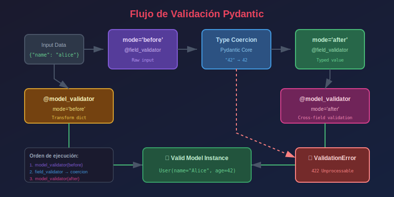

# 🔍 Validadores Personalizados

## 🎯 Objetivos de Aprendizaje

Al finalizar este tema, serás capaz de:

- ✅ Crear validadores de campo con `@field_validator`
- ✅ Crear validadores de modelo con `@model_validator`
- ✅ Entender `mode='before'` vs `mode='after'`
- ✅ Manejar errores de validación personalizados
- ✅ Implementar validaciones complejas entre campos

---

## � Diagrama de Flujo de Validación



---

## �📚 Contenido

### 1. Tipos de Validadores

Pydantic v2 ofrece dos tipos principales de validadores:

| Validador | Decorador | Uso |
|-----------|-----------|-----|
| **Campo** | `@field_validator` | Validar un campo específico |
| **Modelo** | `@model_validator` | Validar múltiples campos juntos |

```python
from pydantic import BaseModel, field_validator, model_validator

class User(BaseModel):
    name: str
    password: str
    confirm_password: str
    
    # Validador de campo
    @field_validator("name")
    @classmethod
    def validate_name(cls, v: str) -> str:
        if len(v) < 2:
            raise ValueError("Name must be at least 2 characters")
        return v.title()
    
    # Validador de modelo
    @model_validator(mode="after")
    def validate_passwords(self) -> "User":
        if self.password != self.confirm_password:
            raise ValueError("Passwords don't match")
        return self
```

---

### 2. @field_validator - Validador de Campo

Valida y transforma campos individuales:

```python
from pydantic import BaseModel, field_validator

class Product(BaseModel):
    name: str
    price: float
    sku: str
    
    @field_validator("name")
    @classmethod
    def validate_name(cls, v: str) -> str:
        """Capitaliza el nombre del producto."""
        if not v.strip():
            raise ValueError("Name cannot be empty")
        return v.strip().title()
    
    @field_validator("price")
    @classmethod
    def validate_price(cls, v: float) -> float:
        """Asegura que el precio sea positivo."""
        if v <= 0:
            raise ValueError("Price must be positive")
        return round(v, 2)  # Redondear a 2 decimales
    
    @field_validator("sku")
    @classmethod
    def validate_sku(cls, v: str) -> str:
        """Convierte SKU a mayúsculas."""
        return v.upper()
```

```python
# El validador transforma los valores
product = Product(name="  laptop  ", price=999.999, sku="lap-001")
print(product)
# name='Laptop' price=1000.0 sku='LAP-001'

# El validador lanza error si es inválido
Product(name="", price=999.99, sku="ABC")
# ValidationError: Name cannot be empty
```

#### Validar Múltiples Campos

```python
from pydantic import BaseModel, field_validator

class User(BaseModel):
    first_name: str
    last_name: str
    username: str
    
    # Validar múltiples campos con el mismo validador
    @field_validator("first_name", "last_name", "username")
    @classmethod
    def validate_not_empty(cls, v: str) -> str:
        if not v or not v.strip():
            raise ValueError("Field cannot be empty")
        return v.strip()
```

#### Acceder a Otros Campos (con `info`)

```python
from pydantic import BaseModel, field_validator, ValidationInfo

class User(BaseModel):
    username: str
    email: str
    
    @field_validator("email")
    @classmethod
    def validate_email(cls, v: str, info: ValidationInfo) -> str:
        """Valida que el email no contenga el username."""
        # info.data contiene los campos ya validados
        if "username" in info.data:
            if info.data["username"].lower() in v.lower():
                raise ValueError("Email should not contain username")
        return v.lower()
```

---

### 3. mode='before' vs mode='after'

Los validadores pueden ejecutarse en diferentes momentos:

| Mode | Cuándo | Input | Uso típico |
|------|--------|-------|------------|
| `'after'` (default) | Después de la conversión de tipos | Tipo final | Validación de negocio |
| `'before'` | Antes de la conversión de tipos | Tipo raw | Transformar input |

#### mode='after' (por defecto)

```python
from pydantic import BaseModel, field_validator

class User(BaseModel):
    age: int
    
    @field_validator("age", mode="after")  # Default
    @classmethod
    def validate_age(cls, v: int) -> int:
        # v ya es int (Pydantic lo convirtió)
        if v < 0:
            raise ValueError("Age must be positive")
        return v

# Pydantic convierte "25" a 25, luego valida
user = User(age="25")
print(user.age)  # 25
```

#### mode='before'

```python
from pydantic import BaseModel, field_validator
from typing import Any

class User(BaseModel):
    tags: list[str]
    
    @field_validator("tags", mode="before")
    @classmethod
    def validate_tags(cls, v: Any) -> list[str]:
        # v es el valor raw, antes de conversión
        if isinstance(v, str):
            # Si es string, convertir a lista
            return [tag.strip() for tag in v.split(",")]
        return v

# Acepta tanto lista como string separado por comas
user1 = User(tags=["python", "fastapi"])
user2 = User(tags="python, fastapi, pydantic")

print(user1.tags)  # ['python', 'fastapi']
print(user2.tags)  # ['python', 'fastapi', 'pydantic']
```

#### Ejemplo Práctico: Normalizar Teléfono

```python
from pydantic import BaseModel, field_validator
import re

class Contact(BaseModel):
    phone: str
    
    @field_validator("phone", mode="before")
    @classmethod
    def normalize_phone(cls, v: str) -> str:
        """Normaliza el teléfono eliminando caracteres no numéricos."""
        if isinstance(v, str):
            # Eliminar todo excepto dígitos
            digits = re.sub(r"\D", "", v)
            if len(digits) == 10:
                return f"+52 {digits[:3]} {digits[3:6]} {digits[6:]}"
            elif len(digits) == 12 and digits.startswith("52"):
                return f"+{digits[:2]} {digits[2:5]} {digits[5:8]} {digits[8:]}"
        return v
    
    @field_validator("phone", mode="after")
    @classmethod
    def validate_phone_format(cls, v: str) -> str:
        """Valida que el teléfono tenga el formato correcto."""
        if not re.match(r"^\+52 \d{3} \d{3} \d{4}$", v):
            raise ValueError("Invalid phone format")
        return v

# Acepta varios formatos de entrada
contact1 = Contact(phone="5551234567")
contact2 = Contact(phone="(555) 123-4567")
contact3 = Contact(phone="+52 555 123 4567")

print(contact1.phone)  # +52 555 123 4567
print(contact2.phone)  # +52 555 123 4567
print(contact3.phone)  # +52 555 123 4567
```

---

### 4. @model_validator - Validador de Modelo

Valida el modelo completo, útil para validaciones entre campos:

#### mode='after' (más común)

```python
from pydantic import BaseModel, model_validator

class DateRange(BaseModel):
    start_date: str
    end_date: str
    
    @model_validator(mode="after")
    def validate_date_range(self) -> "DateRange":
        """Valida que end_date sea posterior a start_date."""
        if self.end_date < self.start_date:
            raise ValueError("end_date must be after start_date")
        return self

# Válido
DateRange(start_date="2025-01-01", end_date="2025-12-31")

# Inválido
DateRange(start_date="2025-12-31", end_date="2025-01-01")
# ValidationError: end_date must be after start_date
```

#### Validación de Contraseñas

```python
from pydantic import BaseModel, Field, model_validator

class UserRegister(BaseModel):
    email: str
    password: str = Field(min_length=8)
    confirm_password: str
    
    @model_validator(mode="after")
    def validate_passwords_match(self) -> "UserRegister":
        if self.password != self.confirm_password:
            raise ValueError("Passwords do not match")
        return self

# Válido
user = UserRegister(
    email="test@example.com",
    password="secret123",
    confirm_password="secret123"
)

# Inválido
UserRegister(
    email="test@example.com",
    password="secret123",
    confirm_password="different"
)
# ValidationError: Passwords do not match
```

#### mode='before'

```python
from pydantic import BaseModel, model_validator
from typing import Any

class User(BaseModel):
    full_name: str
    first_name: str
    last_name: str
    
    @model_validator(mode="before")
    @classmethod
    def split_full_name(cls, data: Any) -> dict:
        """Si solo viene full_name, dividirlo en first y last."""
        if isinstance(data, dict):
            if "full_name" in data and "first_name" not in data:
                parts = data["full_name"].split(" ", 1)
                data["first_name"] = parts[0]
                data["last_name"] = parts[1] if len(parts) > 1 else ""
        return data

# Ambas formas funcionan
user1 = User(full_name="John Doe", first_name="John", last_name="Doe")
user2 = User(full_name="Jane Smith")

print(user2.first_name)  # Jane
print(user2.last_name)   # Smith
```

---

### 5. Errores de Validación Personalizados

#### Usar ValueError

```python
from pydantic import BaseModel, field_validator

class User(BaseModel):
    age: int
    
    @field_validator("age")
    @classmethod
    def validate_age(cls, v: int) -> int:
        if v < 18:
            raise ValueError("Must be 18 or older to register")
        if v > 120:
            raise ValueError("Invalid age")
        return v
```

#### Usar PydanticCustomError

Para errores más detallados:

```python
from pydantic import BaseModel, field_validator
from pydantic_core import PydanticCustomError

class User(BaseModel):
    username: str
    
    @field_validator("username")
    @classmethod
    def validate_username(cls, v: str) -> str:
        if len(v) < 3:
            raise PydanticCustomError(
                "username_too_short",
                "Username must be at least {min_length} characters",
                {"min_length": 3}
            )
        if not v.isalnum():
            raise PydanticCustomError(
                "username_invalid_chars",
                "Username must contain only alphanumeric characters"
            )
        return v.lower()
```

---

### 6. Validadores Comunes

#### Email con Dominio Específico

```python
from pydantic import BaseModel, field_validator

class Employee(BaseModel):
    email: str
    
    @field_validator("email")
    @classmethod
    def validate_company_email(cls, v: str) -> str:
        if not v.endswith("@company.com"):
            raise ValueError("Must use company email")
        return v.lower()
```

#### Contraseña Segura

```python
from pydantic import BaseModel, field_validator
import re

class UserCreate(BaseModel):
    password: str
    
    @field_validator("password")
    @classmethod
    def validate_password_strength(cls, v: str) -> str:
        if len(v) < 8:
            raise ValueError("Password must be at least 8 characters")
        if not re.search(r"[A-Z]", v):
            raise ValueError("Password must contain uppercase letter")
        if not re.search(r"[a-z]", v):
            raise ValueError("Password must contain lowercase letter")
        if not re.search(r"\d", v):
            raise ValueError("Password must contain a digit")
        if not re.search(r"[!@#$%^&*]", v):
            raise ValueError("Password must contain special character")
        return v
```

#### Slug Automático

```python
from pydantic import BaseModel, field_validator
import re

class Article(BaseModel):
    title: str
    slug: str | None = None
    
    @field_validator("slug", mode="before")
    @classmethod
    def generate_slug(cls, v: str | None, info) -> str:
        if v is None and "title" in info.data:
            # Generar slug desde el título
            title = info.data["title"]
            slug = title.lower()
            slug = re.sub(r"[^\w\s-]", "", slug)
            slug = re.sub(r"[\s_]+", "-", slug)
            return slug.strip("-")
        return v or ""

article = Article(title="Hello World! This is a Test")
print(article.slug)  # hello-world-this-is-a-test
```

---

### 7. Orden de Validación

Pydantic ejecuta validadores en este orden:

1. **`mode='before'` field validators** - Transforman input raw
2. **Conversión de tipos** - Pydantic convierte al tipo definido
3. **`mode='after'` field validators** - Validan tipo final
4. **`mode='before'` model validators** - Transforman dict completo
5. **Validación de campos** - Todos los campos
6. **`mode='after'` model validators** - Validan modelo completo

```python
from pydantic import BaseModel, field_validator, model_validator
from typing import Any

class Demo(BaseModel):
    value: int
    
    @field_validator("value", mode="before")
    @classmethod
    def before_field(cls, v: Any) -> Any:
        print(f"1. field_validator before: {v} (type: {type(v).__name__})")
        return v
    
    @field_validator("value", mode="after")
    @classmethod
    def after_field(cls, v: int) -> int:
        print(f"3. field_validator after: {v} (type: {type(v).__name__})")
        return v
    
    @model_validator(mode="before")
    @classmethod
    def before_model(cls, data: Any) -> Any:
        print(f"0. model_validator before: {data}")
        return data
    
    @model_validator(mode="after")
    def after_model(self) -> "Demo":
        print(f"4. model_validator after: {self}")
        return self

demo = Demo(value="42")
# Output:
# 0. model_validator before: {'value': '42'}
# 1. field_validator before: 42 (type: str)
# 3. field_validator after: 42 (type: int)
# 4. model_validator after: value=42
```

---

## 📝 Resumen

| Decorador | Uso | Mode |
|-----------|-----|------|
| `@field_validator("campo")` | Validar un campo | `before`, `after` |
| `@model_validator` | Validar modelo completo | `before`, `after` |

| Mode | Input | Uso |
|------|-------|-----|
| `before` | Valor raw (sin convertir) | Transformar input |
| `after` | Valor convertido | Validar reglas de negocio |

---

## ✅ Checklist de Verificación

Antes de continuar, asegúrate de poder:

- [ ] Crear `@field_validator` para campos específicos
- [ ] Crear `@model_validator` para validaciones entre campos
- [ ] Elegir correctamente entre `mode='before'` y `mode='after'`
- [ ] Lanzar errores de validación con mensajes claros
- [ ] Entender el orden de ejecución de validadores

---

## 🔗 Recursos Adicionales

- [Pydantic Validators](https://docs.pydantic.dev/latest/concepts/validators/)
- [Validation Errors](https://docs.pydantic.dev/latest/concepts/validation_errors/)

---

[← Anterior: BaseModel](02-basemodel.md) | [Siguiente: Tipos de Campo →](04-field-types.md)
