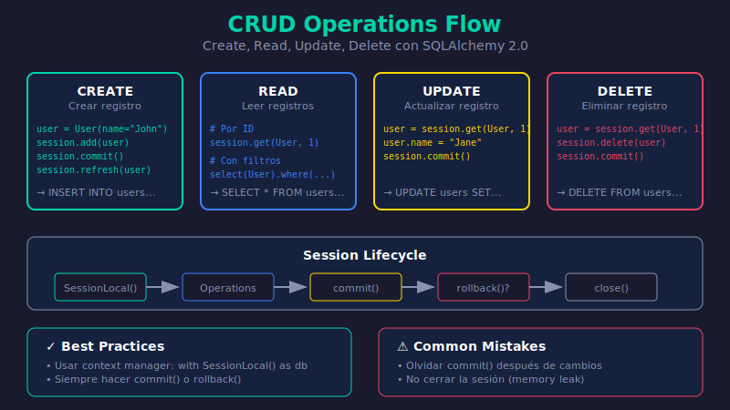

# 🔄 Operaciones CRUD

## 🎯 Objetivos de Aprendizaje

Al finalizar este tema, serás capaz de:

- ✅ Crear registros en la base de datos
- ✅ Leer registros con filtros y paginación
- ✅ Actualizar registros existentes
- ✅ Eliminar registros de forma segura

---

## 📚 Contenido



### 1. Setup Inicial

```python
# database.py
from sqlalchemy import create_engine
from sqlalchemy.orm import DeclarativeBase, sessionmaker

engine = create_engine("sqlite:///./crud_example.db", echo=True)
SessionLocal = sessionmaker(bind=engine, autocommit=False, autoflush=False)

class Base(DeclarativeBase):
    pass

# models.py
from datetime import datetime
from sqlalchemy import String
from sqlalchemy.orm import Mapped, mapped_column
from database import Base

class User(Base):
    __tablename__ = "users"
    
    id: Mapped[int] = mapped_column(primary_key=True)
    name: Mapped[str] = mapped_column(String(100))
    email: Mapped[str] = mapped_column(String(255), unique=True, index=True)
    age: Mapped[int | None] = mapped_column(default=None)
    is_active: Mapped[bool] = mapped_column(default=True)
    created_at: Mapped[datetime] = mapped_column(default=datetime.utcnow)

# Crear tablas
Base.metadata.create_all(bind=engine)
```

---

### 2. CREATE - Crear Registros

#### Crear un solo registro

```python
from sqlalchemy.orm import Session
from database import SessionLocal
from models import User

def create_user(name: str, email: str, age: int | None = None) -> User:
    """Crea un nuevo usuario"""
    with SessionLocal() as session:
        # 1. Crear instancia del modelo
        user = User(name=name, email=email, age=age)
        
        # 2. Agregar a la session
        session.add(user)
        
        # 3. Commit para persistir
        session.commit()
        
        # 4. Refresh para obtener valores generados (id, created_at)
        session.refresh(user)
        
        return user

# Uso
user = create_user("John Doe", "john@example.com", 25)
print(f"Usuario creado: {user.id} - {user.name}")
```

#### Crear múltiples registros

```python
def create_users_bulk(users_data: list[dict]) -> list[User]:
    """Crea múltiples usuarios en una transacción"""
    with SessionLocal() as session:
        users = [User(**data) for data in users_data]
        
        # add_all para múltiples objetos
        session.add_all(users)
        session.commit()
        
        # Refresh cada uno
        for user in users:
            session.refresh(user)
        
        return users

# Uso
users_data = [
    {"name": "Alice", "email": "alice@example.com", "age": 30},
    {"name": "Bob", "email": "bob@example.com", "age": 28},
    {"name": "Charlie", "email": "charlie@example.com"},
]
users = create_users_bulk(users_data)
```

---

### 3. READ - Leer Registros

SQLAlchemy 2.0 usa `select()` para queries:

```python
from sqlalchemy import select
from sqlalchemy.orm import Session
```

#### Obtener por ID

```python
def get_user_by_id(user_id: int) -> User | None:
    """Obtiene un usuario por su ID"""
    with SessionLocal() as session:
        # Método directo para primary key
        user = session.get(User, user_id)
        return user

# Uso
user = get_user_by_id(1)
if user:
    print(f"Encontrado: {user.name}")
else:
    print("Usuario no encontrado")
```

#### Obtener por campo único

```python
def get_user_by_email(email: str) -> User | None:
    """Obtiene un usuario por email"""
    with SessionLocal() as session:
        stmt = select(User).where(User.email == email)
        user = session.execute(stmt).scalar_one_or_none()
        return user

# Alternativas para scalar
# .scalar_one()        - Exactamente uno, error si no o si hay más
# .scalar_one_or_none() - Uno o None, error si hay más
# .scalars().first()   - El primero o None
```

#### Listar todos

```python
def get_all_users() -> list[User]:
    """Obtiene todos los usuarios"""
    with SessionLocal() as session:
        stmt = select(User)
        result = session.execute(stmt)
        users = result.scalars().all()
        return users
```

#### Filtrar con condiciones

```python
def get_active_users(min_age: int | None = None) -> list[User]:
    """Obtiene usuarios activos, opcionalmente filtrados por edad"""
    with SessionLocal() as session:
        stmt = select(User).where(User.is_active == True)
        
        if min_age is not None:
            stmt = stmt.where(User.age >= min_age)
        
        result = session.execute(stmt)
        return result.scalars().all()

# Operadores de comparación
# User.age == 25      # Igual
# User.age != 25      # Diferente
# User.age > 25       # Mayor que
# User.age >= 25      # Mayor o igual
# User.age < 25       # Menor que
# User.age <= 25      # Menor o igual
# User.age.is_(None)  # IS NULL
# User.age.is_not(None)  # IS NOT NULL
```

#### Filtros avanzados

```python
from sqlalchemy import select, or_, and_

def search_users(
    name: str | None = None,
    email: str | None = None,
    min_age: int | None = None,
    max_age: int | None = None
) -> list[User]:
    """Búsqueda avanzada de usuarios"""
    with SessionLocal() as session:
        stmt = select(User).where(User.is_active == True)
        
        # LIKE para búsqueda parcial
        if name:
            stmt = stmt.where(User.name.ilike(f"%{name}%"))
        
        if email:
            stmt = stmt.where(User.email.ilike(f"%{email}%"))
        
        # Rango de edad
        if min_age is not None:
            stmt = stmt.where(User.age >= min_age)
        if max_age is not None:
            stmt = stmt.where(User.age <= max_age)
        
        return session.execute(stmt).scalars().all()

# OR y AND explícitos
stmt = select(User).where(
    or_(
        User.name.ilike("%john%"),
        User.email.ilike("%john%")
    )
)

stmt = select(User).where(
    and_(
        User.is_active == True,
        User.age >= 18
    )
)
```

#### Ordenar resultados

```python
from sqlalchemy import select, desc, asc

def get_users_sorted(order_by: str = "name", descending: bool = False) -> list[User]:
    """Obtiene usuarios ordenados"""
    with SessionLocal() as session:
        stmt = select(User)
        
        # Ordenar dinámicamente
        column = getattr(User, order_by)
        if descending:
            stmt = stmt.order_by(desc(column))
        else:
            stmt = stmt.order_by(asc(column))
        
        return session.execute(stmt).scalars().all()

# Múltiples columnas de ordenamiento
stmt = select(User).order_by(
    desc(User.created_at),
    asc(User.name)
)
```

#### Paginación

```python
def get_users_paginated(
    skip: int = 0,
    limit: int = 10
) -> tuple[list[User], int]:
    """Obtiene usuarios con paginación"""
    with SessionLocal() as session:
        # Query base
        base_stmt = select(User).where(User.is_active == True)
        
        # Contar total
        from sqlalchemy import func
        count_stmt = select(func.count()).select_from(base_stmt.subquery())
        total = session.execute(count_stmt).scalar()
        
        # Aplicar paginación
        stmt = base_stmt.offset(skip).limit(limit)
        users = session.execute(stmt).scalars().all()
        
        return users, total

# Uso
users, total = get_users_paginated(skip=0, limit=10)
print(f"Mostrando {len(users)} de {total} usuarios")
```

---

### 4. UPDATE - Actualizar Registros

#### Actualizar un registro

```python
def update_user(user_id: int, **kwargs) -> User | None:
    """Actualiza un usuario existente"""
    with SessionLocal() as session:
        # 1. Obtener el usuario
        user = session.get(User, user_id)
        
        if not user:
            return None
        
        # 2. Actualizar atributos
        for key, value in kwargs.items():
            if hasattr(user, key):
                setattr(user, key, value)
        
        # 3. Commit
        session.commit()
        session.refresh(user)
        
        return user

# Uso
updated_user = update_user(1, name="John Updated", age=26)
```

#### Actualización masiva

```python
from sqlalchemy import update

def deactivate_old_users(days_inactive: int = 365) -> int:
    """Desactiva usuarios inactivos"""
    from datetime import datetime, timedelta
    
    cutoff_date = datetime.utcnow() - timedelta(days=days_inactive)
    
    with SessionLocal() as session:
        stmt = (
            update(User)
            .where(User.created_at < cutoff_date)
            .where(User.is_active == True)
            .values(is_active=False)
        )
        
        result = session.execute(stmt)
        session.commit()
        
        return result.rowcount  # Número de filas afectadas

# Uso
affected = deactivate_old_users(365)
print(f"Usuarios desactivados: {affected}")
```

---

### 5. DELETE - Eliminar Registros

#### Eliminar un registro

```python
def delete_user(user_id: int) -> bool:
    """Elimina un usuario por ID"""
    with SessionLocal() as session:
        user = session.get(User, user_id)
        
        if not user:
            return False
        
        session.delete(user)
        session.commit()
        
        return True

# Uso
deleted = delete_user(1)
print(f"Usuario eliminado: {deleted}")
```

#### Soft Delete (Recomendado)

En producción, es mejor "desactivar" en lugar de eliminar:

```python
def soft_delete_user(user_id: int) -> bool:
    """Soft delete - marca como inactivo sin eliminar"""
    with SessionLocal() as session:
        user = session.get(User, user_id)
        
        if not user:
            return False
        
        user.is_active = False
        # user.deleted_at = datetime.utcnow()  # Si tienes este campo
        session.commit()
        
        return True
```

#### Eliminación masiva

```python
from sqlalchemy import delete

def delete_inactive_users() -> int:
    """Elimina usuarios inactivos"""
    with SessionLocal() as session:
        stmt = delete(User).where(User.is_active == False)
        
        result = session.execute(stmt)
        session.commit()
        
        return result.rowcount
```

---

### 6. Manejo de Errores

```python
from sqlalchemy.exc import IntegrityError, NoResultFound

def create_user_safe(name: str, email: str) -> User | None:
    """Crea usuario con manejo de errores"""
    with SessionLocal() as session:
        try:
            user = User(name=name, email=email)
            session.add(user)
            session.commit()
            session.refresh(user)
            return user
            
        except IntegrityError:
            # Email duplicado u otra violación de constraint
            session.rollback()
            print(f"Error: Email {email} ya existe")
            return None

def get_user_strict(email: str) -> User:
    """Obtiene usuario o lanza excepción"""
    with SessionLocal() as session:
        stmt = select(User).where(User.email == email)
        
        try:
            user = session.execute(stmt).scalar_one()
            return user
        except NoResultFound:
            raise ValueError(f"Usuario con email {email} no encontrado")
```

---

### 7. Resumen de Métodos

| Operación | Método SQLAlchemy 2.0 |
|-----------|----------------------|
| Crear | `session.add()`, `session.add_all()` |
| Leer por ID | `session.get(Model, id)` |
| Leer con filtro | `session.execute(select(...).where(...))` |
| Actualizar | `setattr()` + `commit()` o `update().values()` |
| Eliminar | `session.delete()` o `delete().where()` |
| Contar | `select(func.count())` |
| Paginar | `.offset(skip).limit(limit)` |

---

## ✅ Checklist

- [ ] Sé crear registros con `add()` y `commit()`
- [ ] Puedo leer registros con `select()` y filtros
- [ ] Entiendo la diferencia entre `scalar_one()` y `scalar_one_or_none()`
- [ ] Puedo actualizar registros de forma individual y masiva
- [ ] Sé eliminar registros y entiendo soft delete
- [ ] Manejo errores con try/except y rollback

---

[← Anterior: Modelos Declarativos](03-modelos-declarativos.md) | [Siguiente: Integración con FastAPI →](05-integracion-fastapi.md)
