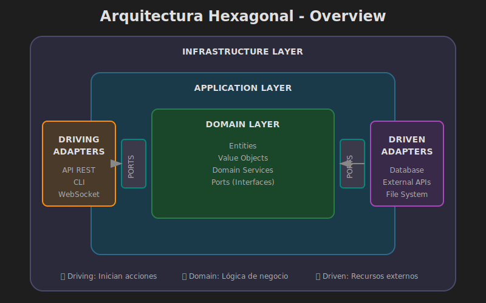

# 🏛️ Arquitectura Hexagonal - Visión General

## 🎯 Objetivos de Aprendizaje

- Comprender los principios fundamentales de la Arquitectura Hexagonal
- Identificar las tres capas principales y sus responsabilidades
- Entender el flujo de dependencias y la regla de dependencia
- Reconocer los beneficios y trade-offs de esta arquitectura

---

## 📚 Contenido

### 1. ¿Qué es la Arquitectura Hexagonal?

La **Arquitectura Hexagonal** (también conocida como **Ports & Adapters**) fue propuesta por Alistair Cockburn en 2005. Su objetivo principal es crear aplicaciones donde la **lógica de negocio está completamente aislada** de los mecanismos de entrega (UI, API) y de los mecanismos de persistencia (bases de datos, servicios externos).



#### El Hexágono

El nombre "hexagonal" viene de la representación visual, aunque el número de lados es arbitrario. Lo importante es el concepto de **puertos** en los bordes y **adaptadores** que conectan con el mundo exterior.

```
                    ┌─────────────────┐
                    │   REST API      │
                    │   (Adapter)     │
                    └────────┬────────┘
                             │
              ┌──────────────▼──────────────┐
              │                             │
    ┌─────────┤      APPLICATION            ├─────────┐
    │         │                             │         │
    │         │  ┌───────────────────┐      │         │
    │         │  │                   │      │         │
    │  Port   │  │      DOMAIN       │      │  Port   │
    │         │  │                   │      │         │
    │         │  └───────────────────┘      │         │
    │         │                             │         │
    └─────────┤                             ├─────────┘
              └──────────────┬──────────────┘
                             │
                    ┌────────▼────────┐
                    │   Database      │
                    │   (Adapter)     │
                    └─────────────────┘
```

### 2. Las Tres Capas

La arquitectura hexagonal se organiza en **tres capas concéntricas**:

#### 2.1 Domain Layer (Centro) 🎯

El corazón de la aplicación. Contiene:

- **Entidades**: Objetos con identidad y ciclo de vida
- **Value Objects**: Objetos inmutables definidos por sus atributos
- **Domain Services**: Lógica que no pertenece a una entidad específica
- **Ports (Interfaces)**: Contratos que define el dominio

```python
# Domain Layer - No depende de NADA externo
from dataclasses import dataclass, field
from enum import Enum
from typing import Protocol
from uuid import UUID, uuid4


class TaskStatus(Enum):
    """Value Object: Estado de una tarea."""
    TODO = "todo"
    IN_PROGRESS = "in_progress"
    DONE = "done"
    CANCELLED = "cancelled"


class Priority(Enum):
    """Value Object: Prioridad de una tarea."""
    LOW = 1
    MEDIUM = 2
    HIGH = 3
    CRITICAL = 4


@dataclass
class Task:
    """Entity: Tarea con identidad única."""
    
    id: UUID
    title: str
    description: str
    status: TaskStatus = TaskStatus.TODO
    priority: Priority = Priority.MEDIUM
    assignee_id: UUID | None = None
    
    @classmethod
    def create(
        cls,
        title: str,
        description: str = "",
        priority: Priority = Priority.MEDIUM,
    ) -> "Task":
        """Factory method para crear tareas."""
        return cls(
            id=uuid4(),
            title=title,
            description=description,
            priority=priority,
        )
    
    def assign_to(self, user_id: UUID) -> None:
        """Asignar tarea a un usuario."""
        if self.status != TaskStatus.TODO:
            raise ValueError("Solo se pueden asignar tareas en estado TODO")
        self.assignee_id = user_id
    
    def start(self) -> None:
        """Iniciar trabajo en la tarea."""
        if self.status != TaskStatus.TODO:
            raise ValueError("Solo se pueden iniciar tareas en estado TODO")
        self.status = TaskStatus.IN_PROGRESS
    
    def complete(self) -> None:
        """Marcar tarea como completada."""
        if self.status == TaskStatus.CANCELLED:
            raise ValueError("No se puede completar una tarea cancelada")
        self.status = TaskStatus.DONE


# Port: Contrato para persistencia (definido en el dominio)
class TaskRepository(Protocol):
    """Port: Define cómo el dominio espera interactuar con persistencia."""
    
    async def save(self, task: Task) -> None:
        """Guardar una tarea."""
        ...
    
    async def get_by_id(self, task_id: UUID) -> Task | None:
        """Obtener tarea por ID."""
        ...
    
    async def get_all(self) -> list[Task]:
        """Obtener todas las tareas."""
        ...
    
    async def delete(self, task_id: UUID) -> bool:
        """Eliminar una tarea."""
        ...
```

#### 2.2 Application Layer (Medio) 📋

Orquesta el dominio. Contiene:

- **Use Cases**: Casos de uso de la aplicación
- **Application Services**: Coordinan entidades y servicios
- **DTOs**: Data Transfer Objects para entrada/salida
- **Commands/Queries**: Objetos que representan intenciones

```python
# Application Layer - Solo depende de Domain Layer
from dataclasses import dataclass
from uuid import UUID

from domain.entities import Task, Priority, TaskStatus
from domain.ports import TaskRepository


# DTO de entrada
@dataclass(frozen=True)
class CreateTaskCommand:
    """Command: Intención de crear una tarea."""
    title: str
    description: str = ""
    priority: str = "MEDIUM"


# DTO de salida
@dataclass(frozen=True)
class TaskDTO:
    """DTO: Representación de tarea para la capa externa."""
    id: str
    title: str
    description: str
    status: str
    priority: str
    assignee_id: str | None
    
    @classmethod
    def from_entity(cls, task: Task) -> "TaskDTO":
        """Crear DTO desde entidad de dominio."""
        return cls(
            id=str(task.id),
            title=task.title,
            description=task.description,
            status=task.status.value,
            priority=task.priority.name,
            assignee_id=str(task.assignee_id) if task.assignee_id else None,
        )


# Use Case
class CreateTaskUseCase:
    """Use Case: Crear una nueva tarea."""
    
    def __init__(self, task_repository: TaskRepository) -> None:
        self._task_repository = task_repository
    
    async def execute(self, command: CreateTaskCommand) -> TaskDTO:
        """Ejecutar el caso de uso."""
        # 1. Validar y crear entidad de dominio
        task = Task.create(
            title=command.title,
            description=command.description,
            priority=Priority[command.priority],
        )
        
        # 2. Persistir usando el port
        await self._task_repository.save(task)
        
        # 3. Retornar DTO
        return TaskDTO.from_entity(task)
```

#### 2.3 Infrastructure Layer (Exterior) 🔧

Conecta con el mundo exterior. Contiene:

- **Driving Adapters**: REST API, CLI, GraphQL (invocan la aplicación)
- **Driven Adapters**: Bases de datos, APIs externas (son invocados)
- **Configuración**: Settings, dependency injection
- **Frameworks**: FastAPI, SQLAlchemy, etc.

```python
# Infrastructure Layer - Driving Adapter (REST API)
from fastapi import APIRouter, Depends, HTTPException
from pydantic import BaseModel

from application.use_cases import CreateTaskUseCase, CreateTaskCommand, TaskDTO
from infrastructure.dependencies import get_create_task_use_case


router = APIRouter(prefix="/tasks", tags=["Tasks"])


class CreateTaskRequest(BaseModel):
    """Request body para crear tarea."""
    title: str
    description: str = ""
    priority: str = "MEDIUM"


class TaskResponse(BaseModel):
    """Response body para tarea."""
    id: str
    title: str
    description: str
    status: str
    priority: str
    assignee_id: str | None


@router.post("/", response_model=TaskResponse, status_code=201)
async def create_task(
    request: CreateTaskRequest,
    use_case: CreateTaskUseCase = Depends(get_create_task_use_case),
) -> TaskResponse:
    """Crear una nueva tarea."""
    command = CreateTaskCommand(
        title=request.title,
        description=request.description,
        priority=request.priority,
    )
    
    result = await use_case.execute(command)
    
    return TaskResponse(
        id=result.id,
        title=result.title,
        description=result.description,
        status=result.status,
        priority=result.priority,
        assignee_id=result.assignee_id,
    )
```

```python
# Infrastructure Layer - Driven Adapter (Repository)
from uuid import UUID

from domain.entities import Task
from domain.ports import TaskRepository


class InMemoryTaskRepository:
    """Adapter: Implementación en memoria del TaskRepository."""
    
    def __init__(self) -> None:
        self._tasks: dict[UUID, Task] = {}
    
    async def save(self, task: Task) -> None:
        """Guardar tarea en memoria."""
        self._tasks[task.id] = task
    
    async def get_by_id(self, task_id: UUID) -> Task | None:
        """Obtener tarea por ID."""
        return self._tasks.get(task_id)
    
    async def get_all(self) -> list[Task]:
        """Obtener todas las tareas."""
        return list(self._tasks.values())
    
    async def delete(self, task_id: UUID) -> bool:
        """Eliminar tarea."""
        if task_id in self._tasks:
            del self._tasks[task_id]
            return True
        return False
```

### 3. La Regla de Dependencia

La regla más importante de la arquitectura hexagonal:

> **Las dependencias SIEMPRE apuntan hacia adentro (hacia el dominio).**

```
Infrastructure → Application → Domain
     ↓               ↓           ↓
  Depende de     Depende de    No depende
  Application     Domain       de nada
```

#### ¿Qué significa esto?

1. **Domain Layer**: No importa nada de Application o Infrastructure
2. **Application Layer**: Solo importa de Domain
3. **Infrastructure Layer**: Puede importar de Application y Domain

```python
# ✅ CORRECTO: Application importa de Domain
from domain.entities import Task
from domain.ports import TaskRepository

# ✅ CORRECTO: Infrastructure importa de Application
from application.use_cases import CreateTaskUseCase

# ❌ INCORRECTO: Domain NO debe importar de Application
from application.dtos import TaskDTO  # ¡ERROR!

# ❌ INCORRECTO: Domain NO debe importar de Infrastructure
from infrastructure.adapters import InMemoryTaskRepository  # ¡ERROR!
```

### 4. Ports & Adapters

#### Driving Ports (Primarios)

Son los **puntos de entrada** a la aplicación. Definen cómo el mundo exterior puede invocar la aplicación.

- REST API endpoints
- CLI commands
- GraphQL resolvers
- Message queue consumers

#### Driven Ports (Secundarios)

Son los **puntos de salida** de la aplicación. Definen qué necesita la aplicación del mundo exterior.

- Repositories (persistencia)
- External API clients
- Message publishers
- Email senders

```python
# Driven Port (definido en Domain)
class TaskRepository(Protocol):
    """Port: El dominio define QUÉ necesita."""
    async def save(self, task: Task) -> None: ...
    async def get_by_id(self, task_id: UUID) -> Task | None: ...


# Driven Adapter (implementado en Infrastructure)
class InMemoryTaskRepository:
    """Adapter: Infraestructura define CÓMO se implementa."""
    async def save(self, task: Task) -> None:
        self._tasks[task.id] = task
    
    async def get_by_id(self, task_id: UUID) -> Task | None:
        return self._tasks.get(task_id)


class PostgresTaskRepository:
    """Adapter: Otra implementación del mismo port."""
    async def save(self, task: Task) -> None:
        # Guardar en PostgreSQL
        ...
    
    async def get_by_id(self, task_id: UUID) -> Task | None:
        # Consultar PostgreSQL
        ...
```

### 5. Beneficios de la Arquitectura Hexagonal

#### 5.1 Testabilidad

```python
# Fácil testing con fake adapters
async def test_create_task():
    # Usamos un adapter fake sin tocar la base de datos real
    fake_repo = FakeTaskRepository()
    use_case = CreateTaskUseCase(fake_repo)
    
    result = await use_case.execute(
        CreateTaskCommand(title="Test Task")
    )
    
    assert result.title == "Test Task"
    assert await fake_repo.get_by_id(UUID(result.id)) is not None
```

#### 5.2 Flexibilidad

```python
# Cambiar de SQLite a PostgreSQL sin tocar el dominio
# Solo cambiamos el adapter en la configuración

# Desarrollo
task_repository = InMemoryTaskRepository()

# Testing
task_repository = FakeTaskRepository()

# Producción
task_repository = PostgresTaskRepository(connection_string)
```

#### 5.3 Mantenibilidad

- Cambios en UI no afectan la lógica de negocio
- Cambios en base de datos no afectan los use cases
- Fácil de entender: cada capa tiene responsabilidades claras

#### 5.4 Framework Independence

El dominio no sabe que existe FastAPI o SQLAlchemy:

```python
# Domain - Puro Python, sin frameworks
class Task:
    def complete(self) -> None:
        self.status = TaskStatus.DONE

# El dominio funcionaría igual con Flask, Django, o sin framework
```

### 6. Trade-offs

#### Complejidad Inicial

Más archivos y estructura que una aplicación simple:

```
# App simple
main.py

# Hexagonal
domain/
    entities/
    ports/
application/
    use_cases/
    dtos/
infrastructure/
    adapters/
    api/
```

#### Over-engineering para Apps Pequeñas

Para un CRUD simple, hexagonal puede ser excesivo. Usar cuando:

- ✅ Lógica de negocio compleja
- ✅ Múltiples puntos de entrada (API, CLI, eventos)
- ✅ Necesidad de cambiar infraestructura
- ✅ Tests extensivos requeridos
- ❌ Prototipos rápidos
- ❌ CRUDs simples sin lógica

### 7. Comparación con Otras Arquitecturas

| Aspecto | MVC | Clean Architecture | Hexagonal |
|---------|-----|-------------------|-----------|
| Enfoque | Separar presentación | Capas concéntricas | Ports & Adapters |
| Dependencias | Modelo ← Vista ← Controlador | Hacia el centro | Hacia el dominio |
| Testing | Moderado | Alto | Alto |
| Complejidad | Baja | Alta | Media-Alta |
| Flexibilidad | Moderada | Alta | Alta |

---

## 🧪 Ejercicio de Comprensión

Dado el siguiente código, identifica a qué capa pertenece cada componente:

```python
# Componente A
class Order:
    def calculate_total(self) -> Decimal:
        return sum(item.price * item.quantity for item in self.items)

# Componente B
@router.post("/orders")
async def create_order(request: OrderRequest):
    ...

# Componente C
class CreateOrderUseCase:
    def __init__(self, order_repo: OrderRepository):
        self._order_repo = order_repo

# Componente D
class PostgresOrderRepository:
    async def save(self, order: Order):
        ...
```

<details>
<summary>Ver respuesta</summary>

- **Componente A**: Domain Layer (Entidad con comportamiento)
- **Componente B**: Infrastructure Layer (Driving Adapter - API)
- **Componente C**: Application Layer (Use Case)
- **Componente D**: Infrastructure Layer (Driven Adapter - Repository)

</details>

---

## 📚 Recursos Adicionales

- [Hexagonal Architecture - Alistair Cockburn](https://alistair.cockburn.us/hexagonal-architecture/)
- [Ports & Adapters Pattern](https://herbertograca.com/2017/09/14/ports-adapters-architecture/)
- [Clean Architecture vs Hexagonal](https://blog.cleancoder.com/uncle-bob/2012/08/13/the-clean-architecture.html)

---

## ✅ Checklist de Verificación

Antes de continuar, asegúrate de:

- [ ] Entender las tres capas (Domain, Application, Infrastructure)
- [ ] Comprender la regla de dependencia (siempre hacia el dominio)
- [ ] Identificar ports (interfaces) y adapters (implementaciones)
- [ ] Reconocer driving adapters vs driven adapters
- [ ] Conocer los beneficios y trade-offs de la arquitectura

---

_Siguiente: [02 - Domain Layer](02-domain-layer.md)_
