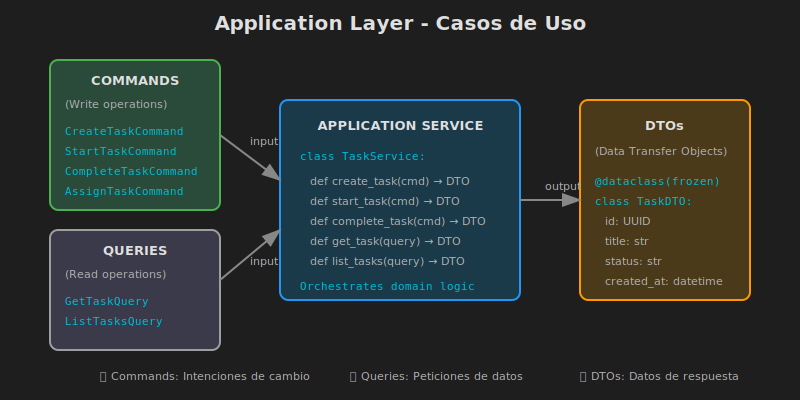

# 📋 Application Layer - Orquestando el Dominio

## 🎯 Objetivos de Aprendizaje

- Diseñar Use Cases que orquestan la lógica de dominio
- Crear DTOs para transferencia de datos entre capas
- Implementar Application Services como fachada
- Separar Commands (escritura) de Queries (lectura)
- Manejar errores y transacciones a nivel de aplicación

---

## 📚 Contenido

### 1. ¿Qué es el Application Layer?

El **Application Layer** es la capa intermedia que:
- **Orquesta** las entidades y servicios del dominio
- **Coordina** el flujo de la aplicación
- **No contiene** lógica de negocio (esa está en Domain)
- **Define** los casos de uso de la aplicación



#### Responsabilidades

| Sí hace | No hace |
|---------|---------|
| Orquestar entidades | Lógica de negocio |
| Coordinar transacciones | Acceso directo a DB |
| Validar inputs | Conocer HTTP/REST |
| Mapear DTOs | Renderizar vistas |
| Llamar a Ports | Implementar Ports |

### 2. Estructura del Application Layer

```
application/
├── __init__.py
├── use_cases/              # Casos de uso
│   ├── __init__.py
│   ├── tasks/
│   │   ├── __init__.py
│   │   ├── create_task.py
│   │   ├── assign_task.py
│   │   ├── complete_task.py
│   │   └── get_tasks.py
│   └── projects/
│       ├── __init__.py
│       ├── create_project.py
│       └── get_projects.py
├── dtos/                   # Data Transfer Objects
│   ├── __init__.py
│   ├── task_dtos.py
│   └── project_dtos.py
├── services/               # Application Services (opcional)
│   ├── __init__.py
│   └── task_service.py
└── exceptions.py           # Excepciones de aplicación
```

### 3. Use Cases

Un **Use Case** representa una acción específica que un usuario puede realizar. Sigue el patrón **Command** o **Query**.

#### 3.1 Command Use Case (Escritura)

```python
# application/use_cases/tasks/create_task.py
"""Use Case: Crear una nueva tarea."""

from dataclasses import dataclass
from uuid import UUID

from domain.entities.task import Task
from domain.value_objects.priority import Priority
from domain.ports.task_repository import TaskRepository
from domain.ports.project_repository import ProjectRepository
from domain.exceptions import ProjectNotFoundError
from application.dtos.task_dtos import TaskDTO


@dataclass(frozen=True)
class CreateTaskCommand:
    """
    Command: Datos necesarios para crear una tarea.
    
    Los Commands son inmutables (frozen=True) y representan
    la intención del usuario.
    """
    title: str
    description: str = ""
    priority: str = "MEDIUM"
    project_id: str | None = None


class CreateTaskUseCase:
    """
    Use Case: Crear una nueva tarea.
    
    Orquesta la creación de una tarea, validando que
    el proyecto exista si se especifica.
    """
    
    def __init__(
        self,
        task_repository: TaskRepository,
        project_repository: ProjectRepository,
    ) -> None:
        self._task_repo = task_repository
        self._project_repo = project_repository
    
    async def execute(self, command: CreateTaskCommand) -> TaskDTO:
        """
        Ejecutar el caso de uso.
        
        Args:
            command: Datos para crear la tarea
            
        Returns:
            TaskDTO con los datos de la tarea creada
            
        Raises:
            ProjectNotFoundError: Si el proyecto no existe
            ValueError: Si los datos son inválidos
        """
        # 1. Validar proyecto si se especifica
        project_uuid = None
        if command.project_id:
            project_uuid = UUID(command.project_id)
            project = await self._project_repo.get_by_id(project_uuid)
            if not project:
                raise ProjectNotFoundError(command.project_id)
        
        # 2. Crear entidad de dominio
        task = Task.create(
            title=command.title,
            description=command.description,
            priority=Priority.from_string(command.priority),
            project_id=project_uuid,
        )
        
        # 3. Persistir usando el port
        await self._task_repo.save(task)
        
        # 4. Retornar DTO
        return TaskDTO.from_entity(task)
```

#### 3.2 Use Case: Asignar Tarea

```python
# application/use_cases/tasks/assign_task.py
"""Use Case: Asignar tarea a un usuario."""

from dataclasses import dataclass
from uuid import UUID

from domain.ports.task_repository import TaskRepository
from domain.exceptions import TaskNotFoundError
from application.dtos.task_dtos import TaskDTO


@dataclass(frozen=True)
class AssignTaskCommand:
    """Command: Datos para asignar una tarea."""
    task_id: str
    user_id: str


class AssignTaskUseCase:
    """Use Case: Asignar una tarea a un usuario."""
    
    def __init__(self, task_repository: TaskRepository) -> None:
        self._task_repo = task_repository
    
    async def execute(self, command: AssignTaskCommand) -> TaskDTO:
        """
        Ejecutar asignación de tarea.
        
        La regla de negocio (solo asignar tareas TODO)
        está en la entidad Task, no aquí.
        """
        task_uuid = UUID(command.task_id)
        user_uuid = UUID(command.user_id)
        
        # 1. Obtener tarea
        task = await self._task_repo.get_by_id(task_uuid)
        if not task:
            raise TaskNotFoundError(command.task_id)
        
        # 2. Asignar (la validación está en el dominio)
        task.assign_to(user_uuid)
        
        # 3. Persistir
        await self._task_repo.save(task)
        
        # 4. Retornar DTO
        return TaskDTO.from_entity(task)
```

#### 3.3 Query Use Case (Lectura)

```python
# application/use_cases/tasks/get_tasks.py
"""Use Case: Obtener tareas con filtros."""

from dataclasses import dataclass
from uuid import UUID

from domain.ports.task_repository import TaskRepository
from domain.value_objects.task_status import TaskStatus
from application.dtos.task_dtos import TaskDTO, TaskListDTO


@dataclass(frozen=True)
class GetTasksQuery:
    """
    Query: Parámetros para buscar tareas.
    
    A diferencia de Commands, las Queries no modifican estado.
    """
    project_id: str | None = None
    assignee_id: str | None = None
    status: str | None = None
    limit: int = 100
    offset: int = 0


class GetTasksUseCase:
    """Use Case: Obtener lista de tareas con filtros."""
    
    def __init__(self, task_repository: TaskRepository) -> None:
        self._task_repo = task_repository
    
    async def execute(self, query: GetTasksQuery) -> TaskListDTO:
        """
        Ejecutar búsqueda de tareas.
        
        Aplica filtros según los parámetros del query.
        """
        # Obtener tareas según filtros
        if query.project_id:
            tasks = await self._task_repo.get_by_project(
                UUID(query.project_id)
            )
        elif query.assignee_id:
            tasks = await self._task_repo.get_by_assignee(
                UUID(query.assignee_id)
            )
        elif query.status:
            tasks = await self._task_repo.get_by_status(
                TaskStatus(query.status)
            )
        else:
            tasks = await self._task_repo.get_all()
        
        # Aplicar paginación
        paginated = tasks[query.offset : query.offset + query.limit]
        
        # Mapear a DTOs
        return TaskListDTO(
            items=[TaskDTO.from_entity(t) for t in paginated],
            total=len(tasks),
            limit=query.limit,
            offset=query.offset,
        )
```

### 4. Data Transfer Objects (DTOs)

Los **DTOs** transportan datos entre capas. Son diferentes de las entidades de dominio.

```python
# application/dtos/task_dtos.py
"""DTOs para tareas."""

from dataclasses import dataclass
from datetime import datetime

from domain.entities.task import Task


@dataclass(frozen=True)
class TaskDTO:
    """
    DTO de salida para una tarea.
    
    Representa la vista pública de una tarea.
    No expone detalles internos del dominio.
    """
    id: str
    title: str
    description: str
    status: str
    priority: str
    project_id: str | None
    assignee_id: str | None
    created_at: str
    updated_at: str
    
    @classmethod
    def from_entity(cls, task: Task) -> "TaskDTO":
        """
        Crear DTO desde entidad de dominio.
        
        Este método es el único punto de conversión
        entre dominio y aplicación.
        """
        return cls(
            id=str(task.id),
            title=task.title,
            description=task.description,
            status=task.status.value,
            priority=task.priority.name,
            project_id=str(task.project_id) if task.project_id else None,
            assignee_id=str(task.assignee_id) if task.assignee_id else None,
            created_at=task.created_at.isoformat(),
            updated_at=task.updated_at.isoformat(),
        )


@dataclass(frozen=True)
class TaskListDTO:
    """DTO para lista paginada de tareas."""
    items: list[TaskDTO]
    total: int
    limit: int
    offset: int
    
    @property
    def has_more(self) -> bool:
        """Verificar si hay más resultados."""
        return self.offset + len(self.items) < self.total


@dataclass(frozen=True)
class TaskSummaryDTO:
    """DTO resumido para listas."""
    id: str
    title: str
    status: str
    priority: str
    
    @classmethod
    def from_entity(cls, task: Task) -> "TaskSummaryDTO":
        return cls(
            id=str(task.id),
            title=task.title,
            status=task.status.value,
            priority=task.priority.name,
        )
```

### 5. Application Services (Opcional)

Los **Application Services** pueden actuar como fachada que agrupa múltiples use cases:

```python
# application/services/task_service.py
"""Application Service: Fachada para operaciones de tareas."""

from application.use_cases.tasks.create_task import (
    CreateTaskUseCase,
    CreateTaskCommand,
)
from application.use_cases.tasks.assign_task import (
    AssignTaskUseCase,
    AssignTaskCommand,
)
from application.use_cases.tasks.complete_task import (
    CompleteTaskUseCase,
    CompleteTaskCommand,
)
from application.use_cases.tasks.get_tasks import (
    GetTasksUseCase,
    GetTasksQuery,
)
from application.dtos.task_dtos import TaskDTO, TaskListDTO
from domain.ports.task_repository import TaskRepository
from domain.ports.project_repository import ProjectRepository


class TaskService:
    """
    Application Service: Fachada para tareas.
    
    Agrupa use cases relacionados para simplificar
    el uso desde la capa de infraestructura.
    """
    
    def __init__(
        self,
        task_repository: TaskRepository,
        project_repository: ProjectRepository,
    ) -> None:
        self._create_uc = CreateTaskUseCase(task_repository, project_repository)
        self._assign_uc = AssignTaskUseCase(task_repository)
        self._complete_uc = CompleteTaskUseCase(task_repository)
        self._get_uc = GetTasksUseCase(task_repository)
    
    async def create_task(
        self,
        title: str,
        description: str = "",
        priority: str = "MEDIUM",
        project_id: str | None = None,
    ) -> TaskDTO:
        """Crear una nueva tarea."""
        command = CreateTaskCommand(
            title=title,
            description=description,
            priority=priority,
            project_id=project_id,
        )
        return await self._create_uc.execute(command)
    
    async def assign_task(self, task_id: str, user_id: str) -> TaskDTO:
        """Asignar tarea a usuario."""
        command = AssignTaskCommand(task_id=task_id, user_id=user_id)
        return await self._assign_uc.execute(command)
    
    async def complete_task(self, task_id: str) -> TaskDTO:
        """Completar una tarea."""
        command = CompleteTaskCommand(task_id=task_id)
        return await self._complete_uc.execute(command)
    
    async def get_tasks(
        self,
        project_id: str | None = None,
        assignee_id: str | None = None,
        status: str | None = None,
        limit: int = 100,
        offset: int = 0,
    ) -> TaskListDTO:
        """Obtener tareas con filtros."""
        query = GetTasksQuery(
            project_id=project_id,
            assignee_id=assignee_id,
            status=status,
            limit=limit,
            offset=offset,
        )
        return await self._get_uc.execute(query)
```

### 6. Manejo de Errores

```python
# application/exceptions.py
"""Excepciones de la capa de aplicación."""


class ApplicationError(Exception):
    """Base para errores de aplicación."""
    pass


class ValidationError(ApplicationError):
    """Error de validación de datos de entrada."""
    
    def __init__(self, field: str, message: str) -> None:
        self.field = field
        self.message = message
        super().__init__(f"{field}: {message}")


class NotFoundError(ApplicationError):
    """Recurso no encontrado."""
    
    def __init__(self, resource: str, identifier: str) -> None:
        self.resource = resource
        self.identifier = identifier
        super().__init__(f"{resource} not found: {identifier}")


class ConflictError(ApplicationError):
    """Conflicto con el estado actual."""
    
    def __init__(self, message: str) -> None:
        super().__init__(message)


class UnauthorizedError(ApplicationError):
    """Operación no autorizada."""
    pass
```

### 7. Patrón CQRS Simplificado

**CQRS** (Command Query Responsibility Segregation) separa lecturas de escrituras:

```python
# Commands (escritura) - Modifican estado
@dataclass(frozen=True)
class CreateTaskCommand:
    title: str
    description: str

@dataclass(frozen=True)
class AssignTaskCommand:
    task_id: str
    user_id: str

@dataclass(frozen=True)
class CompleteTaskCommand:
    task_id: str


# Queries (lectura) - No modifican estado
@dataclass(frozen=True)
class GetTaskByIdQuery:
    task_id: str

@dataclass(frozen=True)
class GetTasksQuery:
    project_id: str | None = None
    status: str | None = None
```

#### Beneficios de CQRS

1. **Claridad**: Es claro qué operaciones modifican datos
2. **Optimización**: Queries pueden usar modelos de lectura optimizados
3. **Escalabilidad**: Reads y writes pueden escalar independientemente

---

## 🧪 Ejercicio de Comprensión

¿Por qué la lógica de validación "solo asignar tareas TODO" está en la entidad Task y no en el Use Case?

```python
# ¿Por qué aquí (Domain)?
class Task:
    def assign_to(self, user_id: UUID) -> None:
        if self.status != TaskStatus.TODO:
            raise TaskNotAssignableError()
        self.assignee_id = user_id

# ¿Y no aquí (Application)?
class AssignTaskUseCase:
    async def execute(self, command):
        task = await self._repo.get_by_id(command.task_id)
        if task.status != TaskStatus.TODO:  # ❌
            raise TaskNotAssignableError()
        task.assignee_id = command.user_id
```

<details>
<summary>Ver respuesta</summary>

La validación está en el **Domain** porque:

1. **Es una regla de negocio**: "Solo se pueden asignar tareas TODO" es una regla del dominio, no de la aplicación

2. **Protege la invariante**: La entidad protege su propio estado válido

3. **Evita duplicación**: Si la regla está en el Use Case, habría que repetirla en cada lugar que asigne tareas

4. **El dominio es autoridad**: El dominio debe ser la fuente de verdad de las reglas de negocio

</details>

---

## ✅ Checklist de Verificación

- [ ] Use Cases orquestan, no contienen lógica de negocio
- [ ] Commands son inmutables y representan intenciones
- [ ] Queries no modifican estado
- [ ] DTOs separan representación interna de externa
- [ ] Application Services son opcionales y actúan como fachada
- [ ] Excepciones de aplicación son diferentes a las de dominio

---

_Siguiente: [04 - Infrastructure Layer](04-infrastructure-layer.md)_
