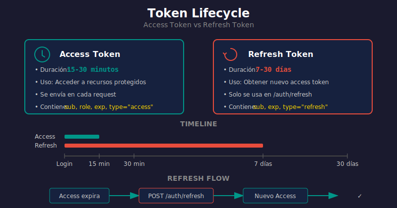

# 🔄 Refresh Tokens y Gestión de Sesiones

## 🎯 Objetivos de Aprendizaje

- Comprender el propósito de los refresh tokens
- Implementar rotación de tokens segura
- Manejar logout y revocación de tokens
- Aplicar estrategias de almacenamiento de tokens

---

## 📚 Contenido

### 1. ¿Por Qué Refresh Tokens?



#### El Problema con Access Tokens

Los **access tokens** deben tener vida corta (15-30 min) por seguridad:
- Si se comprometen, el daño es limitado
- Pero el usuario tendría que hacer login constantemente

#### La Solución: Refresh Tokens

| Token | Duración | Propósito |
|-------|----------|-----------|
| **Access Token** | 15-30 min | Acceder a recursos protegidos |
| **Refresh Token** | 7-30 días | Obtener nuevos access tokens |

```
┌─────────────────────────────────────────────────────────────────┐
│                    TOKEN LIFECYCLE                               │
└─────────────────────────────────────────────────────────────────┘

  Login                           Access Expira              Logout
    │                                  │                        │
    ▼                                  ▼                        ▼
┌───────┐    ┌───────────────┐    ┌───────┐    ┌───────┐    ┌───────┐
│ POST  │───►│ Access Token  │───►│ Token │───►│ POST  │───►│ Access│
│/token │    │ (15 min)      │    │expired│    │/refresh│   │revoked│
└───────┘    │ Refresh Token │    └───────┘    └───────┘    └───────┘
             │ (7 days)      │         │            │
             └───────────────┘         │            │
                                       │            │
                                       └────────────┘
                                       Use refresh token
                                       to get new access
```

### 2. Implementación Básica

#### 2.1 Crear Ambos Tokens en Login

```python
# auth/security.py
"""Funciones de seguridad para tokens."""

from datetime import datetime, timedelta, timezone
from jose import jwt

SECRET_KEY = "tu_clave_secreta_muy_larga"
ALGORITHM = "HS256"
ACCESS_TOKEN_EXPIRE_MINUTES = 30
REFRESH_TOKEN_EXPIRE_DAYS = 7


def create_access_token(data: dict) -> str:
    """Crea un access token de corta duración."""
    to_encode = data.copy()
    expire = datetime.now(timezone.utc) + timedelta(minutes=ACCESS_TOKEN_EXPIRE_MINUTES)
    to_encode.update({
        "exp": expire,
        "type": "access"
    })
    return jwt.encode(to_encode, SECRET_KEY, algorithm=ALGORITHM)


def create_refresh_token(data: dict) -> str:
    """Crea un refresh token de larga duración."""
    to_encode = data.copy()
    expire = datetime.now(timezone.utc) + timedelta(days=REFRESH_TOKEN_EXPIRE_DAYS)
    to_encode.update({
        "exp": expire,
        "type": "refresh"
    })
    return jwt.encode(to_encode, SECRET_KEY, algorithm=ALGORITHM)


def create_tokens(user_id: str) -> dict:
    """Crea par de tokens para un usuario."""
    return {
        "access_token": create_access_token({"sub": user_id}),
        "refresh_token": create_refresh_token({"sub": user_id}),
        "token_type": "bearer",
    }
```

#### 2.2 Endpoint de Login

```python
# auth/router.py
from fastapi import APIRouter, Depends, HTTPException, status
from fastapi.security import OAuth2PasswordRequestForm

router = APIRouter(prefix="/auth", tags=["Authentication"])


@router.post("/token")
async def login(form_data: OAuth2PasswordRequestForm = Depends()):
    """
    Login con OAuth2 Password Flow.
    
    Retorna access_token y refresh_token.
    """
    user = authenticate_user(form_data.username, form_data.password)
    
    if not user:
        raise HTTPException(
            status_code=status.HTTP_401_UNAUTHORIZED,
            detail="Incorrect email or password",
        )
    
    return create_tokens(user.id)
```

#### 2.3 Endpoint de Refresh

```python
from pydantic import BaseModel


class RefreshRequest(BaseModel):
    """Request para refrescar token."""
    refresh_token: str


@router.post("/refresh")
async def refresh_token(request: RefreshRequest):
    """
    Obtiene nuevos tokens usando el refresh token.
    
    - Valida el refresh token
    - Genera nuevo access token
    - Opcionalmente rota el refresh token
    """
    try:
        # Decodificar y validar refresh token
        payload = jwt.decode(
            request.refresh_token,
            SECRET_KEY,
            algorithms=[ALGORITHM]
        )
        
        # Verificar que sea un refresh token
        if payload.get("type") != "refresh":
            raise HTTPException(
                status_code=status.HTTP_401_UNAUTHORIZED,
                detail="Invalid token type",
            )
        
        user_id = payload.get("sub")
        if not user_id:
            raise HTTPException(
                status_code=status.HTTP_401_UNAUTHORIZED,
                detail="Invalid token",
            )
        
        # Crear nuevos tokens
        return create_tokens(user_id)
        
    except jwt.ExpiredSignatureError:
        raise HTTPException(
            status_code=status.HTTP_401_UNAUTHORIZED,
            detail="Refresh token expired, please login again",
        )
    except jwt.JWTError:
        raise HTTPException(
            status_code=status.HTTP_401_UNAUTHORIZED,
            detail="Invalid refresh token",
        )
```

### 3. Rotación de Refresh Tokens

Por seguridad, es mejor **rotar** el refresh token en cada uso:

```python
# auth/token_store.py
"""Almacenamiento de tokens para rotación y revocación."""

from datetime import datetime, timezone
from typing import Protocol
from uuid import uuid4


class TokenStore(Protocol):
    """Interface para almacenar tokens."""
    
    def save_refresh_token(self, user_id: str, token_id: str) -> None: ...
    def is_token_valid(self, user_id: str, token_id: str) -> bool: ...
    def revoke_token(self, user_id: str, token_id: str) -> None: ...
    def revoke_all_tokens(self, user_id: str) -> None: ...


class InMemoryTokenStore:
    """Implementación en memoria (para desarrollo)."""
    
    def __init__(self):
        # {user_id: {token_id: expiry_time}}
        self._tokens: dict[str, dict[str, datetime]] = {}
    
    def save_refresh_token(self, user_id: str, token_id: str, expires: datetime) -> None:
        if user_id not in self._tokens:
            self._tokens[user_id] = {}
        self._tokens[user_id][token_id] = expires
    
    def is_token_valid(self, user_id: str, token_id: str) -> bool:
        if user_id not in self._tokens:
            return False
        if token_id not in self._tokens[user_id]:
            return False
        
        expires = self._tokens[user_id][token_id]
        return datetime.now(timezone.utc) < expires
    
    def revoke_token(self, user_id: str, token_id: str) -> None:
        if user_id in self._tokens:
            self._tokens[user_id].pop(token_id, None)
    
    def revoke_all_tokens(self, user_id: str) -> None:
        self._tokens.pop(user_id, None)


# Instancia global (usar DI en producción)
token_store = InMemoryTokenStore()
```

#### Refresh con Rotación

```python
def create_refresh_token_with_rotation(user_id: str) -> tuple[str, str]:
    """
    Crea refresh token con ID único para rotación.
    
    Returns:
        (token, token_id)
    """
    token_id = str(uuid4())
    expires = datetime.now(timezone.utc) + timedelta(days=REFRESH_TOKEN_EXPIRE_DAYS)
    
    payload = {
        "sub": user_id,
        "jti": token_id,  # JWT ID único
        "type": "refresh",
        "exp": expires,
    }
    
    # Guardar en store
    token_store.save_refresh_token(user_id, token_id, expires)
    
    token = jwt.encode(payload, SECRET_KEY, algorithm=ALGORITHM)
    return token, token_id


@router.post("/refresh")
async def refresh_with_rotation(request: RefreshRequest):
    """Refresh con rotación de tokens."""
    try:
        payload = jwt.decode(
            request.refresh_token,
            SECRET_KEY,
            algorithms=[ALGORITHM]
        )
        
        user_id = payload["sub"]
        token_id = payload.get("jti")
        
        # Verificar que el token esté en el store (no revocado)
        if not token_store.is_token_valid(user_id, token_id):
            # Token ya usado o revocado - posible ataque!
            # Revocar TODOS los tokens del usuario por seguridad
            token_store.revoke_all_tokens(user_id)
            raise HTTPException(
                status_code=status.HTTP_401_UNAUTHORIZED,
                detail="Token already used or revoked",
            )
        
        # Revocar el token actual (solo se puede usar una vez)
        token_store.revoke_token(user_id, token_id)
        
        # Crear nuevos tokens
        access = create_access_token({"sub": user_id})
        refresh, new_token_id = create_refresh_token_with_rotation(user_id)
        
        return {
            "access_token": access,
            "refresh_token": refresh,
            "token_type": "bearer",
        }
        
    except jwt.JWTError:
        raise HTTPException(
            status_code=status.HTTP_401_UNAUTHORIZED,
            detail="Invalid token",
        )
```

### 4. Logout y Revocación

#### 4.1 Logout Simple

```python
@router.post("/logout")
async def logout(
    current_user: User = Depends(get_current_user),
    refresh_token: str | None = None,
):
    """
    Cierra sesión del usuario.
    
    Con JWT stateless, el access token sigue siendo válido
    hasta que expire. Opciones:
    1. Revocar refresh token (evita nuevos access tokens)
    2. Usar blacklist de tokens (más complejo)
    3. Token versioning por usuario
    """
    if refresh_token:
        try:
            payload = jwt.decode(refresh_token, SECRET_KEY, algorithms=[ALGORITHM])
            token_id = payload.get("jti")
            token_store.revoke_token(current_user.id, token_id)
        except jwt.JWTError:
            pass  # Token inválido, ignorar
    
    return {"message": "Successfully logged out"}
```

#### 4.2 Logout de Todas las Sesiones

```python
@router.post("/logout-all")
async def logout_all_sessions(
    current_user: User = Depends(get_current_user),
):
    """
    Cierra todas las sesiones del usuario.
    
    Revoca todos los refresh tokens.
    """
    token_store.revoke_all_tokens(current_user.id)
    return {"message": "All sessions logged out"}
```

### 5. Token Blacklist (Alternativa)

Para revocar access tokens antes de su expiración:

```python
# auth/blacklist.py
"""Blacklist de tokens revocados."""

from datetime import datetime, timezone
import redis


class TokenBlacklist:
    """Blacklist usando Redis."""
    
    def __init__(self, redis_url: str):
        self._redis = redis.from_url(redis_url)
    
    def add(self, token_jti: str, expires_at: datetime) -> None:
        """Agrega token a blacklist hasta que expire."""
        ttl = (expires_at - datetime.now(timezone.utc)).total_seconds()
        if ttl > 0:
            self._redis.setex(f"blacklist:{token_jti}", int(ttl), "1")
    
    def is_blacklisted(self, token_jti: str) -> bool:
        """Verifica si el token está en blacklist."""
        return self._redis.exists(f"blacklist:{token_jti}") > 0


# Modificar get_current_user para verificar blacklist
async def get_current_user(token: str = Depends(oauth2_scheme)):
    payload = jwt.decode(token, SECRET_KEY, algorithms=[ALGORITHM])
    
    # Verificar blacklist
    jti = payload.get("jti")
    if jti and blacklist.is_blacklisted(jti):
        raise HTTPException(
            status_code=status.HTTP_401_UNAUTHORIZED,
            detail="Token has been revoked",
        )
    
    # ... resto de la validación
```

### 6. Almacenamiento de Tokens (Cliente)

#### Web (Browser)

```javascript
// ✅ Access token en memoria (más seguro)
let accessToken = null;

// ✅ Refresh token en HttpOnly cookie (servidor lo setea)
// Set-Cookie: refresh_token=xxx; HttpOnly; Secure; SameSite=Strict

// ❌ NO almacenar en localStorage (vulnerable a XSS)
localStorage.setItem('token', accessToken);  // ❌
```

#### Mobile / Desktop

```python
# ✅ Usar secure storage del sistema
# iOS: Keychain
# Android: EncryptedSharedPreferences
# Desktop: OS credential manager
```

### 7. Configuración con Cookies (Más Seguro para Web)

```python
from fastapi import Response
from fastapi.responses import JSONResponse


@router.post("/token")
async def login_with_cookies(
    response: Response,
    form_data: OAuth2PasswordRequestForm = Depends()
):
    """Login que setea refresh token en HttpOnly cookie."""
    user = authenticate_user(form_data.username, form_data.password)
    
    if not user:
        raise HTTPException(status_code=401)
    
    access_token = create_access_token({"sub": user.id})
    refresh_token = create_refresh_token({"sub": user.id})
    
    # Setear refresh token como HttpOnly cookie
    response.set_cookie(
        key="refresh_token",
        value=refresh_token,
        httponly=True,      # No accesible desde JavaScript
        secure=True,        # Solo HTTPS
        samesite="strict",  # Protección CSRF
        max_age=7 * 24 * 60 * 60,  # 7 días
    )
    
    # Access token en response body
    return {"access_token": access_token, "token_type": "bearer"}


@router.post("/refresh")
async def refresh_from_cookie(
    response: Response,
    refresh_token: str = Cookie(None),
):
    """Refresh usando token de cookie."""
    if not refresh_token:
        raise HTTPException(
            status_code=status.HTTP_401_UNAUTHORIZED,
            detail="Refresh token missing",
        )
    
    # ... validar y crear nuevos tokens
    
    # Rotar refresh token en cookie
    response.set_cookie(
        key="refresh_token",
        value=new_refresh_token,
        httponly=True,
        secure=True,
        samesite="strict",
        max_age=7 * 24 * 60 * 60,
    )
    
    return {"access_token": new_access_token, "token_type": "bearer"}


@router.post("/logout")
async def logout_clear_cookie(response: Response):
    """Logout que elimina la cookie."""
    response.delete_cookie("refresh_token")
    return {"message": "Logged out"}
```

### 8. Flujo Completo

```
┌─────────────────────────────────────────────────────────────────┐
│                    FLUJO COMPLETO DE TOKENS                      │
└─────────────────────────────────────────────────────────────────┘

1. REGISTRO
   POST /auth/register
   → Usuario creado

2. LOGIN
   POST /auth/token (username, password)
   → access_token (15 min)
   → refresh_token (7 días, en cookie o body)

3. USAR API
   GET /users/me
   Authorization: Bearer <access_token>
   → Datos del usuario

4. ACCESS TOKEN EXPIRA (15 min)
   GET /users/me → 401 Unauthorized

5. REFRESH
   POST /auth/refresh (con refresh_token)
   → Nuevo access_token
   → Nuevo refresh_token (rotación)

6. LOGOUT
   POST /auth/logout
   → Revoca refresh_token
   → Elimina cookie

7. REFRESH TOKEN EXPIRA (7 días)
   POST /auth/refresh → 401 Unauthorized
   → Usuario debe hacer login de nuevo
```

---

## 💡 Puntos Clave

1. **Access tokens cortos** (15-30 min), **refresh tokens largos** (7-30 días)
2. **Rotar refresh tokens** en cada uso para detectar reutilización
3. **HttpOnly cookies** son más seguras que localStorage para web
4. **Revocar todos los tokens** si se detecta reutilización (posible ataque)
5. Usar **Redis o DB** para almacenar refresh tokens válidos

---

## 🔗 Recursos

- [OAuth 2.0 Token Best Practices](https://datatracker.ietf.org/doc/html/draft-ietf-oauth-security-topics)
- [Refresh Token Rotation](https://auth0.com/docs/secure/tokens/refresh-tokens/refresh-token-rotation)
- [JWT Security Best Practices](https://curity.io/resources/learn/jwt-best-practices/)

---

## ✅ Checklist de Verificación

- [ ] Entiendo la diferencia entre access y refresh tokens
- [ ] Sé implementar rotación de refresh tokens
- [ ] Puedo manejar logout y revocación
- [ ] Conozco las opciones de almacenamiento seguro
- [ ] Comprendo los flujos de refresh
