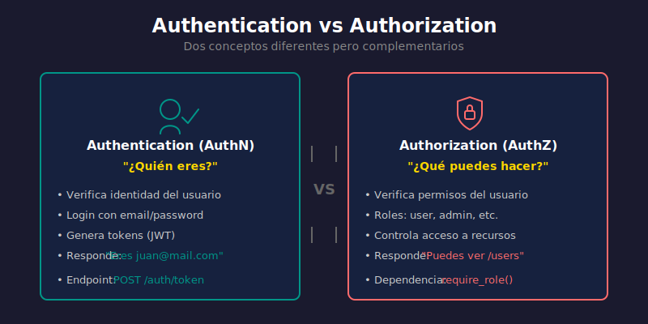

# 🔐 Semana 11: Autenticación JWT y OAuth2

## 📋 Descripción

Esta semana marca el inicio del **nivel Avanzado** del bootcamp. Implementaremos un sistema de autenticación completo usando **JSON Web Tokens (JWT)** y el estándar **OAuth2**. Aprenderemos a proteger nuestras APIs de forma segura y profesional.

La autenticación es fundamental en cualquier aplicación moderna. FastAPI proporciona herramientas integradas que facilitan la implementación de OAuth2 con JWT, siguiendo las mejores prácticas de seguridad.

---

## 🎯 Objetivos de Aprendizaje

Al finalizar esta semana, serás capaz de:

- ✅ Comprender los fundamentos de autenticación vs autorización
- ✅ Implementar **OAuth2 con Password Flow** en FastAPI
- ✅ Generar y validar **JSON Web Tokens (JWT)**
- ✅ Proteger endpoints con **dependencias de seguridad**
- ✅ Implementar **registro, login y logout** de usuarios
- ✅ Manejar **refresh tokens** para sesiones prolongadas
- ✅ Aplicar **hashing seguro** de contraseñas (bcrypt/argon2)
- ✅ Crear middleware de autenticación reutilizable

---

## 📚 Requisitos Previos

Antes de comenzar, asegúrate de haber completado:

- ✅ Semana 10: Arquitectura Hexagonal Completa
- ✅ Conocimiento de HTTP headers y cookies
- ✅ Comprensión de Dependency Injection en FastAPI
- ✅ Manejo básico de bases de datos con SQLAlchemy

---

## 🗂️ Estructura de la Semana

```
week-11/
├── README.md                    # Este archivo
├── rubrica-evaluacion.md        # Criterios de evaluación
├── 0-assets/                    # Diagramas y recursos visuales
│   ├── 01-auth-overview.svg
│   ├── 02-jwt-structure.svg
│   ├── 03-oauth2-flow.svg
│   ├── 04-token-lifecycle.svg
│   └── 05-security-layers.svg
├── 1-teoria/                    # Material teórico
│   ├── 01-fundamentos-autenticacion.md
│   ├── 02-jwt-en-profundidad.md
│   ├── 03-oauth2-password-flow.md
│   ├── 04-seguridad-passwords.md
│   └── 05-refresh-tokens.md
├── 2-practicas/                 # Ejercicios guiados
│   ├── 01-password-hashing/
│   ├── 02-jwt-tokens/
│   ├── 03-oauth2-fastapi/
│   └── 04-protected-endpoints/
├── 3-proyecto/                  # Proyecto integrador
│   ├── README.md
│   ├── starter/                 # Código inicial
│   └── solution/                # Solución (oculta)
├── 4-recursos/                  # Material adicional
│   ├── ebooks-free/
│   ├── videografia/
│   └── webgrafia/
└── 5-glosario/                  # Términos clave
    └── README.md
```

---

## 📝 Contenidos

### 1️⃣ Teoría (1.5-2 horas)

| Archivo | Tema | Duración |
|---------|------|----------|
| [01-fundamentos-autenticacion.md](1-teoria/01-fundamentos-autenticacion.md) | Autenticación vs Autorización | 20 min |
| [02-jwt-en-profundidad.md](1-teoria/02-jwt-en-profundidad.md) | Estructura y funcionamiento de JWT | 25 min |
| [03-oauth2-password-flow.md](1-teoria/03-oauth2-password-flow.md) | OAuth2 Password Flow en FastAPI | 25 min |
| [04-seguridad-passwords.md](1-teoria/04-seguridad-passwords.md) | Hashing seguro con bcrypt/passlib | 20 min |
| [05-refresh-tokens.md](1-teoria/05-refresh-tokens.md) | Refresh Tokens y sesiones | 15 min |

### 2️⃣ Prácticas (2.5-3 horas)

| Práctica | Tema | Duración |
|----------|------|----------|
| [01-password-hashing](2-practicas/01-password-hashing/) | Implementar hashing seguro | 35 min |
| [02-jwt-tokens](2-practicas/02-jwt-tokens/) | Crear y validar JWT | 45 min |
| [03-oauth2-fastapi](2-practicas/03-oauth2-fastapi/) | OAuth2 Password Flow completo | 50 min |
| [04-protected-endpoints](2-practicas/04-protected-endpoints/) | Proteger rutas y obtener usuario actual | 40 min |

### 3️⃣ Proyecto (1.5-2 horas)

| Proyecto | Descripción |
|----------|-------------|
| [Auth System](3-proyecto/) | Sistema de autenticación completo con registro, login, refresh tokens |

---

## 🔐 Conceptos Clave de Autenticación



### Autenticación vs Autorización

| Concepto | Pregunta | Ejemplo |
|----------|----------|---------|
| **Autenticación** | ¿Quién eres? | Login con usuario/contraseña |
| **Autorización** | ¿Qué puedes hacer? | Acceso según rol (admin, user) |

### Flujo OAuth2 con Password

```
┌─────────┐      1. POST /token        ┌─────────┐
│         │      (username, password)  │         │
│ Cliente │ ─────────────────────────► │   API   │
│         │                            │         │
│         │ ◄───────────────────────── │         │
└─────────┘      2. access_token       └─────────┘
                    + refresh_token
     │
     │  3. GET /protected
     │     Authorization: Bearer <token>
     ▼
┌─────────┐                            ┌─────────┐
│         │ ─────────────────────────► │         │
│ Cliente │      4. Validated!         │   API   │
│         │ ◄───────────────────────── │         │
└─────────┘      5. Protected data     └─────────┘
```

### Estructura JWT

```
eyJhbGciOiJIUzI1NiIsInR5cCI6IkpXVCJ9.     ← Header (algoritmo)
eyJzdWIiOiJ1c2VyQGVtYWlsLmNvbSIsImV4cCI6MTY...  ← Payload (datos)
SflKxwRJSMeKKF2QT4fwpMeJf36POk6yJV_adQssw5c   ← Signature (firma)
```

---

## ⏱️ Distribución del Tiempo

| Actividad | Tiempo | Porcentaje |
|-----------|--------|------------|
| 📖 Teoría | 1.5-2 h | ~30% |
| 💻 Prácticas | 2.5-3 h | ~45% |
| 🚀 Proyecto | 1.5-2 h | ~25% |
| **Total** | **~6 h** | **100%** |

---

## 📌 Entregable

**Proyecto: [Auth System](3-proyecto/)**

Sistema de autenticación completo funcionando con:

- [ ] Registro de usuarios con validación
- [ ] Login con OAuth2 Password Flow
- [ ] Generación de access y refresh tokens
- [ ] Endpoints protegidos con JWT
- [ ] Logout y revocación de tokens

---

## 🔗 Navegación

| ← Anterior | Actual | Siguiente → |
|------------|--------|-------------|
| [Semana 10: Hexagonal](../week-10/README.md) | **Semana 11** | [Semana 12: RBAC](../week-12/README.md) |

---

## 📚 Recursos Adicionales

- [FastAPI Security - Documentación Oficial](https://fastapi.tiangolo.com/tutorial/security/)
- [JWT.io - Debugger y Documentación](https://jwt.io/)
- [OAuth 2.0 Simplified](https://www.oauth.com/)
- [OWASP Authentication Cheat Sheet](https://cheatsheetseries.owasp.org/cheatsheets/Authentication_Cheat_Sheet.html)

---

## ✅ Checklist de la Semana

- [ ] Leer los 5 archivos de teoría
- [ ] Completar práctica 01: Password Hashing
- [ ] Completar práctica 02: JWT Tokens
- [ ] Completar práctica 03: OAuth2 FastAPI
- [ ] Completar práctica 04: Protected Endpoints
- [ ] Desarrollar el proyecto Auth System
- [ ] Ejecutar todos los tests
- [ ] Revisar el glosario de términos

---

_Semana 11 de 16 | Autenticación JWT y OAuth2 | Nivel Avanzado_
