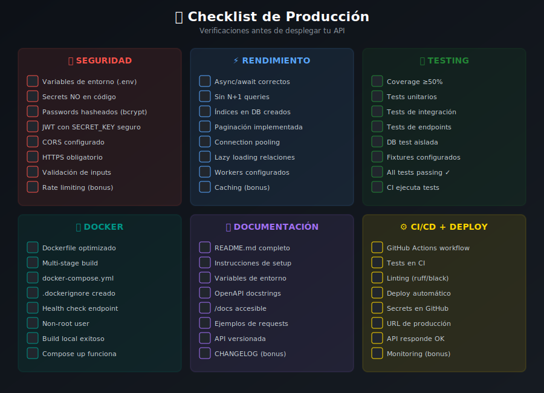

# 🚀 Checklist de Producción



## 📋 Descripción

Esta guía proporciona un checklist exhaustivo para asegurar que tu aplicación FastAPI está lista para producción. Revisa cada sección antes de desplegar.

---

## 🎯 Objetivos

1. Verificar configuración de seguridad
2. Optimizar rendimiento
3. Configurar logging y monitoreo
4. Validar deployment pipeline

---

## 🔐 Seguridad

### Autenticación y Autorización

```python
# ✅ BIEN - JWT con tiempo de expiración corto
from datetime import timedelta

ACCESS_TOKEN_EXPIRE_MINUTES = 15  # 15 minutos
REFRESH_TOKEN_EXPIRE_DAYS = 7     # 7 días

def create_access_token(data: dict) -> str:
    expire = datetime.utcnow() + timedelta(minutes=ACCESS_TOKEN_EXPIRE_MINUTES)
    to_encode = data.copy()
    to_encode.update({"exp": expire, "type": "access"})
    return jwt.encode(to_encode, settings.secret_key, algorithm="HS256")
```

### Checklist de Seguridad

- [ ] **Secrets seguros**: Claves de 32+ caracteres, generadas aleatoriamente
- [ ] **HTTPS obligatorio**: Redirigir HTTP a HTTPS
- [ ] **CORS configurado**: Solo dominios permitidos
- [ ] **Rate limiting**: Limitar requests por IP/usuario
- [ ] **Passwords hasheados**: bcrypt o argon2
- [ ] **SQL Injection**: Usar ORM, nunca string formatting
- [ ] **Input validation**: Pydantic en TODOS los inputs
- [ ] **Headers seguros**: Security headers configurados

```python
# Configuración de CORS para producción
from fastapi.middleware.cors import CORSMiddleware

# ❌ MAL - Permitir todo
app.add_middleware(
    CORSMiddleware,
    allow_origins=["*"],  # Nunca en producción
)

# ✅ BIEN - Dominios específicos
app.add_middleware(
    CORSMiddleware,
    allow_origins=[
        "https://myapp.com",
        "https://www.myapp.com",
    ],
    allow_credentials=True,
    allow_methods=["GET", "POST", "PUT", "DELETE"],
    allow_headers=["Authorization", "Content-Type"],
)
```

### Headers de Seguridad

```python
from fastapi import FastAPI
from starlette.middleware.base import BaseHTTPMiddleware

class SecurityHeadersMiddleware(BaseHTTPMiddleware):
    async def dispatch(self, request, call_next):
        response = await call_next(request)
        response.headers["X-Content-Type-Options"] = "nosniff"
        response.headers["X-Frame-Options"] = "DENY"
        response.headers["X-XSS-Protection"] = "1; mode=block"
        response.headers["Strict-Transport-Security"] = "max-age=31536000; includeSubDomains"
        response.headers["Referrer-Policy"] = "strict-origin-when-cross-origin"
        return response

app.add_middleware(SecurityHeadersMiddleware)
```

---

## ⚡ Rendimiento

### Configuración de Base de Datos

```python
from sqlalchemy.ext.asyncio import create_async_engine, AsyncSession
from sqlalchemy.orm import sessionmaker

# Pool de conexiones optimizado para producción
engine = create_async_engine(
    settings.database_url,
    pool_size=20,           # Conexiones base
    max_overflow=30,        # Conexiones adicionales bajo carga
    pool_timeout=30,        # Timeout para obtener conexión
    pool_recycle=1800,      # Reciclar conexiones cada 30 min
    pool_pre_ping=True,     # Verificar conexiones antes de usar
)

AsyncSessionLocal = sessionmaker(
    engine, 
    class_=AsyncSession, 
    expire_on_commit=False
)
```

### Checklist de Rendimiento

- [ ] **Connection pooling**: Configurado y optimizado
- [ ] **Índices de DB**: Creados para queries frecuentes
- [ ] **Paginación**: En todos los endpoints de listado
- [ ] **Async/await**: I/O no bloqueante
- [ ] **Caching**: Redis para datos frecuentes
- [ ] **Compression**: gzip/brotli habilitado
- [ ] **CDN**: Para assets estáticos

```python
# Paginación estándar
from pydantic import BaseModel

class PaginationParams(BaseModel):
    page: int = 1
    per_page: int = 20
    
    @property
    def offset(self) -> int:
        return (self.page - 1) * self.per_page

class PaginatedResponse(BaseModel):
    items: list
    total: int
    page: int
    per_page: int
    pages: int

@router.get("/items", response_model=PaginatedResponse)
async def list_items(
    pagination: PaginationParams = Depends(),
    db: AsyncSession = Depends(get_db)
):
    total = await service.count_items(db)
    items = await service.get_items(
        db, 
        offset=pagination.offset, 
        limit=pagination.per_page
    )
    return PaginatedResponse(
        items=items,
        total=total,
        page=pagination.page,
        per_page=pagination.per_page,
        pages=(total + pagination.per_page - 1) // pagination.per_page
    )
```

---

## 📝 Logging y Monitoreo

### Configuración de Logging

```python
import logging
import sys
from logging.handlers import RotatingFileHandler
import json
from datetime import datetime

class JSONFormatter(logging.Formatter):
    """Formatter que produce logs en formato JSON."""
    
    def format(self, record: logging.LogRecord) -> str:
        log_data = {
            "timestamp": datetime.utcnow().isoformat(),
            "level": record.levelname,
            "message": record.getMessage(),
            "module": record.module,
            "function": record.funcName,
            "line": record.lineno,
        }
        
        if record.exc_info:
            log_data["exception"] = self.formatException(record.exc_info)
        
        if hasattr(record, "request_id"):
            log_data["request_id"] = record.request_id
            
        return json.dumps(log_data)

def setup_logging(level: str = "INFO"):
    """Configura logging para producción."""
    logger = logging.getLogger("app")
    logger.setLevel(getattr(logging, level))
    
    # Console handler con JSON
    console_handler = logging.StreamHandler(sys.stdout)
    console_handler.setFormatter(JSONFormatter())
    logger.addHandler(console_handler)
    
    # File handler con rotación
    file_handler = RotatingFileHandler(
        "logs/app.log",
        maxBytes=10_000_000,  # 10MB
        backupCount=5
    )
    file_handler.setFormatter(JSONFormatter())
    logger.addHandler(file_handler)
    
    return logger
```

### Middleware de Request ID

```python
import uuid
from contextvars import ContextVar
from starlette.middleware.base import BaseHTTPMiddleware

request_id_var: ContextVar[str] = ContextVar("request_id", default="")

class RequestIDMiddleware(BaseHTTPMiddleware):
    async def dispatch(self, request, call_next):
        request_id = request.headers.get("X-Request-ID", str(uuid.uuid4()))
        request_id_var.set(request_id)
        
        response = await call_next(request)
        response.headers["X-Request-ID"] = request_id
        
        return response
```

### Health Checks

```python
from fastapi import APIRouter, Depends
from sqlalchemy.ext.asyncio import AsyncSession
from sqlalchemy import text

router = APIRouter(tags=["Health"])

@router.get("/health")
async def health():
    """Health check básico."""
    return {"status": "healthy"}

@router.get("/health/ready")
async def readiness(db: AsyncSession = Depends(get_db)):
    """
    Readiness check - verifica dependencias.
    Usado por Kubernetes/load balancers.
    """
    checks = {}
    
    # Database check
    try:
        await db.execute(text("SELECT 1"))
        checks["database"] = "healthy"
    except Exception as e:
        checks["database"] = f"unhealthy: {str(e)}"
    
    # Redis check (si aplica)
    # try:
    #     await redis.ping()
    #     checks["redis"] = "healthy"
    # except:
    #     checks["redis"] = "unhealthy"
    
    all_healthy = all(v == "healthy" for v in checks.values())
    
    return {
        "status": "ready" if all_healthy else "not_ready",
        "checks": checks
    }

@router.get("/health/live")
async def liveness():
    """
    Liveness check - la app está corriendo.
    Si falla, Kubernetes reinicia el pod.
    """
    return {"status": "alive"}
```

---

## 🐳 Docker en Producción

### Dockerfile Optimizado

```dockerfile
# Build stage
FROM python:3.13-slim AS builder

ENV PYTHONDONTWRITEBYTECODE=1 \
    PYTHONUNBUFFERED=1 \
    UV_SYSTEM_PYTHON=1

WORKDIR /app

# Instalar uv
RUN pip install --no-cache-dir uv

# Copiar solo archivos de dependencias primero
COPY pyproject.toml uv.lock ./

# Instalar dependencias (sin dev)
RUN uv sync --frozen --no-dev

# Production stage
FROM python:3.13-slim AS production

ENV PYTHONDONTWRITEBYTECODE=1 \
    PYTHONUNBUFFERED=1

# Crear usuario no-root
RUN groupadd -r appgroup && useradd -r -g appgroup appuser

WORKDIR /app

# Copiar virtual environment del builder
COPY --from=builder /app/.venv /app/.venv

# Copiar código fuente
COPY --chown=appuser:appgroup src/ ./src/
COPY --chown=appuser:appgroup alembic/ ./alembic/
COPY --chown=appuser:appgroup alembic.ini ./

# Crear directorio de logs
RUN mkdir -p /app/logs && chown appuser:appgroup /app/logs

# Cambiar a usuario no-root
USER appuser

# Exponer puerto
EXPOSE 8000

# Health check
HEALTHCHECK --interval=30s --timeout=10s --start-period=5s --retries=3 \
    CMD curl -f http://localhost:8000/health || exit 1

# Comando de inicio
CMD ["/app/.venv/bin/uvicorn", "src.main:app", "--host", "0.0.0.0", "--port", "8000"]
```

### docker-compose.prod.yml

```yaml
version: '3.9'

services:
  api:
    build:
      context: .
      dockerfile: Dockerfile
      target: production
    ports:
      - "8000:8000"
    environment:
      - ENVIRONMENT=production
      - DATABASE_URL=postgresql+asyncpg://user:pass@db:5432/app
      - SECRET_KEY=${SECRET_KEY}
      - LOG_LEVEL=INFO
    depends_on:
      db:
        condition: service_healthy
    restart: unless-stopped
    deploy:
      resources:
        limits:
          cpus: '1'
          memory: 512M
        reservations:
          cpus: '0.5'
          memory: 256M
    healthcheck:
      test: ["CMD", "curl", "-f", "http://localhost:8000/health"]
      interval: 30s
      timeout: 10s
      retries: 3
      start_period: 10s

  db:
    image: postgres:17-alpine
    environment:
      - POSTGRES_USER=user
      - POSTGRES_PASSWORD=pass
      - POSTGRES_DB=app
    volumes:
      - postgres_data:/var/lib/postgresql/data
    healthcheck:
      test: ["CMD-SHELL", "pg_isready -U user -d app"]
      interval: 10s
      timeout: 5s
      retries: 5
    restart: unless-stopped

volumes:
  postgres_data:
```

---

## 🔄 CI/CD Checklist

### GitHub Actions

- [ ] **Lint**: Ruff configurado
- [ ] **Type check**: Pyright/mypy
- [ ] **Tests**: pytest con coverage
- [ ] **Build**: Docker image
- [ ] **Push**: A container registry
- [ ] **Deploy**: Automático a staging/prod

### Branches y Protección

```yaml
# .github/workflows/main.yml
name: CI/CD

on:
  push:
    branches: [main, develop]
  pull_request:
    branches: [main]

jobs:
  test:
    runs-on: ubuntu-latest
    steps:
      - uses: actions/checkout@v4
      
      - name: Run tests
        run: |
          docker compose -f docker-compose.test.yml up --build --abort-on-container-exit
          
  deploy:
    needs: test
    if: github.ref == 'refs/heads/main'
    runs-on: ubuntu-latest
    steps:
      - name: Deploy to production
        run: |
          # Deploy commands here
```

---

## 📊 Checklist Final de Producción

### Antes de Desplegar

#### Código
- [ ] Todos los tests pasan
- [ ] Coverage > 50%
- [ ] Sin errores de linting
- [ ] Type hints completos
- [ ] Sin TODOs críticos
- [ ] Secrets no hardcodeados

#### Configuración
- [ ] Variables de entorno documentadas
- [ ] `.env.example` actualizado
- [ ] Configuración por ambiente (dev/staging/prod)
- [ ] DEBUG = False en producción

#### Seguridad
- [ ] CORS configurado correctamente
- [ ] Rate limiting habilitado
- [ ] Secrets rotados recientemente
- [ ] Dependencias sin vulnerabilidades conocidas

#### DevOps
- [ ] Dockerfile optimizado
- [ ] Health checks funcionando
- [ ] Logs estructurados
- [ ] Backups configurados (DB)
- [ ] SSL/TLS habilitado

#### Documentación
- [ ] README completo
- [ ] API documentada (OpenAPI)
- [ ] Runbook de operaciones
- [ ] Diagrama de arquitectura

---

## 🛠️ Comandos Útiles de Producción

```bash
# Ver logs en tiempo real
docker compose logs -f api

# Ejecutar migraciones
docker compose exec api alembic upgrade head

# Crear backup de DB
docker compose exec db pg_dump -U user app > backup.sql

# Ver métricas del contenedor
docker stats

# Reiniciar servicio sin downtime
docker compose up -d --no-deps --build api

# Ver health status
curl http://localhost:8000/health/ready | jq
```

---

## 📚 Recursos Adicionales

- [12 Factor App](https://12factor.net/)
- [OWASP Top 10](https://owasp.org/www-project-top-ten/)
- [FastAPI Security Best Practices](https://fastapi.tiangolo.com/tutorial/security/)
- [Docker Production Best Practices](https://docs.docker.com/develop/develop-images/dockerfile_best-practices/)
