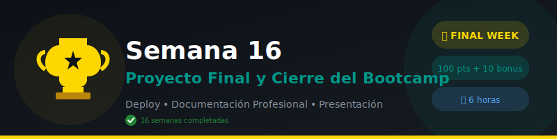

# 🎓 Semana 16: Proyecto Final y Cierre del Bootcamp

## 📋 Descripción General

Esta es la **semana final del bootcamp**. Consolidarás todo lo aprendido construyendo un proyecto completo listo para producción y preparándote para el mundo laboral como desarrollador backend.

---

## 🎯 Objetivos de Aprendizaje

Al finalizar esta semana serás capaz de:

1. ✅ Construir una API completa aplicando todos los conocimientos del bootcamp
2. ✅ Implementar arquitectura limpia y mejores prácticas
3. ✅ Preparar tu proyecto para portfolio profesional
4. ✅ Documentar tu código y API de forma profesional
5. ✅ Aplicar a posiciones de desarrollador backend junior

---

## 📚 Contenido

### 1. Teoría

| Archivo | Tema | Duración |
|---------|------|----------|
| [01-proyecto-final-guia.md](./1-teoria/01-proyecto-final-guia.md) | Guía del Proyecto Final | 30 min |
| [02-mejores-practicas-produccion.md](./1-teoria/02-mejores-practicas-produccion.md) | Checklist de Producción | 30 min |
| [03-documentacion-profesional.md](./1-teoria/03-documentacion-profesional.md) | Documentación de APIs | 20 min |
| [04-preparacion-laboral.md](./1-teoria/04-preparacion-laboral.md) | Portfolio y Entrevistas | 20 min |
| [05-siguientes-pasos.md](./1-teoria/05-siguientes-pasos.md) | Roadmap Post-Bootcamp | 20 min |

### 2. Prácticas

| Práctica | Tema | Duración |
|----------|------|----------|
| [01-revision-codigo](./2-practicas/01-revision-codigo/) | Code Review Checklist | 30 min |
| [02-optimizacion-api](./2-practicas/02-optimizacion-api/) | Performance y Caching | 30 min |
| [03-monitoring-logging](./2-practicas/03-monitoring-logging/) | Observabilidad | 30 min |

### 3. Proyecto Final

| Proyecto | Descripción | Duración |
|----------|-------------|----------|
| [Proyecto Final](./3-proyecto/) | API Completa Production-Ready | 3-4 horas |

---

## ⏱️ Distribución del Tiempo

| Actividad | Tiempo |
|-----------|--------|
| Teoría | 2 horas |
| Prácticas | 1.5 horas |
| Proyecto Final | 3-4 horas |
| **Total** | **~7 horas** |

---

## 📌 Entregable

**Proyecto Final**

Aplicación completa lista para producción:

- [ ] API desplegada y accesible
- [ ] Repositorio GitHub con README profesional
- [ ] Código limpio, documentado y testeado
- [ ] CI/CD configurado
- [ ] Presentación con demo, arquitectura y lecciones aprendidas

---

## 🎓 Certificación

Para obtener el certificado del bootcamp debes:

1. ✅ Completar el proyecto final con nota ≥ 70%
2. ✅ Aprobar las evaluaciones semanales (promedio ≥ 70%)
3. ✅ Presentar el proyecto final
4. ✅ Subir el proyecto a tu portfolio

---

## 📊 Competencias Evaluadas (Proyecto Final)

| Competencia | Peso |
|-------------|------|
| **CE1**: Arquitectura y diseño | 20% |
| **CE2**: Implementación correcta | 25% |
| **CE3**: Testing y calidad | 15% |
| **CE4**: Docker y CI/CD | 15% |
| **CE5**: Documentación | 10% |
| **CE6**: Presentación | 15% |

---

## 📚 Recursos de la Semana

- [Recursos Adicionales](./4-recursos/)
- [Glosario de Términos](./5-glosario/)

---

## 🔗 Navegación

| Anterior | Siguiente |
|----------|-----------|
| [⬅️ Semana 15: Docker y CI/CD](../week-15/) | 🎉 ¡Fin del Bootcamp! |

---

## 🏠 [Volver al Índice del Bootcamp](../)

---

> 💡 **Nota**: Esta semana es principalmente trabajo en el proyecto final. Usa la teoría y prácticas como referencia mientras construyes tu API.
