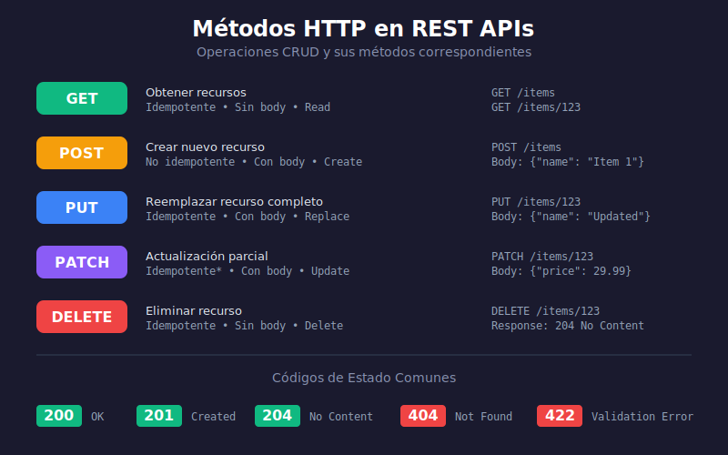

# 🛣️ Rutas Básicas y Diseño RESTful

## 🎯 Objetivos de Aprendizaje

Al finalizar este tema, serás capaz de:

- ✅ Entender los métodos HTTP y su uso apropiado
- ✅ Diseñar URLs siguiendo convenciones REST
- ✅ Crear rutas en FastAPI con diferentes métodos
- ✅ Organizar rutas con APIRouter

---

## 📚 Contenido

### 1. Métodos HTTP

HTTP define métodos (verbos) que indican la acción a realizar:



| Método | Acción | Idempotente | Body |
|--------|--------|-------------|------|
| **GET** | Obtener recurso(s) | ✅ Sí | ❌ No |
| **POST** | Crear recurso | ❌ No | ✅ Sí |
| **PUT** | Reemplazar recurso completo | ✅ Sí | ✅ Sí |
| **PATCH** | Actualizar parcialmente | ❌ No* | ✅ Sí |
| **DELETE** | Eliminar recurso | ✅ Sí | ❌ No |

> **Idempotente**: Ejecutar múltiples veces produce el mismo resultado.

```python
from fastapi import FastAPI

app = FastAPI()

# GET - Obtener todos los usuarios
@app.get("/users")
async def get_users():
    return [{"id": 1, "name": "Alice"}]

# GET - Obtener un usuario específico
@app.get("/users/{user_id}")
async def get_user(user_id: int):
    return {"id": user_id, "name": "Alice"}

# POST - Crear usuario
@app.post("/users")
async def create_user(user: dict):
    return {"id": 1, **user}

# PUT - Reemplazar usuario completo
@app.put("/users/{user_id}")
async def replace_user(user_id: int, user: dict):
    return {"id": user_id, **user}

# PATCH - Actualizar parcialmente
@app.patch("/users/{user_id}")
async def update_user(user_id: int, user: dict):
    return {"id": user_id, "updated": True}

# DELETE - Eliminar usuario
@app.delete("/users/{user_id}")
async def delete_user(user_id: int):
    return {"deleted": True}
```

---

### 2. Diseño de URLs RESTful

#### Convenciones

| ✅ Correcto | ❌ Incorrecto | Razón |
|-------------|---------------|-------|
| `/users` | `/getUsers` | Usar sustantivos, no verbos |
| `/users/123` | `/user/123` | Plural para colecciones |
| `/users/123/orders` | `/getUserOrders/123` | Anidar recursos relacionados |
| `/products?category=electronics` | `/products/electronics` | Query params para filtros |

#### Estructura Recomendada

```
GET    /resources          → Listar recursos
GET    /resources/{id}     → Obtener uno
POST   /resources          → Crear
PUT    /resources/{id}     → Reemplazar
PATCH  /resources/{id}     → Actualizar parcial
DELETE /resources/{id}     → Eliminar

# Recursos anidados
GET    /users/{id}/orders  → Órdenes de un usuario
POST   /users/{id}/orders  → Crear orden para usuario
```

#### Ejemplos Prácticos

```python
from fastapi import FastAPI

app = FastAPI()

# ✅ BIEN - Recursos con sustantivos en plural
@app.get("/products")
async def list_products():
    pass

@app.get("/products/{product_id}")
async def get_product(product_id: int):
    pass

@app.get("/products/{product_id}/reviews")
async def get_product_reviews(product_id: int):
    pass

# ❌ MAL - Verbos en la URL
@app.get("/getProducts")  # Incorrecto
async def get_products_bad():
    pass

@app.post("/createProduct")  # Incorrecto
async def create_product_bad():
    pass
```

---

### 3. Status Codes Apropiados

```python
from fastapi import FastAPI, HTTPException, status

app = FastAPI()

# 200 OK - Operación exitosa (default para GET)
@app.get("/users/{user_id}")
async def get_user(user_id: int):
    return {"id": user_id}

# 201 Created - Recurso creado
@app.post("/users", status_code=status.HTTP_201_CREATED)
async def create_user(user: dict):
    return {"id": 1, **user}

# 204 No Content - Eliminado sin contenido
@app.delete("/users/{user_id}", status_code=status.HTTP_204_NO_CONTENT)
async def delete_user(user_id: int):
    return None  # No retorna contenido

# 404 Not Found - Recurso no existe
@app.get("/users/{user_id}")
async def get_user_with_check(user_id: int):
    user = find_user(user_id)  # Función ficticia
    if not user:
        raise HTTPException(
            status_code=status.HTTP_404_NOT_FOUND,
            detail="User not found"
        )
    return user
```

#### Códigos Comunes

| Código | Nombre | Uso |
|--------|--------|-----|
| 200 | OK | Éxito general |
| 201 | Created | Recurso creado |
| 204 | No Content | Éxito sin body (DELETE) |
| 400 | Bad Request | Error en la solicitud |
| 401 | Unauthorized | No autenticado |
| 403 | Forbidden | Sin permisos |
| 404 | Not Found | Recurso no existe |
| 422 | Unprocessable Entity | Error de validación |
| 500 | Internal Server Error | Error del servidor |

---

### 4. Organización con APIRouter

Para proyectos grandes, organiza rutas en routers separados:

```python
# routers/users.py
from fastapi import APIRouter

router = APIRouter(
    prefix="/users",
    tags=["Users"],
    responses={404: {"description": "Not found"}},
)

@router.get("/")
async def list_users():
    return []

@router.get("/{user_id}")
async def get_user(user_id: int):
    return {"id": user_id}

@router.post("/", status_code=201)
async def create_user(user: dict):
    return {"id": 1, **user}
```

```python
# routers/products.py
from fastapi import APIRouter

router = APIRouter(
    prefix="/products",
    tags=["Products"],
)

@router.get("/")
async def list_products():
    return []
```

```python
# main.py
from fastapi import FastAPI
from routers import users, products

app = FastAPI(title="My API")

# Incluir routers
app.include_router(users.router)
app.include_router(products.router)

@app.get("/")
async def root():
    return {"message": "Welcome to the API"}
```

#### Estructura de Proyecto

```
src/
├── main.py
├── routers/
│   ├── __init__.py
│   ├── users.py
│   └── products.py
├── schemas/
│   ├── __init__.py
│   ├── user.py
│   └── product.py
└── services/
    ├── __init__.py
    └── user_service.py
```

---

### 5. Decoradores de Ruta

FastAPI ofrece decoradores específicos para cada método:

```python
from fastapi import FastAPI

app = FastAPI()

# Métodos específicos
@app.get("/items")      # GET
@app.post("/items")     # POST
@app.put("/items/{id}") # PUT
@app.patch("/items/{id}") # PATCH
@app.delete("/items/{id}") # DELETE

# Método genérico (poco común)
@app.api_route("/items", methods=["GET", "POST"])
async def items_handler():
    pass

# Opciones adicionales del decorador
@app.get(
    "/items",
    summary="List all items",
    description="Returns a list of all items in the database",
    response_description="List of items",
    tags=["Items"],
    deprecated=False,
)
async def list_items():
    """
    Endpoint para listar items.
    
    Este docstring también aparece en la documentación.
    """
    return []
```

---

### 6. Rutas con Parámetros de Ruta Fijos

A veces necesitas rutas fijas antes de parámetros dinámicos:

```python
from fastapi import FastAPI

app = FastAPI()

# ⚠️ ORDEN IMPORTANTE: rutas fijas primero

# Ruta fija - debe ir ANTES
@app.get("/users/me")
async def get_current_user():
    return {"id": "current", "name": "Current User"}

# Ruta dinámica - debe ir DESPUÉS
@app.get("/users/{user_id}")
async def get_user(user_id: str):
    return {"id": user_id}

# Si el orden es incorrecto, /users/me intentará
# usar "me" como user_id
```

---

## 📝 Resumen

| Concepto | Descripción |
|----------|-------------|
| **GET** | Obtener recursos |
| **POST** | Crear recursos |
| **PUT** | Reemplazar completo |
| **PATCH** | Actualizar parcial |
| **DELETE** | Eliminar |
| **APIRouter** | Organizar rutas |
| **Status codes** | Indicar resultado |

---

## ✅ Checklist de Verificación

Antes de continuar, asegúrate de poder:

- [ ] Elegir el método HTTP correcto para cada operación
- [ ] Diseñar URLs RESTful con sustantivos en plural
- [ ] Usar status codes apropiados
- [ ] Organizar rutas con APIRouter
- [ ] Ordenar rutas fijas antes de dinámicas

---

## 🔗 Recursos Adicionales

- [FastAPI Routing](https://fastapi.tiangolo.com/tutorial/first-steps/)
- [HTTP Methods](https://developer.mozilla.org/en-US/docs/Web/HTTP/Methods)
- [REST API Design](https://restfulapi.net/)

---

[Siguiente: Path Parameters →](02-path-parameters.md)
