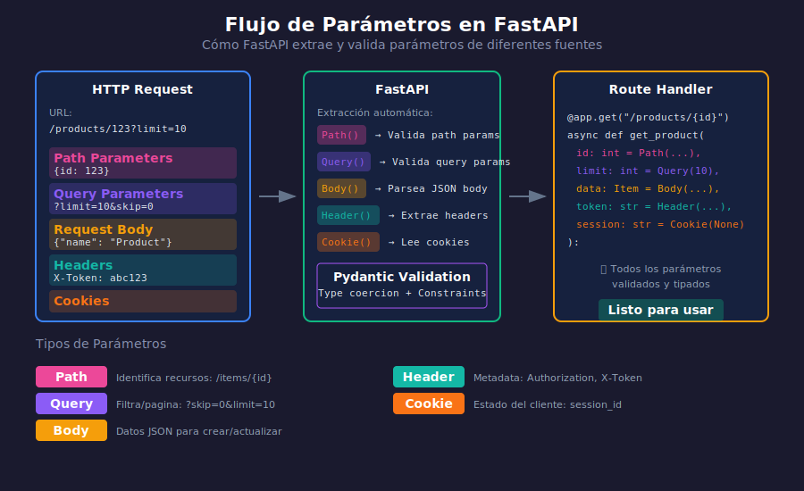

# ⚙️ Parámetros Avanzados

## 🎯 Objetivos de Aprendizaje

Al finalizar este tema, serás capaz de:

- ✅ Usar Header() para leer encabezados HTTP
- ✅ Usar Cookie() para leer cookies
- ✅ Crear dependencias reutilizables para parámetros
- ✅ Implementar parámetros comunes compartidos

---

## 📚 Contenido



### 1. Header Parameters

Leer encabezados HTTP de la request:

```python
from fastapi import FastAPI, Header

app = FastAPI()

@app.get("/items")
async def read_items(
    # Header simple
    user_agent: str | None = Header(default=None),
    
    # Header con nombre diferente
    x_token: str | None = Header(default=None),
    
    # Header requerido
    authorization: str = Header(...)
):
    """
    Headers se convierten automáticamente:
    - user_agent → User-Agent
    - x_token → X-Token
    
    FastAPI convierte snake_case a kebab-case
    """
    return {
        "user_agent": user_agent,
        "x_token": x_token,
        "authorization": authorization
    }
```

#### Conversión de Nombres

```python
from fastapi import FastAPI, Header

app = FastAPI()

@app.get("/headers")
async def read_headers(
    # Por defecto convierte _ a -
    accept_language: str | None = Header(default=None),  # Accept-Language
    
    # Desactivar conversión automática
    some_header: str | None = Header(default=None, convert_underscores=False),
    
    # Alias para headers personalizados
    custom: str | None = Header(default=None, alias="X-Custom-Header")
):
    return {
        "accept_language": accept_language,
        "some_header": some_header,
        "custom": custom
    }
```

#### Headers Duplicados (Lista)

```python
from fastapi import FastAPI, Header

app = FastAPI()

@app.get("/items")
async def read_items(
    # Recibir múltiples valores del mismo header
    x_token: list[str] | None = Header(default=None)
):
    """
    Si el cliente envía:
    X-Token: token1
    X-Token: token2
    
    Recibes: ["token1", "token2"]
    """
    return {"x_tokens": x_token}
```

---

### 2. Cookie Parameters

Leer cookies de la request:

```python
from fastapi import FastAPI, Cookie

app = FastAPI()

@app.get("/items")
async def read_items(
    # Cookie simple
    session_id: str | None = Cookie(default=None),
    
    # Cookie requerida
    auth_token: str = Cookie(...),
    
    # Cookie con validación
    user_prefs: str | None = Cookie(default=None, max_length=100)
):
    return {
        "session_id": session_id,
        "auth_token": auth_token,
        "user_prefs": user_prefs
    }
```

#### Ejemplo: Tracking de Sesión

```python
from fastapi import FastAPI, Cookie, Response
from uuid import uuid4

app = FastAPI()

@app.get("/")
async def home(
    response: Response,
    session_id: str | None = Cookie(default=None)
):
    # Si no hay sesión, crear una nueva
    if not session_id:
        session_id = str(uuid4())
        response.set_cookie(
            key="session_id",
            value=session_id,
            httponly=True,  # No accesible desde JavaScript
            max_age=3600,   # 1 hora
            samesite="lax"
        )
        return {"message": "New session created", "session_id": session_id}
    
    return {"message": "Welcome back!", "session_id": session_id}
```

---

### 3. Dependencias para Parámetros Comunes

Usa `Depends` para reutilizar lógica de parámetros:

```python
from fastapi import FastAPI, Query, Depends
from typing import Annotated

app = FastAPI()

# Función de dependencia para paginación
async def pagination_params(
    page: int = Query(default=1, ge=1, description="Page number"),
    per_page: int = Query(default=10, ge=1, le=100, description="Items per page")
) -> dict:
    return {
        "page": page,
        "per_page": per_page,
        "offset": (page - 1) * per_page
    }

# Alias con Annotated (recomendado)
PaginationDep = Annotated[dict, Depends(pagination_params)]

@app.get("/items")
async def list_items(pagination: PaginationDep):
    return {
        "pagination": pagination,
        "items": []
    }

@app.get("/users")
async def list_users(pagination: PaginationDep):
    return {
        "pagination": pagination,
        "users": []
    }

@app.get("/products")
async def list_products(pagination: PaginationDep):
    return {
        "pagination": pagination,
        "products": []
    }
```

---

### 4. Dependencias con Clases

Las clases son ideales para parámetros complejos:

```python
from fastapi import FastAPI, Query, Depends
from typing import Annotated
from enum import Enum

app = FastAPI()

class SortOrder(str, Enum):
    asc = "asc"
    desc = "desc"

# Clase para filtros comunes
class CommonFilters:
    def __init__(
        self,
        search: str | None = Query(default=None, min_length=2),
        sort_by: str = Query(default="created_at"),
        order: SortOrder = Query(default=SortOrder.desc),
        page: int = Query(default=1, ge=1),
        per_page: int = Query(default=20, ge=1, le=100)
    ):
        self.search = search
        self.sort_by = sort_by
        self.order = order
        self.page = page
        self.per_page = per_page
        self.offset = (page - 1) * per_page

# Alias
FiltersDep = Annotated[CommonFilters, Depends()]

@app.get("/posts")
async def list_posts(filters: FiltersDep):
    return {
        "search": filters.search,
        "sort_by": filters.sort_by,
        "order": filters.order,
        "page": filters.page,
        "per_page": filters.per_page,
        "offset": filters.offset
    }

@app.get("/comments")
async def list_comments(filters: FiltersDep):
    return {
        "filters": {
            "search": filters.search,
            "sort_by": filters.sort_by,
            "page": filters.page
        }
    }
```

---

### 5. Dependencias Anidadas

Las dependencias pueden depender de otras dependencias:

```python
from fastapi import FastAPI, Header, Depends, HTTPException, status
from typing import Annotated

app = FastAPI()

# Base de datos de usuarios simulada
users_db = {
    "token123": {"id": 1, "name": "Alice", "role": "admin"},
    "token456": {"id": 2, "name": "Bob", "role": "user"},
}

# Dependencia 1: Extraer token
async def get_token(
    authorization: str = Header(...)
) -> str:
    if not authorization.startswith("Bearer "):
        raise HTTPException(
            status_code=status.HTTP_401_UNAUTHORIZED,
            detail="Invalid authorization header"
        )
    return authorization.replace("Bearer ", "")

TokenDep = Annotated[str, Depends(get_token)]

# Dependencia 2: Obtener usuario (depende del token)
async def get_current_user(token: TokenDep) -> dict:
    if token not in users_db:
        raise HTTPException(
            status_code=status.HTTP_401_UNAUTHORIZED,
            detail="Invalid token"
        )
    return users_db[token]

CurrentUserDep = Annotated[dict, Depends(get_current_user)]

# Dependencia 3: Verificar rol admin (depende del usuario)
async def require_admin(user: CurrentUserDep) -> dict:
    if user["role"] != "admin":
        raise HTTPException(
            status_code=status.HTTP_403_FORBIDDEN,
            detail="Admin access required"
        )
    return user

AdminUserDep = Annotated[dict, Depends(require_admin)]

# Endpoints usando las dependencias
@app.get("/users/me")
async def get_me(user: CurrentUserDep):
    """Cualquier usuario autenticado"""
    return user

@app.get("/admin/dashboard")
async def admin_dashboard(admin: AdminUserDep):
    """Solo administradores"""
    return {"message": f"Welcome admin {admin['name']}!"}
```

---

### 6. Parámetros desde Request Directo

Acceder al objeto Request completo:

```python
from fastapi import FastAPI, Request

app = FastAPI()

@app.get("/info")
async def get_request_info(request: Request):
    return {
        "method": request.method,
        "url": str(request.url),
        "base_url": str(request.base_url),
        "headers": dict(request.headers),
        "cookies": request.cookies,
        "client": {
            "host": request.client.host if request.client else None,
            "port": request.client.port if request.client else None
        },
        "path_params": request.path_params,
        "query_params": dict(request.query_params)
    }

@app.post("/raw-body")
async def get_raw_body(request: Request):
    # Leer body como bytes
    body = await request.body()
    
    # O como JSON
    # json_body = await request.json()
    
    return {
        "content_type": request.headers.get("content-type"),
        "body_size": len(body)
    }
```

---

### 7. Ejemplo Completo: API con Autenticación

```python
from fastapi import FastAPI, Path, Query, Header, Cookie, Depends, HTTPException, status
from pydantic import BaseModel
from typing import Annotated
from enum import Enum
from datetime import datetime

app = FastAPI(title="Advanced Parameters API")

# ============================================
# SCHEMAS
# ============================================

class SortOrder(str, Enum):
    asc = "asc"
    desc = "desc"

class User(BaseModel):
    id: int
    username: str
    role: str

class Article(BaseModel):
    id: int
    title: str
    content: str
    author_id: int
    created_at: datetime

# ============================================
# BASE DE DATOS SIMULADA
# ============================================

users_db = {
    "admin_token": User(id=1, username="admin", role="admin"),
    "user_token": User(id=2, username="john", role="user"),
}

articles_db: dict[int, Article] = {
    1: Article(id=1, title="FastAPI Guide", content="...", author_id=1, created_at=datetime.now()),
    2: Article(id=2, title="Python Tips", content="...", author_id=2, created_at=datetime.now()),
}

# ============================================
# DEPENDENCIAS
# ============================================

async def get_token(
    authorization: str | None = Header(default=None),
    session_token: str | None = Cookie(default=None)
) -> str:
    """Extraer token de header o cookie"""
    token = None
    
    if authorization and authorization.startswith("Bearer "):
        token = authorization.replace("Bearer ", "")
    elif session_token:
        token = session_token
    
    if not token:
        raise HTTPException(
            status_code=status.HTTP_401_UNAUTHORIZED,
            detail="No authentication provided",
            headers={"WWW-Authenticate": "Bearer"}
        )
    
    return token

TokenDep = Annotated[str, Depends(get_token)]

async def get_current_user(token: TokenDep) -> User:
    """Obtener usuario desde token"""
    if token not in users_db:
        raise HTTPException(
            status_code=status.HTTP_401_UNAUTHORIZED,
            detail="Invalid token"
        )
    return users_db[token]

CurrentUserDep = Annotated[User, Depends(get_current_user)]

async def require_admin(user: CurrentUserDep) -> User:
    """Verificar rol de admin"""
    if user.role != "admin":
        raise HTTPException(
            status_code=status.HTTP_403_FORBIDDEN,
            detail="Admin privileges required"
        )
    return user

AdminDep = Annotated[User, Depends(require_admin)]

class PaginationParams:
    """Parámetros de paginación reutilizables"""
    def __init__(
        self,
        page: int = Query(default=1, ge=1),
        per_page: int = Query(default=10, ge=1, le=50),
        sort_by: str = Query(default="created_at"),
        order: SortOrder = Query(default=SortOrder.desc)
    ):
        self.page = page
        self.per_page = per_page
        self.sort_by = sort_by
        self.order = order
        self.offset = (page - 1) * per_page

PaginationDep = Annotated[PaginationParams, Depends()]

# ============================================
# ENDPOINTS
# ============================================

@app.get("/me")
async def get_current_user_info(
    user: CurrentUserDep,
    user_agent: str | None = Header(default=None),
    accept_language: str | None = Header(default=None)
):
    """Información del usuario actual"""
    return {
        "user": user.model_dump(),
        "client_info": {
            "user_agent": user_agent,
            "language": accept_language
        }
    }

@app.get("/articles")
async def list_articles(
    user: CurrentUserDep,
    pagination: PaginationDep,
    search: str | None = Query(default=None, min_length=2),
    author_id: int | None = Query(default=None, gt=0)
):
    """Listar artículos con filtros y paginación"""
    result = list(articles_db.values())
    
    # Filtrar
    if search:
        result = [a for a in result if search.lower() in a.title.lower()]
    if author_id:
        result = [a for a in result if a.author_id == author_id]
    
    # Ordenar
    if hasattr(result[0] if result else None, pagination.sort_by):
        reverse = pagination.order == SortOrder.desc
        result.sort(key=lambda x: getattr(x, pagination.sort_by), reverse=reverse)
    
    # Paginar
    total = len(result)
    result = result[pagination.offset:pagination.offset + pagination.per_page]
    
    return {
        "articles": [a.model_dump() for a in result],
        "total": total,
        "page": pagination.page,
        "per_page": pagination.per_page
    }

@app.get("/articles/{article_id}")
async def get_article(
    user: CurrentUserDep,
    article_id: int = Path(..., gt=0)
):
    """Obtener un artículo por ID"""
    if article_id not in articles_db:
        raise HTTPException(status_code=404, detail="Article not found")
    
    return articles_db[article_id]

@app.delete("/articles/{article_id}")
async def delete_article(
    admin: AdminDep,  # Solo admins
    article_id: int = Path(..., gt=0)
):
    """Eliminar artículo (solo admin)"""
    if article_id not in articles_db:
        raise HTTPException(status_code=404, detail="Article not found")
    
    del articles_db[article_id]
    return {"message": "Article deleted", "deleted_by": admin.username}

@app.get("/admin/stats")
async def admin_stats(
    admin: AdminDep,
    x_request_id: str | None = Header(default=None)
):
    """Estadísticas (solo admin)"""
    return {
        "request_id": x_request_id,
        "stats": {
            "total_users": len(users_db),
            "total_articles": len(articles_db)
        },
        "requested_by": admin.username
    }
```

---

## 📝 Resumen

| Fuente | Función | Uso |
|--------|---------|-----|
| **Header** | `Header()` | Tokens, User-Agent, etc. |
| **Cookie** | `Cookie()` | Sesiones, preferencias |
| **Depends** | `Depends()` | Lógica reutilizable |
| **Request** | `Request` | Acceso completo |

---

## ✅ Checklist de Verificación

- [ ] Leer headers con Header()
- [ ] Leer cookies con Cookie()
- [ ] Crear dependencias reutilizables
- [ ] Usar clases como dependencias
- [ ] Anidar dependencias
- [ ] Acceder al Request completo

---

## 🔗 Recursos Adicionales

- [FastAPI Header Parameters](https://fastapi.tiangolo.com/tutorial/header-params/)
- [FastAPI Cookie Parameters](https://fastapi.tiangolo.com/tutorial/cookie-params/)
- [FastAPI Dependencies](https://fastapi.tiangolo.com/tutorial/dependencies/)

---

[← Request Body](04-request-body.md) | [Volver al inicio →](../README.md)
