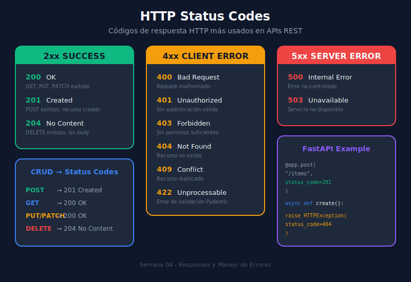

# 📊 Status Codes (Códigos de Estado HTTP)

## 🎯 Objetivos de Aprendizaje

Al finalizar este tema, serás capaz de:

- ✅ Entender las categorías de códigos HTTP
- ✅ Usar el código correcto para cada operación
- ✅ Configurar status codes en FastAPI
- ✅ Combinar status codes con response models

---

## 📚 Contenido

### 1. Categorías de Códigos HTTP



Los códigos HTTP se dividen en 5 categorías:

| Rango | Categoría | Descripción |
|-------|-----------|-------------|
| **1xx** | Informational | Petición recibida, procesando |
| **2xx** | Success | Petición exitosa |
| **3xx** | Redirection | Acción adicional requerida |
| **4xx** | Client Error | Error del cliente |
| **5xx** | Server Error | Error del servidor |

---

### 2. Códigos Más Usados en APIs

#### ✅ Códigos de Éxito (2xx)

```python
from fastapi import FastAPI, status
from pydantic import BaseModel

app = FastAPI()

class Item(BaseModel):
    name: str
    price: float

# 200 OK - Respuesta exitosa por defecto
@app.get("/items/{item_id}")
async def get_item(item_id: int):
    return {"id": item_id, "name": "Item", "price": 10.0}

# 201 Created - Recurso creado exitosamente
@app.post("/items", status_code=status.HTTP_201_CREATED)
async def create_item(item: Item):
    return {"id": 1, **item.model_dump()}

# 204 No Content - Éxito sin contenido de respuesta
@app.delete("/items/{item_id}", status_code=status.HTTP_204_NO_CONTENT)
async def delete_item(item_id: int):
    # Eliminar item...
    return None  # No retorna body
```

| Código | Nombre | Cuándo Usar |
|--------|--------|-------------|
| **200** | OK | GET, PUT, PATCH exitosos |
| **201** | Created | POST que crea recurso |
| **202** | Accepted | Tarea aceptada, procesamiento async |
| **204** | No Content | DELETE exitoso, sin body |

#### ❌ Códigos de Error del Cliente (4xx)

```python
from fastapi import FastAPI, HTTPException, status

app = FastAPI()

items_db = {1: {"name": "Item 1", "price": 10.0}}

# 400 Bad Request - Datos inválidos
@app.post("/items")
async def create_item(item: dict):
    if "name" not in item:
        raise HTTPException(
            status_code=status.HTTP_400_BAD_REQUEST,
            detail="Field 'name' is required"
        )
    return item

# 401 Unauthorized - No autenticado
@app.get("/protected")
async def protected_route(token: str | None = None):
    if not token:
        raise HTTPException(
            status_code=status.HTTP_401_UNAUTHORIZED,
            detail="Authentication required",
            headers={"WWW-Authenticate": "Bearer"}
        )
    return {"message": "Access granted"}

# 403 Forbidden - Autenticado pero sin permisos
@app.delete("/admin/users/{user_id}")
async def delete_user(user_id: int, is_admin: bool = False):
    if not is_admin:
        raise HTTPException(
            status_code=status.HTTP_403_FORBIDDEN,
            detail="Admin privileges required"
        )
    return {"deleted": user_id}

# 404 Not Found - Recurso no existe
@app.get("/items/{item_id}")
async def get_item(item_id: int):
    if item_id not in items_db:
        raise HTTPException(
            status_code=status.HTTP_404_NOT_FOUND,
            detail=f"Item {item_id} not found"
        )
    return items_db[item_id]

# 409 Conflict - Conflicto con estado actual
@app.post("/users")
async def create_user(email: str):
    existing_emails = ["user@example.com"]
    if email in existing_emails:
        raise HTTPException(
            status_code=status.HTTP_409_CONFLICT,
            detail=f"Email {email} already registered"
        )
    return {"email": email}

# 422 Unprocessable Entity - FastAPI lo usa automáticamente
# para errores de validación de Pydantic
```

| Código | Nombre | Cuándo Usar |
|--------|--------|-------------|
| **400** | Bad Request | Sintaxis inválida, datos malformados |
| **401** | Unauthorized | No autenticado |
| **403** | Forbidden | Autenticado pero sin permisos |
| **404** | Not Found | Recurso no existe |
| **409** | Conflict | Conflicto (ej: email duplicado) |
| **422** | Unprocessable Entity | Validación fallida (Pydantic) |
| **429** | Too Many Requests | Rate limiting excedido |

#### 💥 Códigos de Error del Servidor (5xx)

```python
from fastapi import FastAPI, HTTPException, status
import logging

app = FastAPI()
logger = logging.getLogger(__name__)

# 500 Internal Server Error
@app.get("/process")
async def process_data():
    try:
        # Operación que puede fallar
        result = risky_operation()
        return result
    except Exception as e:
        logger.error(f"Processing error: {e}")
        raise HTTPException(
            status_code=status.HTTP_500_INTERNAL_SERVER_ERROR,
            detail="An internal error occurred"
        )

# 503 Service Unavailable
@app.get("/external-data")
async def get_external_data():
    external_service_available = False
    
    if not external_service_available:
        raise HTTPException(
            status_code=status.HTTP_503_SERVICE_UNAVAILABLE,
            detail="External service temporarily unavailable",
            headers={"Retry-After": "60"}
        )
    return {"data": "..."}
```

| Código | Nombre | Cuándo Usar |
|--------|--------|-------------|
| **500** | Internal Server Error | Error inesperado del servidor |
| **502** | Bad Gateway | Proxy/gateway recibió respuesta inválida |
| **503** | Service Unavailable | Servicio no disponible temporalmente |
| **504** | Gateway Timeout | Timeout del proxy/gateway |

---

### 3. Usando `status` de FastAPI

FastAPI provee constantes para todos los códigos:

```python
from fastapi import status

# Éxito
status.HTTP_200_OK
status.HTTP_201_CREATED
status.HTTP_202_ACCEPTED
status.HTTP_204_NO_CONTENT

# Redirección
status.HTTP_301_MOVED_PERMANENTLY
status.HTTP_302_FOUND
status.HTTP_307_TEMPORARY_REDIRECT
status.HTTP_308_PERMANENT_REDIRECT

# Error del cliente
status.HTTP_400_BAD_REQUEST
status.HTTP_401_UNAUTHORIZED
status.HTTP_403_FORBIDDEN
status.HTTP_404_NOT_FOUND
status.HTTP_405_METHOD_NOT_ALLOWED
status.HTTP_409_CONFLICT
status.HTTP_422_UNPROCESSABLE_ENTITY
status.HTTP_429_TOO_MANY_REQUESTS

# Error del servidor
status.HTTP_500_INTERNAL_SERVER_ERROR
status.HTTP_502_BAD_GATEWAY
status.HTTP_503_SERVICE_UNAVAILABLE
status.HTTP_504_GATEWAY_TIMEOUT
```

---

### 4. Status Code por Defecto vs Dinámico

#### Status Code Fijo

```python
from fastapi import FastAPI, status
from pydantic import BaseModel

app = FastAPI()

class Item(BaseModel):
    name: str

# El status code siempre será 201
@app.post("/items", status_code=status.HTTP_201_CREATED)
async def create_item(item: Item):
    return {"id": 1, "name": item.name}
```

#### Status Code Dinámico con Response

```python
from fastapi import FastAPI, Response, status
from pydantic import BaseModel

app = FastAPI()

class Item(BaseModel):
    name: str

items_db: dict[int, dict] = {}

@app.put("/items/{item_id}")
async def upsert_item(item_id: int, item: Item, response: Response):
    """
    PUT puede crear o actualizar.
    - 201 si crea nuevo
    - 200 si actualiza existente
    """
    if item_id in items_db:
        # Actualizar existente
        items_db[item_id] = item.model_dump()
        response.status_code = status.HTTP_200_OK
        return {"id": item_id, "action": "updated", **item.model_dump()}
    else:
        # Crear nuevo
        items_db[item_id] = item.model_dump()
        response.status_code = status.HTTP_201_CREATED
        return {"id": item_id, "action": "created", **item.model_dump()}
```

---

### 5. Documentando Responses en OpenAPI

```python
from fastapi import FastAPI, HTTPException, status
from pydantic import BaseModel

app = FastAPI()

class Item(BaseModel):
    id: int
    name: str

class ErrorResponse(BaseModel):
    detail: str

@app.get(
    "/items/{item_id}",
    response_model=Item,
    responses={
        200: {
            "description": "Item encontrado",
            "model": Item
        },
        404: {
            "description": "Item no encontrado",
            "model": ErrorResponse,
            "content": {
                "application/json": {
                    "example": {"detail": "Item 123 not found"}
                }
            }
        },
        500: {
            "description": "Error interno del servidor",
            "model": ErrorResponse
        }
    }
)
async def get_item(item_id: int):
    """
    Obtiene un item por su ID.
    
    - **item_id**: ID único del item
    
    Returns:
        Item con sus datos completos
    
    Raises:
        404: Si el item no existe
    """
    items_db = {1: {"id": 1, "name": "Item 1"}}
    
    if item_id not in items_db:
        raise HTTPException(
            status_code=status.HTTP_404_NOT_FOUND,
            detail=f"Item {item_id} not found"
        )
    return items_db[item_id]
```

---

### 6. CRUD Completo con Status Codes Correctos

```python
from datetime import datetime
from fastapi import FastAPI, HTTPException, status, Response
from pydantic import BaseModel, Field

app = FastAPI(title="Task API", version="1.0.0")

# ============================================
# MODELOS
# ============================================

class TaskCreate(BaseModel):
    title: str = Field(..., min_length=1, max_length=200)
    description: str | None = None

class TaskUpdate(BaseModel):
    title: str | None = Field(None, min_length=1, max_length=200)
    description: str | None = None
    completed: bool | None = None

class TaskResponse(BaseModel):
    id: int
    title: str
    description: str | None
    completed: bool
    created_at: datetime

# ============================================
# BASE DE DATOS SIMULADA
# ============================================

tasks_db: dict[int, dict] = {}
task_counter = 0

# ============================================
# ENDPOINTS
# ============================================

# CREATE - 201 Created
@app.post(
    "/tasks",
    response_model=TaskResponse,
    status_code=status.HTTP_201_CREATED,
    summary="Crear nueva tarea"
)
async def create_task(task: TaskCreate):
    """Crea una nueva tarea y retorna 201 Created."""
    global task_counter
    task_counter += 1
    
    new_task = {
        "id": task_counter,
        "title": task.title,
        "description": task.description,
        "completed": False,
        "created_at": datetime.now()
    }
    tasks_db[task_counter] = new_task
    return new_task

# READ ALL - 200 OK
@app.get(
    "/tasks",
    response_model=list[TaskResponse],
    status_code=status.HTTP_200_OK,
    summary="Listar todas las tareas"
)
async def list_tasks():
    """Lista todas las tareas. Retorna 200 OK."""
    return list(tasks_db.values())

# READ ONE - 200 OK o 404 Not Found
@app.get(
    "/tasks/{task_id}",
    response_model=TaskResponse,
    summary="Obtener una tarea"
)
async def get_task(task_id: int):
    """
    Obtiene una tarea por ID.
    
    - 200 OK si existe
    - 404 Not Found si no existe
    """
    if task_id not in tasks_db:
        raise HTTPException(
            status_code=status.HTTP_404_NOT_FOUND,
            detail=f"Task {task_id} not found"
        )
    return tasks_db[task_id]

# UPDATE - 200 OK o 404 Not Found
@app.patch(
    "/tasks/{task_id}",
    response_model=TaskResponse,
    summary="Actualizar tarea parcialmente"
)
async def update_task(task_id: int, task: TaskUpdate):
    """
    Actualiza parcialmente una tarea.
    
    - 200 OK si se actualiza
    - 404 Not Found si no existe
    """
    if task_id not in tasks_db:
        raise HTTPException(
            status_code=status.HTTP_404_NOT_FOUND,
            detail=f"Task {task_id} not found"
        )
    
    stored = tasks_db[task_id]
    update_data = task.model_dump(exclude_unset=True)
    
    for field, value in update_data.items():
        stored[field] = value
    
    return stored

# REPLACE - 200 OK o 201 Created
@app.put(
    "/tasks/{task_id}",
    response_model=TaskResponse,
    summary="Reemplazar o crear tarea"
)
async def replace_task(task_id: int, task: TaskCreate, response: Response):
    """
    Reemplaza completamente una tarea o la crea si no existe.
    
    - 200 OK si reemplaza
    - 201 Created si crea nueva
    """
    if task_id in tasks_db:
        # Reemplazar
        tasks_db[task_id].update({
            "title": task.title,
            "description": task.description
        })
        response.status_code = status.HTTP_200_OK
    else:
        # Crear
        tasks_db[task_id] = {
            "id": task_id,
            "title": task.title,
            "description": task.description,
            "completed": False,
            "created_at": datetime.now()
        }
        response.status_code = status.HTTP_201_CREATED
    
    return tasks_db[task_id]

# DELETE - 204 No Content o 404 Not Found
@app.delete(
    "/tasks/{task_id}",
    status_code=status.HTTP_204_NO_CONTENT,
    summary="Eliminar tarea"
)
async def delete_task(task_id: int):
    """
    Elimina una tarea.
    
    - 204 No Content si se elimina
    - 404 Not Found si no existe
    """
    if task_id not in tasks_db:
        raise HTTPException(
            status_code=status.HTTP_404_NOT_FOUND,
            detail=f"Task {task_id} not found"
        )
    
    del tasks_db[task_id]
    return None  # 204 no retorna body
```

---

## 🎯 Resumen: Guía Rápida de Status Codes

| Operación | Éxito | Error Común |
|-----------|-------|-------------|
| **GET /items** | 200 OK | - |
| **GET /items/{id}** | 200 OK | 404 Not Found |
| **POST /items** | 201 Created | 400 Bad Request, 409 Conflict |
| **PUT /items/{id}** | 200 OK / 201 Created | 400 Bad Request |
| **PATCH /items/{id}** | 200 OK | 404 Not Found, 400 Bad Request |
| **DELETE /items/{id}** | 204 No Content | 404 Not Found |

### Mejores Prácticas

1. ✅ Usa `status.HTTP_XXX` en lugar de números
2. ✅ 201 para crear, 204 para eliminar
3. ✅ 404 antes de 400 (primero verificar existencia)
4. ✅ Documenta todos los códigos posibles en OpenAPI
5. ✅ Mensajes de error claros y útiles

---

## 📚 Recursos Adicionales

- [HTTP Status Codes - MDN](https://developer.mozilla.org/en-US/docs/Web/HTTP/Status)
- [FastAPI Status Codes](https://fastapi.tiangolo.com/tutorial/response-status-code/)
- [RFC 9110 - HTTP Semantics](https://httpwg.org/specs/rfc9110.html)

---

[← Anterior: Response Models](01-response-models.md) | [Siguiente: Manejo de Errores →](03-manejo-errores.md)
