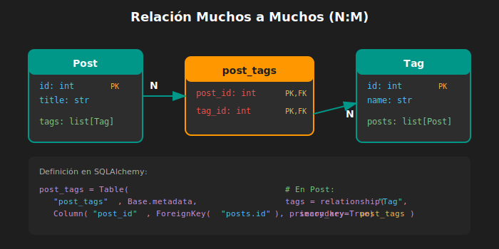

# 🔗 Relaciones Muchos a Muchos (N:M)

## 🎯 Objetivos de Aprendizaje

Al finalizar este tema, serás capaz de:

- ✅ Entender qué es una relación muchos a muchos
- ✅ Crear tablas asociativas (junction tables)
- ✅ Usar `secondary` en relationship()
- ✅ Manejar relaciones N:M bidireccionales

---

## 📚 Contenido

### 1. ¿Qué es una Relación N:M?

Una relación **muchos a muchos** conecta múltiples registros de ambas tablas:



**Ejemplos del mundo real:**
- Un **Post** tiene muchos **Tags**, y un **Tag** tiene muchos **Posts**
- Un **Student** tiene muchos **Courses**, y un **Course** tiene muchos **Students**
- Un **User** tiene muchos **Roles**, y un **Role** tiene muchos **Users**

---

### 2. La Tabla Asociativa

Las bases de datos relacionales no pueden expresar N:M directamente. Necesitamos una **tabla intermedia**:

```
┌──────────┐       ┌──────────────┐       ┌──────────┐
│   Post   │       │  post_tags   │       │   Tag    │
├──────────┤       ├──────────────┤       ├──────────┤
│ id (PK)  │──────→│ post_id (FK) │       │ id (PK)  │
│ title    │       │ tag_id (FK)  │←──────│ name     │
│ content  │       └──────────────┘       └──────────┘
└──────────┘
     N              (tabla asociativa)           M
```

---

### 3. Implementación en SQLAlchemy

#### Paso 1: Crear la Tabla Asociativa

```python
from sqlalchemy import Table, Column, Integer, ForeignKey
from database import Base

# Tabla asociativa (sin clase, solo Table)
post_tags = Table(
    "post_tags",
    Base.metadata,
    Column("post_id", Integer, ForeignKey("posts.id"), primary_key=True),
    Column("tag_id", Integer, ForeignKey("tags.id"), primary_key=True)
)
```

#### Paso 2: Definir el Modelo Post

```python
from sqlalchemy import String, Text
from sqlalchemy.orm import Mapped, mapped_column, relationship
from database import Base

class Post(Base):
    __tablename__ = "posts"
    
    id: Mapped[int] = mapped_column(primary_key=True)
    title: Mapped[str] = mapped_column(String(200))
    content: Mapped[str] = mapped_column(Text)
    
    # Relación N:M con Tag
    tags: Mapped[list["Tag"]] = relationship(
        secondary=post_tags,        # Tabla asociativa
        back_populates="posts"
    )
```

#### Paso 3: Definir el Modelo Tag

```python
from sqlalchemy import String
from sqlalchemy.orm import Mapped, mapped_column, relationship
from database import Base

class Tag(Base):
    __tablename__ = "tags"
    
    id: Mapped[int] = mapped_column(primary_key=True)
    name: Mapped[str] = mapped_column(String(50), unique=True)
    
    # Relación inversa N:M con Post
    posts: Mapped[list["Post"]] = relationship(
        secondary=post_tags,
        back_populates="tags"
    )
```

---

### 4. Parámetro `secondary`

```python
tags: Mapped[list["Tag"]] = relationship(
    secondary=post_tags,  # ← Indica qué tabla asociativa usar
    back_populates="posts"
)
```

- `secondary` recibe la **tabla asociativa** (no un string)
- SQLAlchemy maneja automáticamente los INSERT/DELETE en la tabla intermedia
- Ambos lados de la relación usan el mismo `secondary`

---

### 5. Operaciones CRUD con N:M

#### Crear Post con Tags

```python
def create_post_with_tags(
    db: Session,
    title: str,
    content: str,
    tag_names: list[str]
) -> Post:
    # Obtener o crear tags
    tags = []
    for name in tag_names:
        tag = db.execute(
            select(Tag).where(Tag.name == name)
        ).scalar_one_or_none()
        
        if not tag:
            tag = Tag(name=name)
            db.add(tag)
        tags.append(tag)
    
    # Crear post con tags
    post = Post(title=title, content=content, tags=tags)
    db.add(post)
    db.commit()
    db.refresh(post)
    return post

# Uso
post = create_post_with_tags(
    db,
    title="Intro to FastAPI",
    content="...",
    tag_names=["python", "fastapi", "tutorial"]
)
```

#### Agregar Tag a Post Existente

```python
def add_tag_to_post(db: Session, post_id: int, tag_name: str) -> Post:
    post = db.get(Post, post_id)
    if not post:
        raise ValueError("Post not found")
    
    # Buscar o crear tag
    tag = db.execute(
        select(Tag).where(Tag.name == tag_name)
    ).scalar_one_or_none()
    
    if not tag:
        tag = Tag(name=tag_name)
    
    # Agregar a la lista (SQLAlchemy maneja la tabla asociativa)
    if tag not in post.tags:
        post.tags.append(tag)
        db.commit()
    
    return post
```

#### Eliminar Tag de Post

```python
def remove_tag_from_post(db: Session, post_id: int, tag_name: str) -> Post:
    post = db.get(Post, post_id)
    if not post:
        raise ValueError("Post not found")
    
    # Buscar tag en los tags del post
    for tag in post.tags:
        if tag.name == tag_name:
            post.tags.remove(tag)
            db.commit()
            break
    
    return post
```

#### Obtener Posts por Tag

```python
def get_posts_by_tag(db: Session, tag_name: str) -> list[Post]:
    stmt = (
        select(Post)
        .join(Post.tags)
        .where(Tag.name == tag_name)
    )
    return db.execute(stmt).scalars().all()
```

---

### 6. Tabla Asociativa con Datos Extra

A veces necesitas guardar información adicional en la relación:

```python
# Ejemplo: Fecha en que se agregó el tag
from datetime import datetime
from sqlalchemy import Table, Column, Integer, ForeignKey, DateTime

post_tags = Table(
    "post_tags",
    Base.metadata,
    Column("post_id", Integer, ForeignKey("posts.id"), primary_key=True),
    Column("tag_id", Integer, ForeignKey("tags.id"), primary_key=True),
    Column("added_at", DateTime, default=datetime.utcnow)  # ← Extra
)
```

Para acceder a estos datos extra, necesitas un **Association Object** (tema más avanzado).

---

### 7. Ejemplo Completo

```python
# models/associations.py
from sqlalchemy import Table, Column, Integer, ForeignKey
from database import Base

post_tags = Table(
    "post_tags",
    Base.metadata,
    Column("post_id", Integer, ForeignKey("posts.id", ondelete="CASCADE"), primary_key=True),
    Column("tag_id", Integer, ForeignKey("tags.id", ondelete="CASCADE"), primary_key=True)
)


# models/tag.py
from sqlalchemy import String
from sqlalchemy.orm import Mapped, mapped_column, relationship
from database import Base
from models.associations import post_tags

class Tag(Base):
    __tablename__ = "tags"
    
    id: Mapped[int] = mapped_column(primary_key=True)
    name: Mapped[str] = mapped_column(String(50), unique=True, index=True)
    
    posts: Mapped[list["Post"]] = relationship(
        secondary=post_tags,
        back_populates="tags"
    )
    
    def __repr__(self) -> str:
        return f"Tag(id={self.id}, name='{self.name}')"


# models/post.py
from datetime import datetime
from sqlalchemy import String, Text, ForeignKey
from sqlalchemy.orm import Mapped, mapped_column, relationship
from database import Base
from models.associations import post_tags

class Post(Base):
    __tablename__ = "posts"
    
    id: Mapped[int] = mapped_column(primary_key=True)
    title: Mapped[str] = mapped_column(String(200))
    content: Mapped[str] = mapped_column(Text)
    created_at: Mapped[datetime] = mapped_column(default=datetime.utcnow)
    
    # FK a Author (relación 1:N)
    author_id: Mapped[int] = mapped_column(ForeignKey("authors.id"))
    author: Mapped["Author"] = relationship(back_populates="posts")
    
    # Relación N:M con Tag
    tags: Mapped[list["Tag"]] = relationship(
        secondary=post_tags,
        back_populates="posts"
    )
    
    def __repr__(self) -> str:
        return f"Post(id={self.id}, title='{self.title}')"
```

---

## ✅ Checklist

- [ ] Entiendo qué es una relación N:M
- [ ] Sé crear tablas asociativas con `Table()`
- [ ] Puedo usar `secondary` en relationship()
- [ ] Puedo agregar/eliminar elementos de la relación
- [ ] Puedo hacer queries que involucren N:M

---

[← Anterior: Relaciones 1:N](01-relaciones-uno-a-muchos.md) | [Siguiente: Queries con Relaciones →](03-queries-con-relaciones.md)
