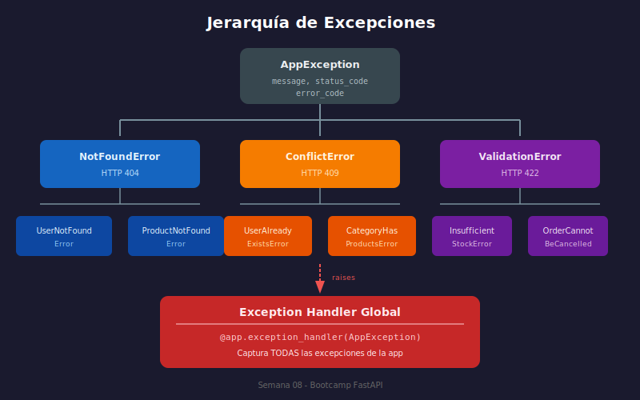

# 📘 Manejo de Errores por Capas



## 🎯 Objetivos

- Diseñar excepciones personalizadas por capa
- Implementar traducción de errores entre capas
- Crear exception handlers centralizados
- Producir respuestas de error consistentes

---

## 🔍 El Problema

Sin una estrategia clara, los errores se propagan de forma inconsistente:

```python
# ❌ Problemas comunes
@router.post("/products/")
def create_product(data: ProductCreate, db: Session = Depends()):
    try:
        # Acceso directo a DB
        product = Product(**data.model_dump())
        db.add(product)
        db.commit()
    except IntegrityError:
        # Error técnico expuesto al cliente
        raise HTTPException(status_code=500, detail="IntegrityError")
    except Exception as e:
        # Error genérico, sin información útil
        raise HTTPException(status_code=500, detail=str(e))
```

---

## 🏗️ Jerarquía de Excepciones

### Base Exception

```python
# exceptions/base.py
class AppException(Exception):
    """Base para todas las excepciones de la aplicación"""
    
    def __init__(self, message: str, code: str | None = None):
        self.message = message
        self.code = code or self.__class__.__name__
        super().__init__(message)


class NotFoundError(AppException):
    """Recurso no encontrado"""
    pass


class ConflictError(AppException):
    """Conflicto (duplicado, estado inválido)"""
    pass


class ValidationError(AppException):
    """Error de validación de negocio"""
    pass


class UnauthorizedError(AppException):
    """No autorizado"""
    pass


class ForbiddenError(AppException):
    """Sin permisos"""
    pass
```

### Excepciones de Dominio

```python
# exceptions/product.py
from .base import NotFoundError, ConflictError, ValidationError


class ProductNotFoundError(NotFoundError):
    """Producto no encontrado"""
    
    def __init__(self, product_id: int):
        super().__init__(
            message=f"Product with id {product_id} not found",
            code="PRODUCT_NOT_FOUND"
        )


class ProductAlreadyExistsError(ConflictError):
    """SKU duplicado"""
    
    def __init__(self, sku: str):
        super().__init__(
            message=f"Product with SKU '{sku}' already exists",
            code="PRODUCT_SKU_DUPLICATE"
        )


class InsufficientStockError(ValidationError):
    """Stock insuficiente"""
    
    def __init__(self, product_id: int, requested: int, available: int):
        super().__init__(
            message=f"Insufficient stock for product {product_id}. "
                    f"Requested: {requested}, Available: {available}",
            code="INSUFFICIENT_STOCK"
        )
```

---

## 🔄 Errores por Capa

### Data Access Layer (Repository)

```python
# repositories/product.py
from sqlalchemy.exc import IntegrityError


class ProductRepository:
    def add(self, product: Product) -> Product:
        try:
            self.db.add(product)
            self.db.flush()
            self.db.refresh(product)
            return product
        except IntegrityError as e:
            self.db.rollback()
            # Traducir error técnico a error de dominio
            if "unique constraint" in str(e).lower():
                raise ProductAlreadyExistsError(product.sku)
            raise  # Re-raise si es otro tipo de IntegrityError
```

### Application Layer (Service)

```python
# services/product.py
class ProductService:
    def get_by_id(self, product_id: int) -> Product:
        product = self.repo.get_by_id(product_id)
        if not product:
            raise ProductNotFoundError(product_id)
        return product
    
    def reduce_stock(self, product_id: int, quantity: int) -> Product:
        product = self.get_by_id(product_id)
        
        # Validación de negocio
        if product.stock < quantity:
            raise InsufficientStockError(
                product_id=product_id,
                requested=quantity,
                available=product.stock
            )
        
        product.stock -= quantity
        return self.repo.update(product)
```

### Presentation Layer (Router)

```python
# routers/products.py
from exceptions.product import (
    ProductNotFoundError,
    ProductAlreadyExistsError,
    InsufficientStockError
)


@router.post("/", response_model=ProductResponse, status_code=201)
def create_product(
    data: ProductCreate,
    service: ProductService = Depends(get_service)
):
    try:
        return service.create(data)
    except ProductAlreadyExistsError as e:
        raise HTTPException(status_code=409, detail=e.message)


@router.patch("/{product_id}/reduce-stock")
def reduce_stock(
    product_id: int,
    quantity: int,
    service: ProductService = Depends(get_service)
):
    try:
        return service.reduce_stock(product_id, quantity)
    except ProductNotFoundError as e:
        raise HTTPException(status_code=404, detail=e.message)
    except InsufficientStockError as e:
        raise HTTPException(status_code=400, detail=e.message)
```

---

## 🎯 Exception Handlers Centralizados

En lugar de try/except en cada endpoint, usa handlers globales:

```python
# main.py
from fastapi import FastAPI, Request
from fastapi.responses import JSONResponse

from exceptions.base import (
    AppException,
    NotFoundError,
    ConflictError,
    ValidationError
)

app = FastAPI()


# Schema para respuestas de error
class ErrorResponse(BaseModel):
    error: str
    code: str
    detail: str | None = None


@app.exception_handler(NotFoundError)
async def not_found_handler(request: Request, exc: NotFoundError):
    return JSONResponse(
        status_code=404,
        content={
            "error": "Not Found",
            "code": exc.code,
            "detail": exc.message
        }
    )


@app.exception_handler(ConflictError)
async def conflict_handler(request: Request, exc: ConflictError):
    return JSONResponse(
        status_code=409,
        content={
            "error": "Conflict",
            "code": exc.code,
            "detail": exc.message
        }
    )


@app.exception_handler(ValidationError)
async def validation_handler(request: Request, exc: ValidationError):
    return JSONResponse(
        status_code=400,
        content={
            "error": "Validation Error",
            "code": exc.code,
            "detail": exc.message
        }
    )


# Handler genérico para AppException no manejadas
@app.exception_handler(AppException)
async def app_exception_handler(request: Request, exc: AppException):
    return JSONResponse(
        status_code=500,
        content={
            "error": "Internal Error",
            "code": exc.code,
            "detail": exc.message
        }
    )
```

### Router Simplificado

Con handlers globales, los routers son más limpios:

```python
# routers/products.py
@router.post("/", response_model=ProductResponse, status_code=201)
def create_product(
    data: ProductCreate,
    service: ProductService = Depends(get_service)
):
    # Sin try/except - los handlers globales manejan errores
    return service.create(data)


@router.get("/{product_id}", response_model=ProductResponse)
def get_product(
    product_id: int,
    service: ProductService = Depends(get_service)
):
    return service.get_by_id(product_id)
```

---

## 📊 Mapeo de Excepciones → HTTP Status

| Excepción | HTTP Status | Uso |
|-----------|-------------|-----|
| `NotFoundError` | 404 | Recurso no existe |
| `ConflictError` | 409 | Duplicado, estado inválido |
| `ValidationError` | 400 | Validación de negocio fallida |
| `UnauthorizedError` | 401 | No autenticado |
| `ForbiddenError` | 403 | Sin permisos |
| `AppException` | 500 | Error genérico |

---

## 📋 Respuestas de Error Consistentes

```json
// 404 Not Found
{
    "error": "Not Found",
    "code": "PRODUCT_NOT_FOUND",
    "detail": "Product with id 123 not found"
}

// 409 Conflict
{
    "error": "Conflict",
    "code": "PRODUCT_SKU_DUPLICATE",
    "detail": "Product with SKU 'ABC-1234' already exists"
}

// 400 Bad Request
{
    "error": "Validation Error",
    "code": "INSUFFICIENT_STOCK",
    "detail": "Insufficient stock for product 5. Requested: 10, Available: 3"
}
```

---

## ✅ Checklist

- [ ] Tengo excepciones base para cada tipo de error
- [ ] Cada dominio tiene sus excepciones específicas
- [ ] Los repositorios traducen errores técnicos
- [ ] Los services lanzan excepciones de dominio
- [ ] Tengo exception handlers centralizados
- [ ] Las respuestas de error son consistentes
