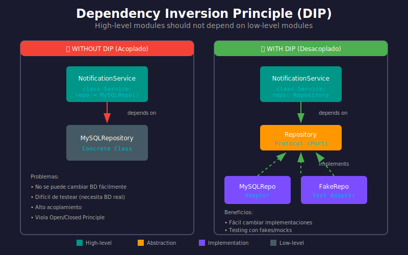

# 🔄 Principio de Inversión de Dependencias (DIP)

## 🎯 Objetivos de Aprendizaje

Al finalizar este tema, serás capaz de:

- Comprender el Principio de Inversión de Dependencias (DIP)
- Diferenciar DIP de Inyección de Dependencias (DI)
- Aplicar DIP para desacoplar módulos
- Diseñar sistemas donde el dominio no depende de infraestructura

---

## 📋 Contenido

### 1. ¿Qué es el Principio de Inversión de Dependencias?

El **DIP** (Dependency Inversion Principle) es la "D" de los principios SOLID, formulado por Robert C. Martin:

> **"Los módulos de alto nivel no deben depender de módulos de bajo nivel. Ambos deben depender de abstracciones."**
>
> **"Las abstracciones no deben depender de detalles. Los detalles deben depender de abstracciones."**



---

### 2. El Problema: Dependencias Tradicionales

En una arquitectura tradicional, las dependencias fluyen hacia abajo:

```
┌─────────────────────────────────────────────┐
│           ARQUITECTURA TRADICIONAL          │
├─────────────────────────────────────────────┤
│                                             │
│    ┌─────────────────────┐                  │
│    │    UserService      │  Alto nivel      │
│    │   (Negocio)         │                  │
│    └──────────┬──────────┘                  │
│               │                             │
│               │ depende de                  │
│               ▼                             │
│    ┌─────────────────────┐                  │
│    │  SQLAlchemyUserRepo │  Bajo nivel      │
│    │   (Infraestructura) │                  │
│    └──────────┬──────────┘                  │
│               │                             │
│               ▼                             │
│         PostgreSQL                          │
│                                             │
└─────────────────────────────────────────────┘
```

```python
# ❌ VIOLACIÓN DE DIP
# Alto nivel depende de bajo nivel

class UserService:
    """Módulo de ALTO nivel (lógica de negocio)."""
    
    def __init__(self):
        # ❌ Dependencia DIRECTA de infraestructura
        self.repository = SQLAlchemyUserRepository()
        self.email_sender = SMTPEmailSender()
    
    async def register_user(self, email: str, password: str) -> User:
        # La lógica de negocio está ACOPLADA a:
        # - SQLAlchemy (persistencia)
        # - SMTP (notificaciones)
        user = User(email=email, password=hash(password))
        await self.repository.save(user)
        await self.email_sender.send_welcome(email)
        return user
```

**Problemas:**

| Problema | Consecuencia |
|----------|--------------|
| Acoplamiento fuerte | Cambiar BD requiere modificar UserService |
| Testing difícil | Tests necesitan BD real y servidor SMTP |
| Reutilización nula | No puedes usar UserService con MongoDB |
| Violación OCP | Nuevo proveedor de email = cambiar código |

---

### 3. La Solución: Invertir las Dependencias

Con DIP, introducimos **abstracciones** (Protocols) entre las capas:

```
┌─────────────────────────────────────────────┐
│          ARQUITECTURA CON DIP               │
├─────────────────────────────────────────────┤
│                                             │
│    ┌─────────────────────┐                  │
│    │    UserService      │                  │
│    │   (Alto nivel)      │                  │
│    └──────────┬──────────┘                  │
│               │                             │
│               │ depende de                  │
│               ▼                             │
│    ╔═════════════════════╗                  │
│    ║   UserRepository    ║  ABSTRACCIÓN     │
│    ║     (Protocol)      ║  (interface)     │
│    ╚══════════╤══════════╝                  │
│               ▲                             │
│               │ implementa                  │
│               │                             │
│    ┌──────────┴──────────┐                  │
│    │  SQLAlchemyUserRepo │                  │
│    │   (Bajo nivel)      │                  │
│    └─────────────────────┘                  │
│                                             │
└─────────────────────────────────────────────┘
```

La **inversión** está en que:
- Antes: Alto nivel → Bajo nivel
- Ahora: Alto nivel → Abstracción ← Bajo nivel

```python
from typing import Protocol

# ========================================
# ABSTRACCIÓN (Protocol)
# ========================================
class UserRepository(Protocol):
    """Abstracción que define el contrato."""
    
    async def save(self, user: User) -> User:
        ...
    
    async def get_by_email(self, email: str) -> User | None:
        ...


class EmailSender(Protocol):
    """Abstracción para envío de emails."""
    
    async def send(self, to: str, subject: str, body: str) -> bool:
        ...


# ========================================
# ALTO NIVEL (depende de abstracciones)
# ========================================
class UserService:
    """Módulo de alto nivel - lógica de negocio."""
    
    def __init__(
        self,
        repository: UserRepository,  # ✅ Abstracción
        email_sender: EmailSender     # ✅ Abstracción
    ):
        self._repository = repository
        self._email_sender = email_sender
    
    async def register_user(self, email: str, password: str) -> User:
        # Lógica de negocio PURA
        # No sabe nada de SQLAlchemy ni SMTP
        existing = await self._repository.get_by_email(email)
        if existing:
            raise UserAlreadyExistsError(email)
        
        user = User(email=email, hashed_password=hash_password(password))
        saved = await self._repository.save(user)
        
        await self._email_sender.send(
            to=email,
            subject="Bienvenido",
            body="Tu cuenta ha sido creada"
        )
        
        return saved


# ========================================
# BAJO NIVEL (implementa abstracciones)
# ========================================
class SQLAlchemyUserRepository:
    """Implementación concreta para PostgreSQL."""
    
    def __init__(self, session: AsyncSession):
        self._session = session
    
    async def save(self, user: User) -> User:
        # Detalles de SQLAlchemy
        model = UserModel(**user.__dict__)
        self._session.add(model)
        await self._session.flush()
        return user
    
    async def get_by_email(self, email: str) -> User | None:
        stmt = select(UserModel).where(UserModel.email == email)
        result = await self._session.execute(stmt)
        return result.scalar_one_or_none()


class SMTPEmailSender:
    """Implementación concreta para SMTP."""
    
    def __init__(self, config: SMTPConfig):
        self._config = config
    
    async def send(self, to: str, subject: str, body: str) -> bool:
        # Detalles de SMTP
        async with aiosmtplib.SMTP(self._config.host) as smtp:
            await smtp.send_message(...)
            return True
```

---

### 4. DIP vs Inyección de Dependencias (DI)

Son conceptos relacionados pero diferentes:

| Concepto | Qué es | Propósito |
|----------|--------|-----------|
| **DIP** | Principio de diseño | Definir direcciones de dependencia correctas |
| **DI** | Técnica/Patrón | Proveer dependencias desde afuera |

```python
# DIP: El diseño donde alto nivel depende de abstracción
class UserService:
    def __init__(self, repo: UserRepository):  # DIP aplicado
        self._repo = repo

# DI: La técnica de proveer la dependencia
repo = SQLAlchemyUserRepository(session)
service = UserService(repo)  # DI aplicada
```

Puedes tener DI sin DIP:

```python
# ❌ DI sin DIP (inyectas pero sigues acoplado al tipo concreto)
class UserService:
    def __init__(self, repo: SQLAlchemyUserRepository):  # Tipo concreto!
        self._repo = repo
```

Y DIP sin DI (raro, pero posible):

```python
# ❌ DIP sin DI (abstracción pero instancias internamente)
class UserService:
    def __init__(self):
        self._repo: UserRepository = SQLAlchemyUserRepository()  # Mal!
```

**Lo ideal: DIP + DI juntos** ✅

---

### 5. Aplicando DIP en FastAPI

FastAPI facilita aplicar DIP con su sistema de **Depends**:

```python
from fastapi import FastAPI, Depends
from typing import Annotated

# ========================================
# Protocols (Abstracciones)
# ========================================
class UserRepository(Protocol):
    async def save(self, user: User) -> User: ...
    async def get_by_id(self, user_id: int) -> User | None: ...


class NotificationService(Protocol):
    async def notify(self, user_id: int, message: str) -> bool: ...


# ========================================
# Factory Functions
# ========================================
async def get_db_session() -> AsyncGenerator[AsyncSession, None]:
    async with async_session() as session:
        yield session


def get_user_repository(
    session: Annotated[AsyncSession, Depends(get_db_session)]
) -> UserRepository:
    """Factory que retorna la implementación concreta."""
    return SQLAlchemyUserRepository(session)


def get_notification_service() -> NotificationService:
    """Factory configurable por entorno."""
    if settings.ENV == "test":
        return FakeNotificationService()
    return EmailNotificationService(settings.smtp_config)


def get_user_service(
    repo: Annotated[UserRepository, Depends(get_user_repository)],
    notifier: Annotated[NotificationService, Depends(get_notification_service)]
) -> UserService:
    """Ensambla el servicio con sus dependencias."""
    return UserService(repository=repo, notifier=notifier)


# ========================================
# Router (usa abstracciones)
# ========================================
app = FastAPI()

@app.post("/users")
async def create_user(
    data: UserCreate,
    service: Annotated[UserService, Depends(get_user_service)]
):
    """
    El endpoint no sabe qué implementación se usa.
    Solo sabe que tiene un UserService que funciona.
    """
    return await service.register_user(data.email, data.password)
```

---

### 6. Beneficios de Aplicar DIP

#### 6.1 Testabilidad

```python
import pytest

# Tests usan implementaciones fake
class FakeUserRepository:
    def __init__(self):
        self._users: dict[int, User] = {}
        self._id = 0
    
    async def save(self, user: User) -> User:
        self._id += 1
        user.id = self._id
        self._users[user.id] = user
        return user
    
    async def get_by_id(self, user_id: int) -> User | None:
        return self._users.get(user_id)


class FakeNotificationService:
    def __init__(self):
        self.notifications: list[tuple[int, str]] = []
    
    async def notify(self, user_id: int, message: str) -> bool:
        self.notifications.append((user_id, message))
        return True


@pytest.mark.asyncio
async def test_register_user():
    # Arrange - inyectamos fakes
    repo = FakeUserRepository()
    notifier = FakeNotificationService()
    service = UserService(repository=repo, notifier=notifier)
    
    # Act
    user = await service.register_user("test@test.com", "password")
    
    # Assert
    assert user.id is not None
    assert user.email == "test@test.com"
    assert len(notifier.notifications) == 1
```

#### 6.2 Flexibilidad

```python
# Cambiar de PostgreSQL a MongoDB = solo crear nuevo adapter
class MongoUserRepository:
    def __init__(self, database: Database):
        self._db = database
    
    async def save(self, user: User) -> User:
        await self._db.users.insert_one(user.to_dict())
        return user


# El UserService NO cambia
# Solo cambia la factory
def get_user_repository() -> UserRepository:
    if settings.DB_TYPE == "postgres":
        return SQLAlchemyUserRepository(session)
    elif settings.DB_TYPE == "mongo":
        return MongoUserRepository(mongo_db)
```

#### 6.3 Desarrollo Paralelo

```python
# Equipo A trabaja en el dominio con fakes
# Equipo B trabaja en infraestructura implementando los Protocols

# Equipo A (dominio)
async def test_business_logic():
    service = UserService(
        repository=FakeUserRepository(),
        notifier=FakeNotificationService()
    )
    # Puede testear toda la lógica sin esperar infraestructura

# Equipo B (infraestructura)
class SQLAlchemyUserRepository:
    # Implementa el Protocol definido
    # Cuando termine, se integra sin cambiar dominio
```

---

### 7. Regla de Dependencia

En arquitecturas limpias, la **Regla de Dependencia** dice:

> Las dependencias del código fuente solo pueden apuntar hacia **adentro** (hacia el dominio).

```
┌───────────────────────────────────────────────────────┐
│                    INFRAESTRUCTURA                    │
│  ┌─────────────────────────────────────────────────┐  │
│  │                  APLICACIÓN                     │  │
│  │  ┌───────────────────────────────────────────┐  │  │
│  │  │                 DOMINIO                   │  │  │
│  │  │                                           │  │  │
│  │  │    Entidades, Value Objects, Reglas      │  │  │
│  │  │                                           │  │  │
│  │  └───────────────────────────────────────────┘  │  │
│  │                                                 │  │
│  │     Services, Use Cases, Ports                 │  │
│  │                                                 │  │
│  └─────────────────────────────────────────────────┘  │
│                                                       │
│     Adapters, Controllers, Repositories, APIs        │
│                                                       │
└───────────────────────────────────────────────────────┘

Las flechas de dependencia SIEMPRE apuntan hacia el centro.
```

**En código:**

```python
# ✅ CORRECTO: Infraestructura importa de Dominio
# infrastructure/adapters/sqlalchemy_repo.py
from domain.ports import UserRepository  # ← Importa del dominio
from domain.entities import User

class SQLAlchemyUserRepository:
    async def save(self, user: User) -> User:
        ...


# ❌ INCORRECTO: Dominio importa de Infraestructura
# domain/services/user_service.py
from infrastructure.adapters.sqlalchemy_repo import SQLAlchemyUserRepository  # ← MAL!
```

---

### 8. Errores Comunes

#### ❌ Error 1: Abstracción que filtra detalles

```python
# ❌ MAL: El Protocol expone detalles de SQLAlchemy
class UserRepository(Protocol):
    async def execute_query(self, stmt: Select) -> Result:  # SQLAlchemy!
        ...

# ✅ BIEN: Abstracción agnóstica
class UserRepository(Protocol):
    async def find_by_criteria(self, criteria: UserCriteria) -> list[User]:
        ...
```

#### ❌ Error 2: Demasiadas abstracciones

```python
# ❌ MAL: Abstracción innecesaria para algo trivial
class StringFormatter(Protocol):
    def format(self, template: str, **kwargs) -> str:
        ...

# ✅ BIEN: Usa f-strings directamente
message = f"Hello {name}!"
```

#### ❌ Error 3: Abstracción en el lugar incorrecto

```python
# ❌ MAL: Protocol en infraestructura
# infrastructure/ports.py  <- ¡No aquí!
class UserRepository(Protocol):
    ...

# ✅ BIEN: Protocol en dominio/aplicación
# domain/ports.py o application/ports.py
class UserRepository(Protocol):
    ...
```

---

## 📚 Resumen

| Concepto | Definición |
|----------|------------|
| **DIP** | Alto nivel no depende de bajo nivel; ambos de abstracciones |
| **DI** | Técnica para proveer dependencias desde afuera |
| **Abstracción** | Interface/Protocol que define el contrato |
| **Regla de Dependencia** | Dependencias apuntan hacia el dominio |
| **Inversión** | Infraestructura depende de dominio, no al revés |

---

## ✅ Checklist de Verificación

- [ ] Entiendo la diferencia entre DIP y DI
- [ ] Mis servicios de dominio solo dependen de Protocols
- [ ] La infraestructura implementa los Protocols del dominio
- [ ] Puedo testear el dominio sin infraestructura real
- [ ] Las dependencias apuntan hacia el centro (dominio)

---

## 🧭 Navegación

| Anterior | Índice | Siguiente |
|:---------|:------:|----------:|
| [02 - Protocols en Python](02-protocols-python.md) | [README](../README.md) | [04 - Implementando Adapters](04-implementando-adapters.md) |
