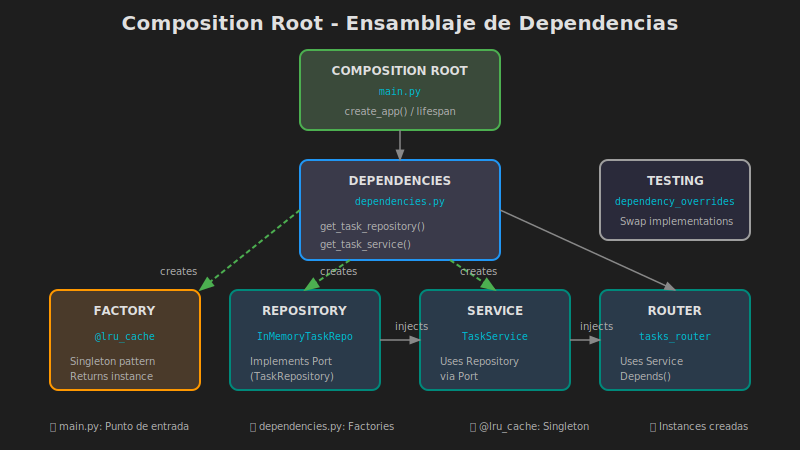

# 🔗 Composition Root - Ensamblando la Aplicación

## 🎯 Objetivos de Aprendizaje

- Entender qué es el Composition Root y su propósito
- Implementar la composición de dependencias en FastAPI
- Usar el patrón Factory para crear instancias
- Configurar diferentes entornos (desarrollo, testing, producción)
- Aplicar el principio de inversión de control (IoC)

---

## 📚 Contenido

### 1. ¿Qué es el Composition Root?

El **Composition Root** es el único lugar en la aplicación donde:
- Se **crean** todas las instancias de objetos
- Se **inyectan** las dependencias
- Se **ensambla** el grafo de objetos



#### Principio Clave

> **Componer en la raíz, usar en todas partes.**

```
main.py (Composition Root)
    │
    ├── Crea InMemoryTaskRepository
    │       │
    │       └── Inyecta en TaskService
    │               │
    │               └── Inyecta en Router
    │
    └── Inicia FastAPI con todo conectado
```

### 2. Ubicación del Composition Root

En una aplicación FastAPI, el Composition Root está en:
- `main.py` - Punto de entrada
- `dependencies.py` - Funciones que crean dependencias

```
infrastructure/
├── api/
│   ├── main.py           # Composition Root principal
│   └── dependencies.py   # Factories de dependencias
```

### 3. Implementación Básica

#### 3.1 Dependencies (Factories)

```python
# infrastructure/api/dependencies.py
"""
Composition Root: Factories de dependencias.

Este módulo es responsable de crear y conectar
todas las dependencias de la aplicación.
"""

from functools import lru_cache

from domain.ports.task_repository import TaskRepository
from domain.ports.project_repository import ProjectRepository
from application.services.task_service import TaskService
from application.services.project_service import ProjectService
from infrastructure.persistence.in_memory.task_repository import (
    InMemoryTaskRepository,
)
from infrastructure.persistence.in_memory.project_repository import (
    InMemoryProjectRepository,
)
from infrastructure.config import get_settings, Settings


# ============================================
# Singletons (una instancia compartida)
# ============================================

@lru_cache
def get_task_repository() -> TaskRepository:
    """
    Factory: Obtener TaskRepository.
    
    Usa @lru_cache para que sea singleton.
    El tipo de retorno es el Port, no la implementación.
    """
    settings = get_settings()
    
    if settings.persistence_type == "memory":
        return InMemoryTaskRepository()
    # Futuro: agregar más implementaciones
    # elif settings.persistence_type == "sqlite":
    #     return SQLiteTaskRepository(settings.database_url)
    
    return InMemoryTaskRepository()


@lru_cache
def get_project_repository() -> ProjectRepository:
    """Factory: Obtener ProjectRepository."""
    return InMemoryProjectRepository()


# ============================================
# Services (dependen de repositories)
# ============================================

def get_task_service() -> TaskService:
    """
    Factory: Obtener TaskService.
    
    Compone el servicio con sus dependencias.
    NO usa @lru_cache porque el service es stateless.
    """
    return TaskService(
        task_repository=get_task_repository(),
        project_repository=get_project_repository(),
    )


def get_project_service() -> ProjectService:
    """Factory: Obtener ProjectService."""
    return ProjectService(
        project_repository=get_project_repository(),
    )


# ============================================
# Reset para testing
# ============================================

def reset_repositories() -> None:
    """
    Resetear repositories (para tests).
    
    Limpia el cache de lru_cache y los datos.
    """
    get_task_repository.cache_clear()
    get_project_repository.cache_clear()
```

#### 3.2 Main (Entry Point)

```python
# infrastructure/api/main.py
"""
Punto de entrada de la aplicación.

Este es el Composition Root donde se ensambla
toda la aplicación FastAPI.
"""

from contextlib import asynccontextmanager
from fastapi import FastAPI

from infrastructure.config import get_settings
from infrastructure.api.routers import tasks, projects
from infrastructure.api.error_handlers import (
    domain_error_handler,
    application_error_handler,
)
from domain.exceptions import DomainError
from application.exceptions import ApplicationError


@asynccontextmanager
async def lifespan(app: FastAPI):
    """
    Lifecycle de la aplicación.
    
    - startup: Inicializar recursos
    - shutdown: Liberar recursos
    """
    # Startup
    settings = get_settings()
    print(f"🚀 Starting {settings.app_name} v{settings.app_version}")
    print(f"📦 Persistence: {settings.persistence_type}")
    
    yield  # La aplicación corre aquí
    
    # Shutdown
    print("👋 Shutting down...")


def create_app() -> FastAPI:
    """
    Factory: Crear la aplicación FastAPI.
    
    Esta función es el corazón del Composition Root.
    Crea y configura toda la aplicación.
    """
    settings = get_settings()
    
    # 1. Crear instancia de FastAPI
    app = FastAPI(
        title=settings.app_name,
        version=settings.app_version,
        description="Sistema de gestión de tareas con Arquitectura Hexagonal",
        lifespan=lifespan,
        debug=settings.debug,
    )
    
    # 2. Registrar exception handlers
    app.add_exception_handler(DomainError, domain_error_handler)
    app.add_exception_handler(ApplicationError, application_error_handler)
    
    # 3. Incluir routers
    app.include_router(tasks.router)
    app.include_router(projects.router)
    
    # 4. Health check
    @app.get("/health", tags=["Health"])
    async def health_check():
        return {
            "status": "healthy",
            "app": settings.app_name,
            "version": settings.app_version,
        }
    
    return app


# Crear la aplicación
app = create_app()


if __name__ == "__main__":
    import uvicorn
    
    settings = get_settings()
    uvicorn.run(
        "infrastructure.api.main:app",
        host=settings.host,
        port=settings.port,
        reload=settings.debug,
    )
```

### 4. Configuración por Entorno

#### 4.1 Variables de Entorno

```bash
# .env.development
APP_NAME="Task Management API (DEV)"
DEBUG=true
PERSISTENCE_TYPE=memory

# .env.production
APP_NAME="Task Management API"
DEBUG=false
PERSISTENCE_TYPE=sqlite
DATABASE_URL=sqlite:///./prod.db

# .env.testing
APP_NAME="Task Management API (TEST)"
DEBUG=true
PERSISTENCE_TYPE=memory
```

#### 4.2 Configuración Dinámica

```python
# infrastructure/config.py
"""Configuración multi-entorno."""

from pydantic_settings import BaseSettings
from functools import lru_cache
import os


class Settings(BaseSettings):
    """Configuración de la aplicación."""
    
    # Entorno
    environment: str = "development"
    
    # API
    app_name: str = "Task Management API"
    app_version: str = "1.0.0"
    debug: bool = False
    
    # Server
    host: str = "0.0.0.0"
    port: int = 8000
    
    # Database
    database_url: str = "sqlite:///./tasks.db"
    persistence_type: str = "memory"
    
    model_config = {
        "env_file": f".env.{os.getenv('ENVIRONMENT', 'development')}",
        "env_file_encoding": "utf-8",
        "extra": "ignore",
    }


class DevelopmentSettings(Settings):
    """Configuración para desarrollo."""
    debug: bool = True
    persistence_type: str = "memory"


class ProductionSettings(Settings):
    """Configuración para producción."""
    debug: bool = False
    persistence_type: str = "sqlite"


class TestingSettings(Settings):
    """Configuración para testing."""
    debug: bool = True
    persistence_type: str = "memory"
    app_name: str = "Task Management API (TEST)"


@lru_cache
def get_settings() -> Settings:
    """Obtener configuración según entorno."""
    env = os.getenv("ENVIRONMENT", "development")
    
    settings_map = {
        "development": DevelopmentSettings,
        "production": ProductionSettings,
        "testing": TestingSettings,
    }
    
    settings_class = settings_map.get(env, DevelopmentSettings)
    return settings_class()
```

### 5. Testing con Composition Root

```python
# tests/conftest.py
"""Configuración de tests con Composition Root."""

import pytest
from fastapi.testclient import TestClient
from httpx import AsyncClient, ASGITransport

from infrastructure.api.main import create_app
from infrastructure.api.dependencies import (
    get_task_repository,
    get_project_repository,
    reset_repositories,
)


@pytest.fixture
def app():
    """Crear aplicación para tests."""
    return create_app()


@pytest.fixture
def client(app):
    """Cliente síncrono para tests."""
    return TestClient(app)


@pytest.fixture
async def async_client(app):
    """Cliente asíncrono para tests."""
    transport = ASGITransport(app=app)
    async with AsyncClient(transport=transport, base_url="http://test") as ac:
        yield ac


@pytest.fixture(autouse=True)
def reset_state():
    """Resetear estado antes de cada test."""
    reset_repositories()
    yield
    reset_repositories()


# ============================================
# Fixtures con dependencias inyectadas
# ============================================

@pytest.fixture
def task_repository():
    """Obtener repository para tests."""
    return get_task_repository()


@pytest.fixture
def project_repository():
    """Obtener repository para tests."""
    return get_project_repository()
```

```python
# tests/integration/test_tasks_api.py
"""Tests de integración de la API de tareas."""

import pytest
from httpx import AsyncClient


@pytest.mark.asyncio
async def test_create_task(async_client: AsyncClient):
    """Test crear tarea via API."""
    response = await async_client.post(
        "/tasks/",
        json={
            "title": "Test Task",
            "description": "A test task",
            "priority": "HIGH",
        },
    )
    
    assert response.status_code == 201
    data = response.json()
    assert data["title"] == "Test Task"
    assert data["priority"] == "HIGH"
    assert data["status"] == "todo"


@pytest.mark.asyncio
async def test_create_and_complete_task(async_client: AsyncClient):
    """Test flujo completo: crear y completar tarea."""
    # Crear
    create_response = await async_client.post(
        "/tasks/",
        json={"title": "Complete Me"},
    )
    task_id = create_response.json()["id"]
    
    # Completar
    complete_response = await async_client.post(
        f"/tasks/{task_id}/complete",
    )
    
    assert complete_response.status_code == 200
    assert complete_response.json()["status"] == "done"
```

### 6. Override de Dependencias (Testing)

```python
# tests/conftest.py (extendido)
"""Override de dependencias para tests."""

from infrastructure.api.dependencies import (
    get_task_service,
)
from tests.fakes.fake_task_service import FakeTaskService


@pytest.fixture
def app_with_fakes():
    """Aplicación con servicios fake."""
    app = create_app()
    
    # Override dependencias
    fake_service = FakeTaskService()
    app.dependency_overrides[get_task_service] = lambda: fake_service
    
    yield app
    
    # Limpiar overrides
    app.dependency_overrides.clear()


@pytest.fixture
async def client_with_fakes(app_with_fakes):
    """Cliente con servicios fake."""
    transport = ASGITransport(app=app_with_fakes)
    async with AsyncClient(transport=transport, base_url="http://test") as ac:
        yield ac
```

### 7. Diagrama de Composición

```
                    ┌─────────────────────────────────────┐
                    │           main.py                    │
                    │      (Composition Root)              │
                    └─────────────────┬───────────────────┘
                                      │
                    ┌─────────────────▼───────────────────┐
                    │         dependencies.py              │
                    │                                      │
                    │  get_task_repository() ──────┐      │
                    │  get_project_repository() ───┤      │
                    │  get_task_service() ─────────┼──┐   │
                    │  get_project_service() ──────┘  │   │
                    └─────────────────────────────────┼───┘
                                                      │
        ┌─────────────────────────────────────────────┼───────────┐
        │                                             │           │
        ▼                                             ▼           ▼
┌───────────────┐                           ┌──────────────┐  ┌──────────┐
│ InMemoryTask  │                           │ TaskService  │  │ Routers  │
│ Repository    │◄──────────────────────────┤              │◄─┤          │
└───────────────┘                           └──────────────┘  └──────────┘
```

---

## 🧪 Ejercicio de Comprensión

¿Por qué `get_task_repository()` usa `@lru_cache` pero `get_task_service()` no?

<details>
<summary>Ver respuesta</summary>

**`get_task_repository()` con `@lru_cache`:**
- El repository mantiene estado (los datos en memoria)
- Queremos UNA sola instancia compartida (singleton)
- Todos los requests ven los mismos datos

**`get_task_service()` sin cache:**
- El service es stateless (no mantiene estado propio)
- Depende del repository (que sí es singleton)
- Crear una nueva instancia es barato
- Permite más flexibilidad en testing

Si el service también fuera singleton, sería más difícil hacer override en tests.

</details>

---

## 📊 Resumen del Flujo

```
1. main.py llama a create_app()
2. create_app() configura FastAPI y registra routers
3. Cada request llega a un router
4. El router usa Depends() para obtener el service
5. Depends() llama a get_task_service()
6. get_task_service() obtiene el repository via get_task_repository()
7. El service procesa la request usando el repository
8. La response vuelve al cliente
```

---

## ✅ Checklist de Verificación

- [ ] El Composition Root está en main.py y dependencies.py
- [ ] Las factories retornan tipos abstractos (Ports), no implementaciones
- [ ] Los repositories son singleton (con @lru_cache)
- [ ] Los services se crean frescos (sin cache)
- [ ] La configuración se lee de variables de entorno
- [ ] Los tests pueden hacer override de dependencias
- [ ] Existe un mecanismo para resetear estado en tests

---

## 📚 Recursos Adicionales

- [FastAPI - Dependencies](https://fastapi.tiangolo.com/tutorial/dependencies/)
- [Dependency Injection in Python](https://python-dependency-injector.ets-labs.org/)
- [Composition Root Pattern](https://blog.ploeh.dk/2011/07/28/CompositionRoot/)

---

_Fin de la teoría. Continuar con las [prácticas](../2-practicas/)._
