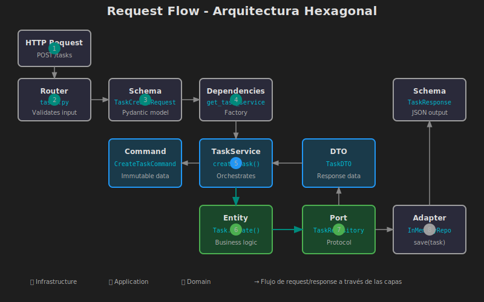

# 🏛️ Semana 10: Arquitectura Hexagonal Completa

## 📋 Descripción

Esta semana culminamos la **progresión arquitectónica** del bootcamp implementando una **Arquitectura Hexagonal completa**. Integraremos todas las capas (Domain, Application, Infrastructure) en un sistema cohesivo y mantenible.

La Arquitectura Hexagonal (también conocida como Ports & Adapters) nos permite crear aplicaciones donde la **lógica de negocio está completamente aislada** de los detalles técnicos como bases de datos, APIs externas o frameworks web.

---

## 🎯 Objetivos de Aprendizaje

Al finalizar esta semana, serás capaz de:

- ✅ Implementar una arquitectura hexagonal completa desde cero
- ✅ Diseñar un **Domain Layer** rico con entidades, value objects y domain services
- ✅ Crear un **Application Layer** con use cases y DTOs bien definidos
- ✅ Desarrollar un **Infrastructure Layer** con múltiples adapters intercambiables
- ✅ Aplicar **Domain-Driven Design (DDD) táctico** en proyectos FastAPI
- ✅ Gestionar la composición de dependencias en el punto de entrada
- ✅ Escribir tests a nivel de cada capa de forma independiente

---

## 📚 Requisitos Previos

Antes de comenzar, asegúrate de haber completado:

- ✅ Semana 08: Arquitectura MVC/Capas completo
- ✅ Semana 09: Ports & Adapters (Inversión de Dependencias)
- ✅ Conocimiento de Python Protocols
- ✅ Comprensión de Dependency Injection en FastAPI

---

## 🗂️ Estructura de la Semana

```
week-10/
├── README.md                    # Este archivo
├── rubrica-evaluacion.md        # Criterios de evaluación
├── 0-assets/                    # Diagramas y recursos visuales
│   ├── 01-hexagonal-overview.svg
│   ├── 02-domain-layer.svg
│   ├── 03-application-layer.svg
│   ├── 04-infrastructure-layer.svg
│   ├── 05-composition-root.svg
│   └── 06-request-flow.svg
├── 1-teoria/                    # Material teórico
│   ├── 01-arquitectura-hexagonal-overview.md
│   ├── 02-domain-layer.md
│   ├── 03-application-layer.md
│   ├── 04-infrastructure-layer.md
│   └── 05-composition-root.md
├── 2-practicas/                 # Ejercicios guiados
│   ├── 01-domain-modeling/
│   ├── 02-application-services/
│   ├── 03-infrastructure-adapters/
│   └── 04-wiring-composition/
├── 3-proyecto/                  # Proyecto integrador
│   ├── README.md
│   ├── starter/                 # Código inicial
│   └── solution/                # Solución (oculta)
├── 4-recursos/                  # Material adicional
│   └── README.md
└── 5-glosario/                  # Términos clave
    └── README.md
```

---

## 📝 Contenidos

### 1️⃣ Teoría (1.5-2 horas)

| Archivo | Tema | Duración |
|---------|------|----------|
| [01-arquitectura-hexagonal-overview.md](1-teoria/01-arquitectura-hexagonal-overview.md) | Visión general de Hexagonal | 25 min |
| [02-domain-layer.md](1-teoria/02-domain-layer.md) | Capa de Dominio | 25 min |
| [03-application-layer.md](1-teoria/03-application-layer.md) | Capa de Aplicación | 20 min |
| [04-infrastructure-layer.md](1-teoria/04-infrastructure-layer.md) | Capa de Infraestructura | 20 min |
| [05-composition-root.md](1-teoria/05-composition-root.md) | Composición y Wiring | 15 min |

### 2️⃣ Prácticas (2.5-3 horas)

| Práctica | Tema | Duración |
|----------|------|----------|
| [01-domain-modeling](2-practicas/01-domain-modeling/) | Modelar dominio con entidades y value objects | 45 min |
| [02-application-services](2-practicas/02-application-services/) | Crear use cases y DTOs | 45 min |
| [03-infrastructure-adapters](2-practicas/03-infrastructure-adapters/) | Implementar adapters completos | 45 min |
| [04-wiring-composition](2-practicas/04-wiring-composition/) | Componer la aplicación completa | 30 min |

### 3️⃣ Proyecto (1.5-2 horas)

| Proyecto | Descripción |
|----------|-------------|
| [Task Management System](3-proyecto/) | Sistema de gestión de tareas con proyectos y usuarios |

---

## 🏗️ Arquitectura Hexagonal - Visión General


### Flujo de un Request



### Diagrama de Capas

```
┌─────────────────────────────────────────────────────────────────┐
│                      INFRASTRUCTURE LAYER                        │
│  ┌─────────────┐  ┌─────────────┐  ┌─────────────┐              │
│  │ REST API    │  │ Database    │  │ Email       │              │
│  │ (FastAPI)   │  │ (SQLite)    │  │ Service     │              │
│  └──────┬──────┘  └──────┬──────┘  └──────┬──────┘              │
│         │                │                │                      │
│    ┌────▼────┐      ┌────▼────┐      ┌────▼────┐                │
│    │ Driving │      │ Driven  │      │ Driven  │                │
│    │ Adapter │      │ Adapter │      │ Adapter │                │
│    └────┬────┘      └────▲────┘      └────▲────┘                │
└─────────┼────────────────┼────────────────┼─────────────────────┘
          │                │                │
┌─────────▼────────────────▼────────────────▼─────────────────────┐
│                      APPLICATION LAYER                           │
│  ┌──────────────────────────────────────────────────────────┐   │
│  │                      Use Cases                            │   │
│  │  CreateTask  │  AssignTask  │  CompleteTask  │  GetTasks  │   │
│  └──────────────────────────────────────────────────────────┘   │
│  ┌─────────────┐  ┌─────────────┐  ┌─────────────┐              │
│  │    DTOs     │  │   Ports     │  │  Services   │              │
│  │ (Input/Out) │  │ (Interfaces)│  │(Orchestrate)│              │
│  └─────────────┘  └─────────────┘  └─────────────┘              │
└─────────────────────────────┬───────────────────────────────────┘
                              │
┌─────────────────────────────▼───────────────────────────────────┐
│                        DOMAIN LAYER                              │
│  ┌─────────────┐  ┌─────────────┐  ┌─────────────┐              │
│  │  Entities   │  │   Value     │  │   Domain    │              │
│  │  (Task,     │  │   Objects   │  │   Services  │              │
│  │   Project)  │  │  (Priority) │  │             │              │
│  └─────────────┘  └─────────────┘  └─────────────┘              │
│  ┌─────────────┐  ┌─────────────┐                               │
│  │   Domain    │  │    Repo     │                               │
│  │   Events    │  │   Ports     │                               │
│  └─────────────┘  └─────────────┘                               │
└─────────────────────────────────────────────────────────────────┘
```

---

## ⏱️ Distribución del Tiempo

| Actividad | Tiempo | Porcentaje |
|-----------|--------|------------|
| 📖 Teoría | 1.5-2 h | ~30% |
| 💻 Prácticas | 2.5-3 h | ~45% |
| 🚀 Proyecto | 1.5-2 h | ~25% |
| **Total** | **~6 h** | **100%** |

---

## 📌 Entregable

**Proyecto: [Task Management System](3-proyecto/)**

Sistema de gestión de tareas con arquitectura hexagonal:

- [ ] Domain Layer con entidades Task, Project, User
- [ ] Application Layer con use cases CRUD + asignación
- [ ] Infrastructure Layer con persistencia y API REST
- [ ] Tests unitarios e integración

---

## 🔗 Navegación

| ← Anterior | Actual | Siguiente → |
|------------|--------|-------------|
| [Semana 09: Ports & Adapters](../week-09/README.md) | **Semana 10** | [Semana 11: Autenticación JWT](../week-11/README.md) |

---

## 📚 Recursos Adicionales

- [Documentación FastAPI - Dependencies](https://fastapi.tiangolo.com/tutorial/dependencies/)
- [Hexagonal Architecture - Alistair Cockburn](https://alistair.cockburn.us/hexagonal-architecture/)
- [Domain-Driven Design Quickly](https://www.infoq.com/minibooks/domain-driven-design-quickly/)
- [Clean Architecture - Uncle Bob](https://blog.cleancoder.com/uncle-bob/2012/08/13/the-clean-architecture.html)

---

## ✅ Checklist de la Semana

- [ ] Leer los 5 archivos de teoría
- [ ] Completar práctica 01: Domain Modeling
- [ ] Completar práctica 02: Application Services
- [ ] Completar práctica 03: Infrastructure Adapters
- [ ] Completar práctica 04: Wiring & Composition
- [ ] Desarrollar el proyecto Task Management System
- [ ] Ejecutar todos los tests
- [ ] Revisar el glosario de términos

---

_Semana 10 de 16 | Arquitectura Hexagonal Completa_
