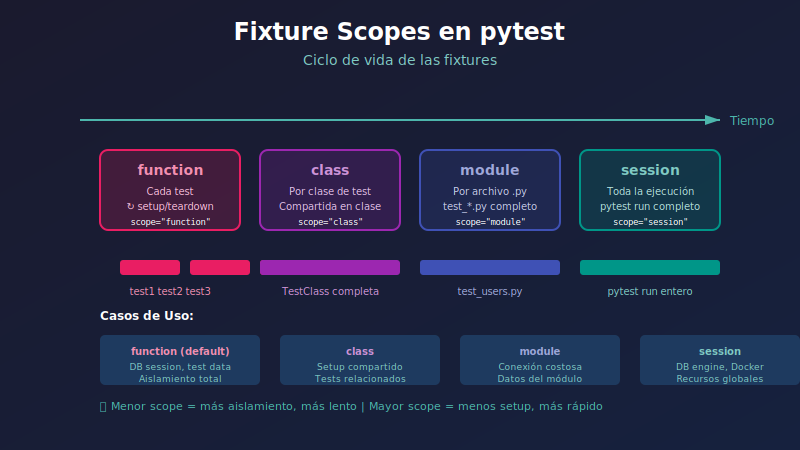

# 🔩 Fixtures y Parametrización

## 🎯 Objetivos

- Entender qué son las fixtures y para qué sirven
- Dominar los diferentes scopes de fixtures
- Usar conftest.py para compartir fixtures
- Aplicar parametrización para tests múltiples

---

## 📋 ¿Qué son las Fixtures?

Las **fixtures** son funciones que proveen datos o estado para los tests. Reemplazan el tradicional setup/teardown.

```python
import pytest


# Sin fixture - repetición de código
def test_user_has_name():
    user = {"name": "John", "email": "john@example.com"}
    assert user["name"] == "John"

def test_user_has_email():
    user = {"name": "John", "email": "john@example.com"}
    assert user["email"] == "john@example.com"


# Con fixture - código DRY
@pytest.fixture
def user():
    """Fixture que provee un usuario de prueba."""
    return {"name": "John", "email": "john@example.com"}

def test_user_has_name(user):
    assert user["name"] == "John"

def test_user_has_email(user):
    assert user["email"] == "john@example.com"
```

---

## 🔧 Anatomía de una Fixture

### Fixture Básica

```python
import pytest


@pytest.fixture
def sample_data():
    """Retorna datos de prueba."""
    return {"key": "value", "number": 42}


def test_sample_has_key(sample_data):
    assert "key" in sample_data


def test_sample_number_is_42(sample_data):
    assert sample_data["number"] == 42
```

### Fixture con Setup y Teardown

```python
import pytest


@pytest.fixture
def database_connection():
    """Fixture con setup y teardown usando yield."""
    # Setup: código antes del yield
    print("\n🔌 Connecting to database...")
    connection = {"connected": True, "data": []}
    
    yield connection  # El test recibe este valor
    
    # Teardown: código después del yield
    print("\n🔌 Disconnecting from database...")
    connection["connected"] = False


def test_connection_is_active(database_connection):
    assert database_connection["connected"] is True


def test_can_add_data(database_connection):
    database_connection["data"].append("item")
    assert len(database_connection["data"]) == 1
```

---

## 🎚️ Scopes de Fixtures

El **scope** determina cuántas veces se ejecuta la fixture.



### Scope: function (default)

```python
@pytest.fixture(scope="function")  # Default
def fresh_list():
    """Se crea una nueva lista para CADA test."""
    print("\n📝 Creating fresh list")
    return []


def test_append_to_list(fresh_list):
    fresh_list.append(1)
    assert fresh_list == [1]


def test_list_is_empty(fresh_list):
    # Lista está vacía porque es una nueva instancia
    assert fresh_list == []
```

### Scope: class

```python
@pytest.fixture(scope="class")
def shared_in_class():
    """Se crea UNA vez por clase de tests."""
    print("\n📦 Creating shared resource for class")
    return {"count": 0}


class TestGroupA:
    def test_increment(self, shared_in_class):
        shared_in_class["count"] += 1
        assert shared_in_class["count"] == 1
    
    def test_increment_again(self, shared_in_class):
        shared_in_class["count"] += 1
        assert shared_in_class["count"] == 2  # Comparte estado


class TestGroupB:
    def test_fresh_count(self, shared_in_class):
        # Nueva instancia para esta clase
        assert shared_in_class["count"] == 0
```

### Scope: module

```python
# tests/test_module_scope.py

@pytest.fixture(scope="module")
def expensive_resource():
    """Se crea UNA vez por módulo (archivo)."""
    print("\n⏳ Loading expensive resource...")
    import time
    time.sleep(1)  # Simula operación costosa
    return {"loaded": True}


def test_resource_is_loaded(expensive_resource):
    assert expensive_resource["loaded"] is True


def test_resource_same_instance(expensive_resource):
    # Misma instancia que el test anterior
    expensive_resource["modified"] = True
    assert "modified" in expensive_resource
```

### Scope: session

```python
@pytest.fixture(scope="session")
def database_engine():
    """Se crea UNA vez para TODA la sesión de tests."""
    print("\n🗄️ Creating database engine (once per session)")
    engine = create_engine("sqlite:///:memory:")
    Base.metadata.create_all(engine)
    
    yield engine
    
    print("\n🗄️ Disposing database engine")
    engine.dispose()
```

### Comparación de Scopes

| Scope | Cuándo se crea | Cuándo se destruye | Uso típico |
|-------|----------------|-------------------|------------|
| `function` | Cada test | Después de cada test | Datos aislados |
| `class` | Primera vez en clase | Después de última en clase | Tests relacionados |
| `module` | Primera vez en archivo | Después de última en archivo | Recursos costosos |
| `session` | Primera vez en sesión | Después de todos los tests | DB engine, conexiones |

---

## 📁 conftest.py

El archivo `conftest.py` permite **compartir fixtures** entre múltiples archivos de tests.

### Estructura

```
tests/
├── conftest.py              # Fixtures globales
├── unit/
│   ├── conftest.py          # Fixtures para unit tests
│   └── test_services.py
└── integration/
    ├── conftest.py          # Fixtures para integration tests
    └── test_api.py
```

### conftest.py Global

```python
# tests/conftest.py
import pytest
from sqlalchemy import create_engine
from sqlalchemy.orm import sessionmaker

from src.database import Base
from src.models import User


@pytest.fixture(scope="session")
def engine():
    """Engine de base de datos para toda la sesión."""
    engine = create_engine("sqlite:///:memory:")
    Base.metadata.create_all(engine)
    yield engine
    engine.dispose()


@pytest.fixture(scope="function")
def db_session(engine):
    """Sesión de BD fresca para cada test."""
    Session = sessionmaker(bind=engine)
    session = Session()
    
    yield session
    
    session.rollback()
    session.close()


@pytest.fixture
def test_user(db_session):
    """Usuario de prueba en la base de datos."""
    user = User(
        email="test@example.com",
        hashed_password="hashedpassword123",
        is_active=True
    )
    db_session.add(user)
    db_session.commit()
    db_session.refresh(user)
    return user
```

### conftest.py para Integration Tests

```python
# tests/integration/conftest.py
import pytest
from fastapi.testclient import TestClient

from src.main import app
from src.database import get_db


@pytest.fixture
def client(db_session):
    """Cliente de prueba con BD override."""
    def override_get_db():
        yield db_session
    
    app.dependency_overrides[get_db] = override_get_db
    
    with TestClient(app) as test_client:
        yield test_client
    
    app.dependency_overrides.clear()


@pytest.fixture
def authenticated_client(client, test_user):
    """Cliente autenticado con token válido."""
    response = client.post(
        "/auth/token",
        data={"username": test_user.email, "password": "testpassword"}
    )
    token = response.json()["access_token"]
    client.headers["Authorization"] = f"Bearer {token}"
    return client
```

---

## 🔄 Parametrización

Permite ejecutar el **mismo test con diferentes datos**.

### @pytest.mark.parametrize

```python
import pytest


def is_valid_email(email: str) -> bool:
    """Valida formato básico de email."""
    return "@" in email and "." in email.split("@")[-1]


@pytest.mark.parametrize("email,expected", [
    ("user@example.com", True),
    ("user@domain.org", True),
    ("invalid-email", False),
    ("missing@domain", False),
    ("@nodomain.com", False),
    ("noatsign.com", False),
])
def test_email_validation(email, expected):
    """Test con múltiples casos de email."""
    assert is_valid_email(email) == expected
```

### Múltiples Parámetros

```python
@pytest.mark.parametrize("a,b,expected", [
    (1, 1, 2),
    (2, 3, 5),
    (10, -5, 5),
    (0, 0, 0),
    (-1, -1, -2),
])
def test_addition(a, b, expected):
    assert a + b == expected


@pytest.mark.parametrize("input_str,expected_len", [
    ("hello", 5),
    ("", 0),
    ("a", 1),
    ("hello world", 11),
])
def test_string_length(input_str, expected_len):
    assert len(input_str) == expected_len
```

### IDs Personalizados

```python
@pytest.mark.parametrize("status_code,expected_message", [
    pytest.param(200, "OK", id="success"),
    pytest.param(404, "Not Found", id="not-found"),
    pytest.param(500, "Server Error", id="server-error"),
])
def test_status_messages(status_code, expected_message):
    messages = {200: "OK", 404: "Not Found", 500: "Server Error"}
    assert messages[status_code] == expected_message
```

Output:
```
test_status.py::test_status_messages[success] PASSED
test_status.py::test_status_messages[not-found] PASSED
test_status.py::test_status_messages[server-error] PASSED
```

### Combinar Parametrize

```python
@pytest.mark.parametrize("username", ["alice", "bob"])
@pytest.mark.parametrize("role", ["admin", "user", "guest"])
def test_user_role_combinations(username, role):
    """Ejecuta 6 tests (2 usuarios × 3 roles)."""
    user = create_user(username, role)
    assert user.username == username
    assert user.role == role
```

### Fixture Parametrizada

```python
@pytest.fixture(params=["sqlite", "postgresql", "mysql"])
def database_type(request):
    """Fixture que itera sobre tipos de BD."""
    return request.param


def test_database_connection(database_type):
    """Se ejecuta 3 veces, una por cada BD."""
    print(f"\nTesting with {database_type}")
    assert database_type in ["sqlite", "postgresql", "mysql"]
```

---

## 🎭 Fixtures Avanzadas

### Fixture que Usa Otra Fixture

```python
@pytest.fixture
def base_user():
    """Usuario base."""
    return {"name": "Base", "role": "user"}


@pytest.fixture
def admin_user(base_user):
    """Admin basado en usuario base."""
    base_user["role"] = "admin"
    base_user["permissions"] = ["read", "write", "delete"]
    return base_user


def test_admin_has_permissions(admin_user):
    assert "delete" in admin_user["permissions"]
```

### Fixture Factory

```python
@pytest.fixture
def make_user():
    """Factory para crear usuarios personalizados."""
    created_users = []
    
    def _make_user(name: str, email: str, role: str = "user"):
        user = {"name": name, "email": email, "role": role}
        created_users.append(user)
        return user
    
    yield _make_user
    
    # Cleanup: eliminar usuarios creados
    print(f"\n🧹 Cleaning up {len(created_users)} users")
    created_users.clear()


def test_create_multiple_users(make_user):
    alice = make_user("Alice", "alice@example.com")
    bob = make_user("Bob", "bob@example.com", role="admin")
    
    assert alice["role"] == "user"
    assert bob["role"] == "admin"
```

### Autouse Fixtures

```python
@pytest.fixture(autouse=True)
def reset_database(db_session):
    """Se ejecuta automáticamente antes de CADA test."""
    yield
    db_session.rollback()


# No necesita declarar la fixture - se aplica automáticamente
def test_create_item(db_session):
    item = Item(name="Test")
    db_session.add(item)
    db_session.commit()
    # rollback automático después del test
```

---

## 📊 Fixtures para FastAPI

### Fixture de Aplicación

```python
# tests/conftest.py
import pytest
from fastapi.testclient import TestClient
from sqlalchemy import create_engine
from sqlalchemy.orm import sessionmaker

from src.main import app
from src.database import Base, get_db


SQLALCHEMY_DATABASE_URL = "sqlite:///:memory:"


@pytest.fixture(scope="session")
def engine():
    engine = create_engine(
        SQLALCHEMY_DATABASE_URL,
        connect_args={"check_same_thread": False}
    )
    Base.metadata.create_all(bind=engine)
    yield engine
    Base.metadata.drop_all(bind=engine)


@pytest.fixture(scope="function")
def db_session(engine):
    connection = engine.connect()
    transaction = connection.begin()
    Session = sessionmaker(bind=connection)
    session = Session()
    
    yield session
    
    session.close()
    transaction.rollback()
    connection.close()


@pytest.fixture(scope="function")
def client(db_session):
    def override_get_db():
        yield db_session
    
    app.dependency_overrides[get_db] = override_get_db
    
    with TestClient(app) as c:
        yield c
    
    app.dependency_overrides.clear()
```

---

## ✅ Resumen

| Concepto | Uso |
|----------|-----|
| `@pytest.fixture` | Definir fixture |
| `scope="function"` | Una por test (default) |
| `scope="session"` | Una por sesión completa |
| `yield` | Setup antes, teardown después |
| `conftest.py` | Compartir fixtures |
| `@pytest.mark.parametrize` | Múltiples inputs |
| `autouse=True` | Ejecutar automáticamente |

---

## 🔗 Próximo Tema

→ [04-testing-fastapi.md](04-testing-fastapi.md) - Testing de endpoints FastAPI
