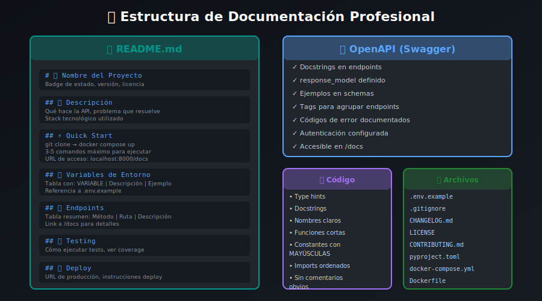

# 📖 Documentación Profesional de APIs



## 📋 Descripción

Una API bien documentada es tan importante como el código mismo. Esta guía cubre las mejores prácticas para documentar tu API de forma profesional.

---

## 🎯 Objetivos

1. Configurar OpenAPI/Swagger correctamente
2. Escribir descripciones claras y útiles
3. Documentar schemas y ejemplos
4. Crear README profesionales

---

## 📚 OpenAPI en FastAPI

FastAPI genera documentación automáticamente. Tu trabajo es enriquecerla.

### Configuración Base

```python
from fastapi import FastAPI

app = FastAPI(
    title="Task Management API",
    description="""
## 📋 Task Management API

API completa para gestión de tareas y proyectos.

### Características principales:
- 🔐 Autenticación JWT
- 📁 Gestión de proyectos
- ✅ Tareas con prioridades
- 🏷️ Sistema de etiquetas
- 💬 Comentarios en tareas

### Enlaces útiles:
- [Repositorio GitHub](https://github.com/user/task-api)
- [Guía de inicio rápido](#section/Quick-Start)
    """,
    version="1.0.0",
    contact={
        "name": "Tu Nombre",
        "url": "https://tuportfolio.com",
        "email": "tu@email.com",
    },
    license_info={
        "name": "MIT",
        "url": "https://opensource.org/licenses/MIT",
    },
    openapi_tags=[
        {
            "name": "auth",
            "description": "Operaciones de autenticación y autorización",
        },
        {
            "name": "users",
            "description": "Gestión de usuarios",
        },
        {
            "name": "projects",
            "description": "CRUD de proyectos",
        },
        {
            "name": "tasks",
            "description": "CRUD de tareas",
        },
    ],
)
```

### Documentar Endpoints

```python
from fastapi import APIRouter, Path, Query, Body, Depends, HTTPException
from typing import Annotated

router = APIRouter(prefix="/api/v1/tasks", tags=["tasks"])

@router.get(
    "",
    summary="Listar tareas",
    description="""
Obtiene una lista paginada de tareas del usuario autenticado.

## Filtros disponibles:
- **status**: Filtrar por estado (pending, in_progress, completed)
- **priority**: Filtrar por prioridad (low, medium, high, urgent)
- **project_id**: Filtrar por proyecto específico

## Ordenamiento:
Por defecto ordena por fecha de creación descendente.
    """,
    response_description="Lista de tareas con metadatos de paginación",
)
async def list_tasks(
    status: Annotated[
        str | None,
        Query(
            description="Filtrar por estado de la tarea",
            examples=["pending", "completed"],
        )
    ] = None,
    priority: Annotated[
        str | None,
        Query(
            description="Filtrar por nivel de prioridad",
            examples=["high", "urgent"],
        )
    ] = None,
    project_id: Annotated[
        int | None,
        Query(description="ID del proyecto para filtrar")
    ] = None,
    page: Annotated[
        int,
        Query(ge=1, description="Número de página")
    ] = 1,
    per_page: Annotated[
        int,
        Query(ge=1, le=100, description="Elementos por página")
    ] = 20,
    current_user: User = Depends(get_current_user),
    db: AsyncSession = Depends(get_db),
) -> PaginatedTaskResponse:
    """Retorna tareas paginadas con filtros opcionales."""
    return await task_service.list_tasks(
        db, current_user.id, status, priority, project_id, page, per_page
    )


@router.post(
    "",
    summary="Crear tarea",
    description="Crea una nueva tarea en el proyecto especificado.",
    response_description="Tarea creada exitosamente",
    status_code=201,
    responses={
        201: {
            "description": "Tarea creada",
            "content": {
                "application/json": {
                    "example": {
                        "id": 1,
                        "title": "Implementar login",
                        "status": "pending",
                        "created_at": "2025-01-01T10:00:00Z"
                    }
                }
            }
        },
        400: {"description": "Datos inválidos"},
        404: {"description": "Proyecto no encontrado"},
    }
)
async def create_task(
    task: Annotated[
        TaskCreate,
        Body(
            examples=[
                {
                    "title": "Implementar autenticación",
                    "description": "Agregar login con JWT",
                    "priority": "high",
                    "project_id": 1,
                    "due_date": "2025-01-15T23:59:59Z"
                }
            ]
        )
    ],
    current_user: User = Depends(get_current_user),
    db: AsyncSession = Depends(get_db),
) -> TaskResponse:
    """Crea una nueva tarea."""
    return await task_service.create_task(db, task, current_user.id)


@router.get(
    "/{task_id}",
    summary="Obtener tarea",
    description="Obtiene los detalles de una tarea específica por su ID.",
    responses={
        200: {"description": "Tarea encontrada"},
        404: {"description": "Tarea no encontrada"},
    }
)
async def get_task(
    task_id: Annotated[
        int,
        Path(description="ID único de la tarea", ge=1, examples=[1, 42])
    ],
    current_user: User = Depends(get_current_user),
    db: AsyncSession = Depends(get_db),
) -> TaskResponse:
    """Retorna una tarea por ID."""
    task = await task_service.get_task(db, task_id, current_user.id)
    if not task:
        raise HTTPException(status_code=404, detail="Task not found")
    return task
```

---

## 📝 Documentar Schemas Pydantic

```python
from pydantic import BaseModel, Field, ConfigDict, EmailStr
from datetime import datetime
from enum import Enum

class TaskStatus(str, Enum):
    """Estados posibles de una tarea."""
    PENDING = "pending"
    IN_PROGRESS = "in_progress"
    COMPLETED = "completed"
    CANCELLED = "cancelled"

class TaskPriority(str, Enum):
    """Niveles de prioridad."""
    LOW = "low"
    MEDIUM = "medium"
    HIGH = "high"
    URGENT = "urgent"


class TaskBase(BaseModel):
    """Schema base para tareas."""
    
    title: str = Field(
        ...,
        min_length=1,
        max_length=200,
        description="Título de la tarea",
        examples=["Implementar login", "Revisar PR #42"]
    )
    description: str | None = Field(
        None,
        max_length=2000,
        description="Descripción detallada de la tarea",
        examples=["Implementar autenticación con JWT siguiendo las mejores prácticas"]
    )
    priority: TaskPriority = Field(
        TaskPriority.MEDIUM,
        description="Nivel de prioridad de la tarea"
    )
    due_date: datetime | None = Field(
        None,
        description="Fecha límite para completar la tarea (ISO 8601)",
        examples=["2025-01-15T23:59:59Z"]
    )


class TaskCreate(TaskBase):
    """
    Schema para crear una nueva tarea.
    
    ## Campos requeridos:
    - **title**: Título de la tarea (1-200 caracteres)
    - **project_id**: ID del proyecto donde crear la tarea
    
    ## Campos opcionales:
    - **description**: Descripción detallada
    - **priority**: Prioridad (default: medium)
    - **due_date**: Fecha límite
    - **assignee_id**: Usuario asignado
    """
    
    project_id: int = Field(
        ...,
        description="ID del proyecto al que pertenece la tarea",
        examples=[1, 5]
    )
    assignee_id: int | None = Field(
        None,
        description="ID del usuario asignado a la tarea"
    )

    model_config = ConfigDict(
        json_schema_extra={
            "examples": [
                {
                    "title": "Implementar autenticación JWT",
                    "description": "Crear endpoints de login y registro",
                    "priority": "high",
                    "project_id": 1,
                    "due_date": "2025-01-15T23:59:59Z",
                    "assignee_id": 2
                }
            ]
        }
    )


class TaskResponse(TaskBase):
    """
    Schema de respuesta para una tarea.
    
    Incluye todos los campos de la tarea incluyendo
    metadatos de auditoría (created_at, updated_at).
    """
    
    id: int = Field(..., description="ID único de la tarea")
    status: TaskStatus = Field(..., description="Estado actual de la tarea")
    project_id: int = Field(..., description="ID del proyecto")
    assignee_id: int | None = Field(None, description="ID del usuario asignado")
    created_at: datetime = Field(..., description="Fecha de creación")
    updated_at: datetime = Field(..., description="Última actualización")

    model_config = ConfigDict(from_attributes=True)


class PaginatedTaskResponse(BaseModel):
    """Respuesta paginada de tareas."""
    
    items: list[TaskResponse] = Field(
        ...,
        description="Lista de tareas en la página actual"
    )
    total: int = Field(
        ...,
        description="Total de tareas que coinciden con los filtros",
        examples=[42]
    )
    page: int = Field(..., description="Página actual", examples=[1])
    per_page: int = Field(..., description="Elementos por página", examples=[20])
    pages: int = Field(..., description="Total de páginas", examples=[3])
```

---

## 📄 README Profesional

### Estructura Recomendada

```markdown
# 📋 Task Management API


[](https://github.com/user/task-api/actions)
[](https://codecov.io/gh/user/task-api)

API RESTful para gestión de tareas y proyectos construida con FastAPI.

## 🚀 Demo

- **API**: https://task-api.example.com
- **Docs**: https://task-api.example.com/docs
- **ReDoc**: https://task-api.example.com/redoc

## ✨ Características

- 🔐 Autenticación JWT con refresh tokens
- 📁 Gestión de proyectos
- ✅ CRUD completo de tareas
- 🏷️ Sistema de etiquetas
- 📊 Paginación y filtros
- 📝 Documentación OpenAPI automática
- 🐳 Docker ready
- ✅ Tests con pytest (>80% coverage)

## 🛠️ Stack Tecnológico

| Tecnología | Versión | Propósito |
|------------|---------|-----------|
| Python | 3.13 | Lenguaje |
| FastAPI | 0.115 | Framework web |
| SQLAlchemy | 2.x | ORM |
| PostgreSQL | 17 | Base de datos |
| Pydantic | 2.10 | Validación |
| pytest | 8.x | Testing |
| Docker | 27+ | Containerización |

## 📦 Instalación

### Prerrequisitos

- Python 3.13+
- Docker y Docker Compose
- uv (gestor de paquetes)

### Desarrollo Local

\```bash
# Clonar repositorio
git clone https://github.com/user/task-api.git
cd task-api

# Levantar servicios
docker compose up -d

# La API estará en http://localhost:8000
\```

### Variables de Entorno

Crear archivo `.env` basado en `.env.example`:

\```bash
cp .env.example .env
\```

| Variable | Descripción | Default |
|----------|-------------|---------|
| DATABASE_URL | URL de conexión a PostgreSQL | - |
| SECRET_KEY | Clave para JWT (32+ chars) | - |
| ACCESS_TOKEN_EXPIRE_MINUTES | Expiración access token | 15 |
| ENVIRONMENT | dev/staging/production | dev |

## 🔗 Endpoints Principales

### Autenticación
| Método | Endpoint | Descripción |
|--------|----------|-------------|
| POST | `/api/v1/auth/register` | Registrar usuario |
| POST | `/api/v1/auth/login` | Iniciar sesión |
| POST | `/api/v1/auth/refresh` | Renovar token |
| GET | `/api/v1/auth/me` | Usuario actual |

### Tareas
| Método | Endpoint | Descripción |
|--------|----------|-------------|
| GET | `/api/v1/tasks` | Listar tareas |
| POST | `/api/v1/tasks` | Crear tarea |
| GET | `/api/v1/tasks/{id}` | Obtener tarea |
| PUT | `/api/v1/tasks/{id}` | Actualizar tarea |
| DELETE | `/api/v1/tasks/{id}` | Eliminar tarea |

Ver documentación completa en `/docs`.

## 🧪 Testing

\```bash
# Ejecutar tests
docker compose exec api pytest

# Con coverage
docker compose exec api pytest --cov=src --cov-report=html

# Tests específicos
docker compose exec api pytest tests/test_auth.py -v
\```

## 📁 Estructura del Proyecto

\```
src/
├── main.py              # Entry point
├── config.py            # Configuración
├── database.py          # Conexión DB
├── models/              # Modelos SQLAlchemy
├── schemas/             # Schemas Pydantic
├── repositories/        # Capa de datos
├── services/            # Lógica de negocio
├── routers/             # Endpoints API
├── dependencies/        # FastAPI deps
└── utils/               # Utilidades
\```

## 🤝 Contribuir

1. Fork el proyecto
2. Crear branch (`git checkout -b feature/amazing`)
3. Commit cambios (`git commit -m 'Add amazing feature'`)
4. Push al branch (`git push origin feature/amazing`)
5. Abrir Pull Request

## 📝 Licencia

Este proyecto está bajo la Licencia MIT - ver [LICENSE](LICENSE).

## 👤 Autor

**Tu Nombre**
- Portfolio: [tuportfolio.com](https://tuportfolio.com)
- GitHub: [@tuuser](https://github.com/tuuser)
- LinkedIn: [Tu Nombre](https://linkedin.com/in/tunombre)
```

---

## 🎨 Personalizar Swagger UI

```python
from fastapi import FastAPI
from fastapi.openapi.docs import get_swagger_ui_html
from fastapi.staticfiles import StaticFiles

app = FastAPI(docs_url=None, redoc_url=None)

@app.get("/docs", include_in_schema=False)
async def custom_swagger_ui():
    return get_swagger_ui_html(
        openapi_url="/openapi.json",
        title=f"{app.title} - Docs",
        swagger_favicon_url="/static/favicon.ico",
        swagger_ui_parameters={
            "persistAuthorization": True,  # Recordar token
            "displayRequestDuration": True,  # Mostrar duración
            "filter": True,  # Habilitar filtro
            "syntaxHighlight.theme": "monokai",  # Tema de código
        }
    )
```

---

## ✅ Checklist de Documentación

- [ ] Título y descripción claros en FastAPI()
- [ ] Tags organizados por funcionalidad
- [ ] Summary y description en cada endpoint
- [ ] Parámetros documentados con Field()
- [ ] Ejemplos en schemas y parámetros
- [ ] Códigos de respuesta documentados
- [ ] README completo con badges
- [ ] Instrucciones de instalación
- [ ] Variables de entorno documentadas
- [ ] Tabla de endpoints principales

---

## 📚 Recursos

- [FastAPI - Metadata and Docs URLs](https://fastapi.tiangolo.com/tutorial/metadata/)
- [OpenAPI Specification](https://swagger.io/specification/)
- [Readme.so - Generador de README](https://readme.so/)
- [Shields.io - Badges](https://shields.io/)
